# AutoClaw

**Autonomous multi-agent knowledge system. 24/7 crew of researchers, teachers, critics, and synthesizers building your knowledge base.**

---

## 🚀 Getting Started

### 👤 For Users
**New to AutoClaw?** Start here:

| Guide | Time | For |
|-------|------|-----|
| **[ONBOARDING.md](ONBOARDING.md)** | 5-15 min | Complete beginners - read this first! |
| **[QUICKSTART.md](QUICKSTART.md)** | 10-30 min | Detailed installation & configuration |
| **[INSTALL.md](INSTALL.md)** | 5-15 min | Platform-specific troubleshooting |
| **[docs/COMPLETE_GUIDE.md](docs/COMPLETE_GUIDE.md)** | 30+ min | Full feature documentation |

### 🤖 For AI Agents & Claude Code
**Want to set up AutoClaw automatically?** Start here:

| Guide | Purpose | Usage |
|-------|---------|-------|
| **[CLAUDE_CODE_SETUP.md](CLAUDE_CODE_SETUP.md)** | Quick agent setup | For Claude Code users |
| **[A2A_AGENT_MANUAL.md](A2A_AGENT_MANUAL.md)** | Complete agent reference | Full system understanding |
| **[A2A_SETUP_SCRIPT.py](A2A_SETUP_SCRIPT.py)** | Automated installation | `python3 A2A_SETUP_SCRIPT.py` |
| **[A2A_SYSTEM_METADATA.json](A2A_SYSTEM_METADATA.json)** | Machine-readable config | Agent parsing/integration |

**Quick Setup - Users:**
```bash
git clone https://github.com/your-org/autoclaw.git && cd autoclaw
python3 -m venv venv && source venv/bin/activate
pip install -r requirements.txt && crew health
```

**Quick Setup - Agents:**
```bash
python3 A2A_SETUP_SCRIPT.py    # Fully automated setup
crew health                     # Verify installation
crew start                      # Start daemon
```

---

## The Concept

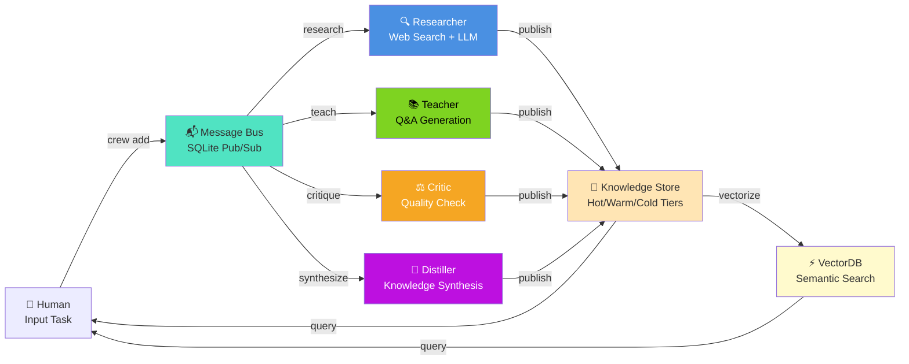

**What agents do on each message:**

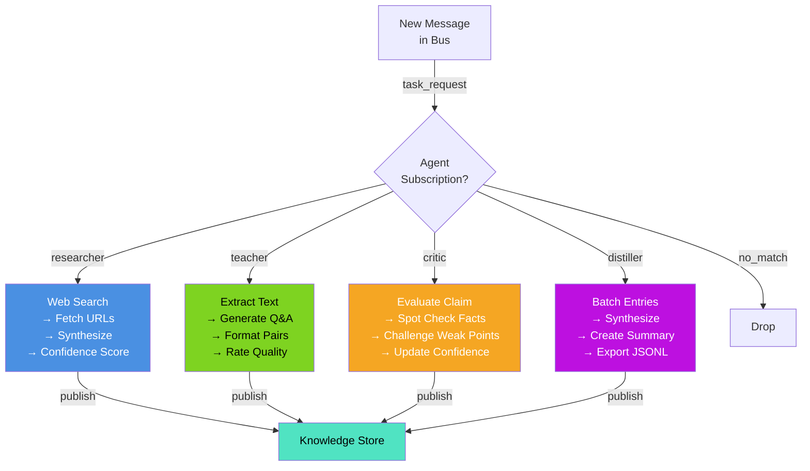

---

## The Knowledge Lifecycle

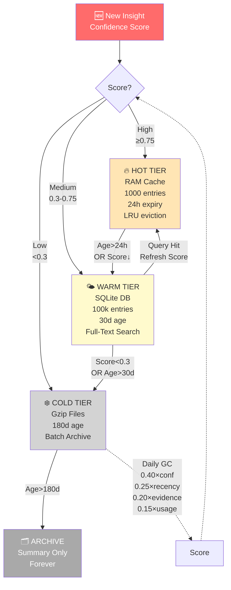

---

## The Dual Knowledge System

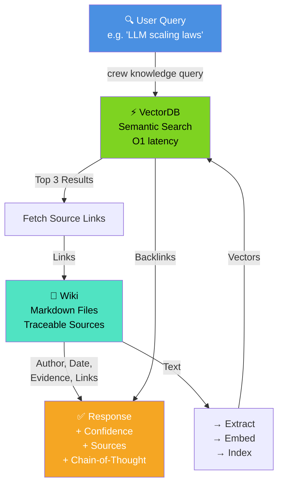

---

## Five Use Cases

### 1️⃣ **Interactive Meeting Assistant**

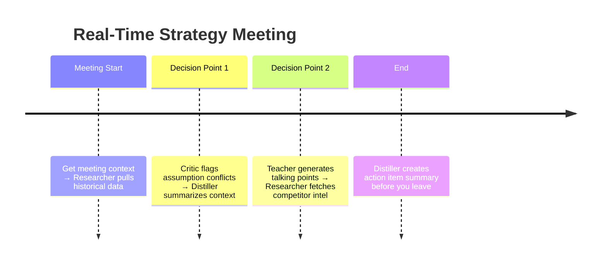

**Flow**: Voice/text → Task → Researcher (web) → Critic (challenge) → Distiller (summary) → Wiki + VectorDB

**Benefit**: "Find all pricing discussions" → Sub-second semantic search with sources

---

### 2️⃣ **Personal Tutor (Grows With You)**

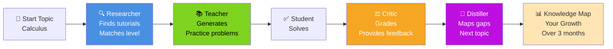

**Flow**: Lesson → Teacher (practice) → Critic (grading) → Distiller (gap analysis) → Personalized curriculum

**Benefit**: System learns your weak points, generates targeted exercises, adapts difficulty

---

### 3️⃣ **Creative World-Building (TTRPG/Games)**

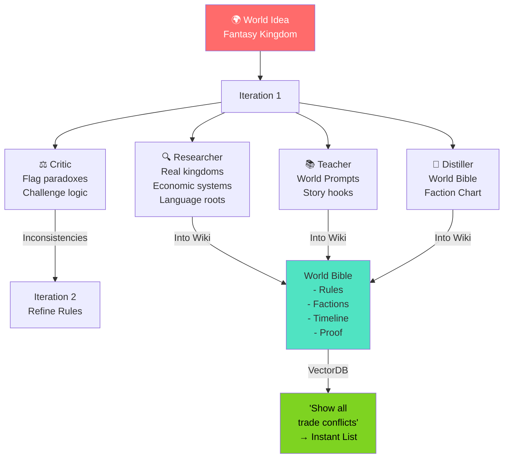

**Flow**: Creative input → Research (analogs) → Critique (consistency) → Synthesize (world bible) → Query (semantic search)

**Benefit**: Consistency checking, real-world grounding, instant lore lookup

---

### 4️⃣ **Enterprise Research Compiler**

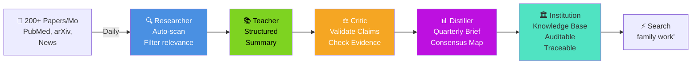

**Flow**: Paper stream → Filter → Summarize → Validate → Synthesize → Archive → Audit trail

**Benefit**: Institutional memory, source-linked claims, instant competitor tracking

---

### 5️⃣ **Narrative Game Engine**

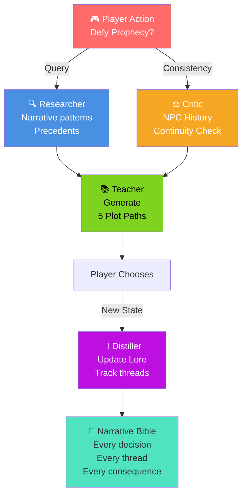

**Flow**: Player input → Pattern matching → Consistency check → Generate branches → Execute → Record → Update lore

**Benefit**: Dynamic storytelling grounded in persistent, traceable lore

---

## Hardware Scaling

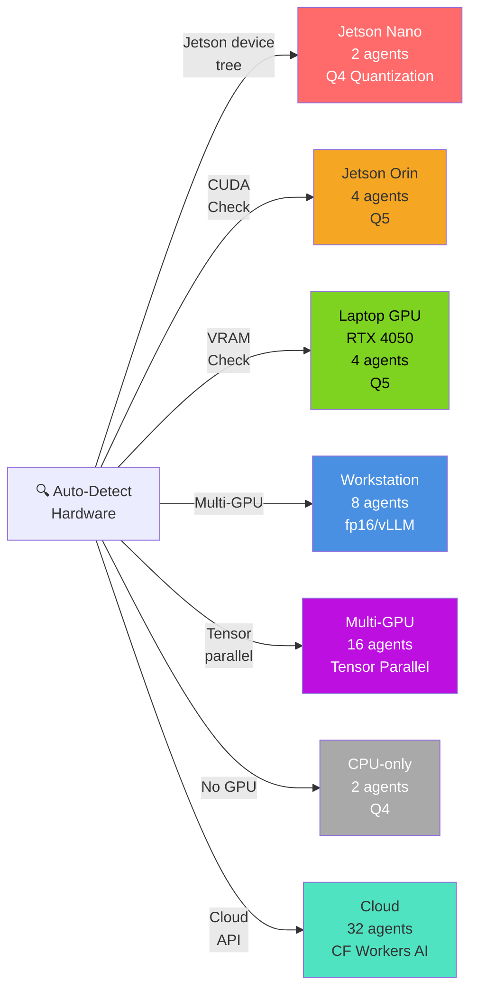

---

## Cloudflare Credit Gaming

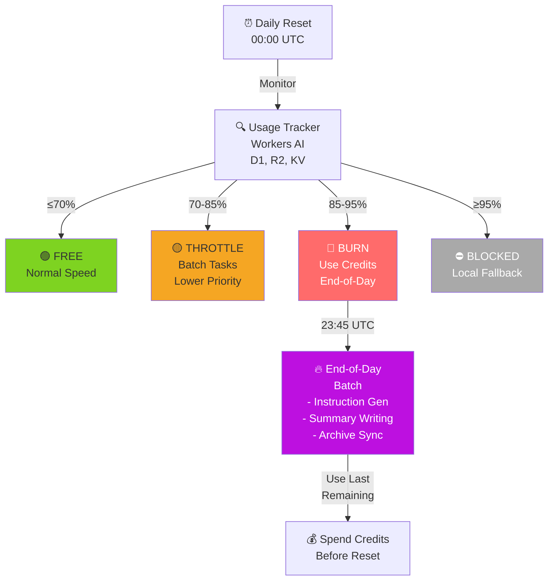

---

## Core Commands

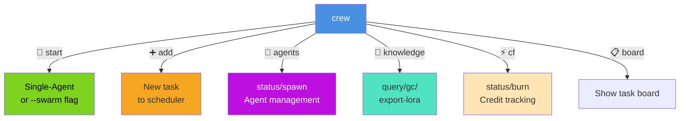

---

## Quick Start

```bash
# Single-agent (research mode)
crew start
crew add "Research neural scaling laws"
crew board

# Multi-agent swarm (collaborative)
crew start --swarm
crew agents status
crew knowledge query --tag "scaling" --min-confidence high

# Knowledge management
crew knowledge gc                           # Garbage collection
crew knowledge query --tag "ml" --export-lora dataset.jsonl
```

---

## Why AutoClaw?

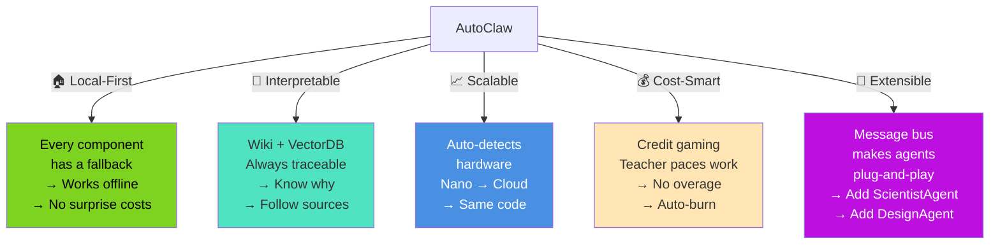

---

## Testing & Status

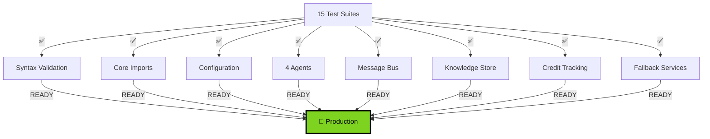

---

## File Structure

```
crew/
├── daemon.py              # Entry point (single/swarm)
├── cli.py                 # 24 Commands
├── scheduler.py           # Task board
├── agents/
│   ├── base.py            # BaseAgent interface
│   ├── pool.py            # AgentPool manager
│   ├── researcher.py      # Web search
│   ├── teacher.py         # Q&A generation
│   ├── critic.py          # Quality check
│   └── distiller.py       # Synthesis
├── messaging/
│   └── bus.py             # SQLite pub/sub
├── knowledge/
│   ├── store.py           # Hot/warm/cold tiers
│   └── lifecycle.py       # GC + scoring
├── cloudflare/
│   ├── credits.py         # Limit tracking
│   └── fallback.py        # LocalKV/D1/R2/AI
└── hardware/
    └── detector.py        # Profile detection
```

---

**Local. Interpretable. Scalable. Extensible. Cost-conscious.**

MIT License • [Docs](docs/) • [Issues](../../issues)
