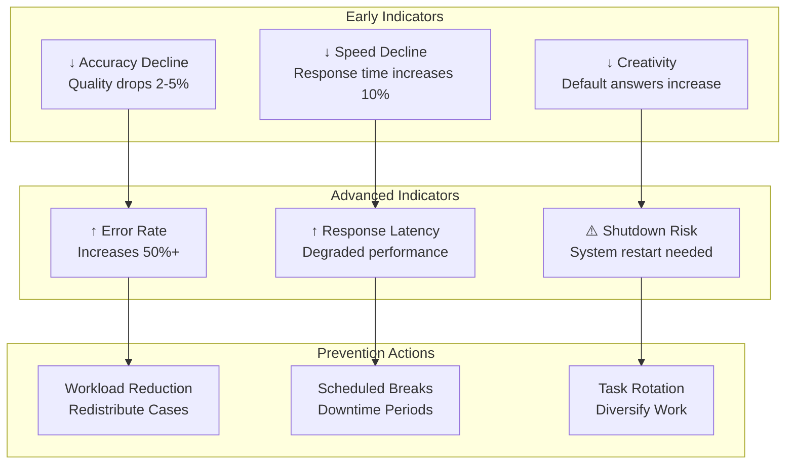

# Agent Burnout Prevention

## Overview

Agent burnout refers to performance degradation from sustained high load, limited breaks, or monotonous work. Unlike human burnout, agent burnout manifests through accuracy decline, slower response times, and reduced creativity. Prevention requires workload management, task variety, and regular system maintenance. This guide covers monitoring and preventing agent burnout.

## Burnout Warning Signs



## Burnout Detection Metrics

```python
def detect_agent_burnout_risk(agent_id, lookback_days=30):
    """
    Detect early signs of agent burnout
    """

    performance_trend = get_performance_trend(agent_id, days=lookback_days)
    workload_data = get_workload_data(agent_id, days=lookback_days)
    system_metrics = get_system_metrics(agent_id, days=lookback_days)

    burnout_indicators = {
        'accuracy_decline': calculate_accuracy_trend(performance_trend),
        'speed_decline': calculate_speed_trend(performance_trend),
        'creativity_decline': measure_response_diversity(performance_trend),
        'error_increase': calculate_error_trend(performance_trend),
        'workload_sustained_high': measure_sustained_load(workload_data),
        'break_frequency_low': measure_break_patterns(workload_data),
        'task_monotony_high': measure_task_diversity(workload_data),
        'memory_usage_increasing': trend_memory_usage(system_metrics),
        'latency_increasing': trend_latency(system_metrics),
        'restart_frequency_increasing': trend_restart_frequency(system_metrics)
    }

    # Weight indicators
    burnout_score = (
        burnout_indicators['accuracy_decline'] * 0.20 +
        burnout_indicators['speed_decline'] * 0.15 +
        burnout_indicators['creativity_decline'] * 0.10 +
        burnout_indicators['error_increase'] * 0.15 +
        burnout_indicators['workload_sustained_high'] * 0.15 +
        burnout_indicators['break_frequency_low'] * 0.10 +
        burnout_indicators['task_monotony_high'] * 0.10 +
        (burnout_indicators['memory_usage_increasing'] * 0.03 +
         burnout_indicators['latency_increasing'] * 0.03 +
         burnout_indicators['restart_frequency_increasing'] * 0.02)
    )

    burnout_risk_level = classify_burnout_risk(burnout_score)

    return {
        'burnout_score': burnout_score,
        'risk_level': burnout_risk_level,
        'indicators': burnout_indicators,
        'recommended_actions': recommend_interventions(burnout_score, burnout_indicators)
    }
```

## Workload Management

```yaml
workload_management_framework:
  optimal_utilization:
    target_utilization: 0.75  # 75% busy, 25% capacity buffer
    peak_utilization_max: 0.90
    sustained_high_utilization_days_max: 3
    recovery_period_after_peak: 2_days_reduced

  workload_distribution:
    strategy: "balanced_queue"
    queue_management:
      - priority_queue: "high_value_low_complexity_first"
      - batch_processing: "group_similar_tasks"
      - distribution: "even_among_agents"

  break_scheduling:
    frequency: "5_minute_break_every_hour"
    duration: "15_minute_break_every_4_hours"
    daily_rest: "1_hour_midday"
    frequency_enforcement: "mandatory"

  task_variety:
    same_task_max_hours: 4
    task_rotation: "every_4_hours"
    task_types_per_day_min: 3
    domain_switching: "reduces_monotony"
```

## Burnout Prevention Strategies

### 1. Workload Leveling

```python
def level_agent_workload(agents, incoming_cases):
    """
    Distribute work evenly to prevent overload
    """

    # Calculate current utilization
    utilization = {}
    for agent in agents:
        utilization[agent.id] = get_current_utilization(agent)

    # Sort by lowest utilization
    sorted_agents = sorted(
        agents,
        key=lambda a: utilization[a.id]
    )

    # Assign cases to balance load
    assignments = []
    for case in incoming_cases:
        # Assign to agent with lowest utilization
        target_agent = sorted_agents[0]

        # Update utilization estimate
        new_utilization = (
            utilization[target_agent.id] +
            estimate_case_duration(case) / target_agent.capacity
        )

        if new_utilization > 0.80:
            # Skip this agent if too loaded
            sorted_agents.pop(0)
            target_agent = sorted_agents[0]

        assignments.append({
            'case_id': case.id,
            'agent_id': target_agent.id,
            'estimated_utilization': new_utilization
        })

        utilization[target_agent.id] = new_utilization

    return assignments
```

### 2. Task Rotation

```yaml
task_rotation_for_burnout_prevention:
  rotation_schedule: "every_4_hours"
  rotation_logic:
    - if_current_task_type: "data_entry"
      switch_to: "problem_solving"
    - if_current_task_type: "analysis"
      switch_to: "communication"
    - if_current_task_type: "communication"
      switch_to: "creative_generation"
    - if_current_task_type: "creative_generation"
      switch_to: "data_entry"

  cognitive_load_balancing:
    high_cognitive_tasks: "alternate_with_low_cognitive"
    monotonous_tasks: "break_with_variety"
    deadline_pressure: "balance_with_flex_tasks"
```

### 3. Mandatory Breaks and Maintenance

```yaml
maintenance_and_recovery:
  hourly_breaks:
    frequency: "every_60_minutes"
    duration_minutes: 5
    activity: "system_health_check_and_refresh"

  daily_maintenance:
    frequency: "daily"
    time: "end_of_shift"
    duration_minutes: 30
    tasks:
      - cache_clearing
      - model_weight_refresh
      - temporary_file_cleanup

  weekly_deep_maintenance:
    frequency: "weekly"
    time: "weekend"
    duration_hours: 4
    tasks:
      - full_system_optimization
      - memory_defragmentation
      - database_reindexing

  quarterly_major_maintenance:
    frequency: "quarterly"
    duration_hours: 16
    offline: true
    tasks:
      - model_retraining_if_needed
      - architecture_optimization
      - dependency_updates
```

### 4. Variety and Enrichment

```python
def create_enriching_task_assignments(agent_id, work_hours=8):
    """
    Design work schedule with variety and enrichment
    """

    schedule = {}

    # Hour 1-2: Deep focus work
    schedule['hour_1_2'] = assign_challenging_task(
        complexity='high',
        novelty='high',
        engagement='maximize'
    )

    # Hour 3: Routine maintenance work
    schedule['hour_3'] = assign_routine_task(
        complexity='low',
        variety='true',
        pace='slower'
    )

    # Hour 4: Collaborative work
    schedule['hour_4'] = assign_collaborative_task(
        interaction='required',
        learning='true'
    )

    # Hour 5: Break + learning
    schedule['hour_5'] = {
        'type': 'break_and_development',
        'break_minutes': 15,
        'learning_activity': 'read_new_technique'
    }

    # Hour 6-7: Creative problem-solving
    schedule['hour_6_7'] = assign_creative_task(
        novelty='high',
        autonomy='high',
        impact='significant'
    )

    # Hour 8: Wrap-up and documentation
    schedule['hour_8'] = assign_documentation_task(
        reflection='required',
        knowledge_capture='true'
    )

    return schedule
```

## Performance Monitoring During Prevention

```json
{
  "agent_burnout_prevention_dashboard": {
    "agent_id": "analyzer_001",
    "monitoring_period": "2026-03-19",
    "burnout_indicators": {
      "accuracy_trend": {
        "baseline": 0.95,
        "current": 0.94,
        "trend": "stable",
        "risk_level": "low"
      },
      "speed_trend": {
        "baseline": "4.5_min_avg",
        "current": "4.6_min_avg",
        "trend": "slight_increase",
        "risk_level": "low"
      },
      "error_rate": {
        "baseline": 0.02,
        "current": 0.022,
        "trend": "stable",
        "risk_level": "low"
      },
      "workload_utilization": {
        "current": 0.72,
        "target": 0.75,
        "status": "healthy"
      },
      "task_diversity_score": {
        "current": 0.78,
        "target": 0.80,
        "status": "good"
      }
    },
    "recovery_actions_in_effect": [
      "task_rotation_enabled",
      "hourly_breaks_enforced",
      "workload_capped_at_75_percent"
    ],
    "risk_assessment": {
      "overall_burnout_risk": "low",
      "next_check": "2026-03-26"
    }
  }
}
```

## Burnout Recovery Procedures

If burnout detected, execute recovery:

```yaml
burnout_recovery_procedure:
  trigger: "burnout_score > 0.60"
  duration: "7_14_days"

  phases:
    - phase_1_immediate_load_reduction:
        duration_days: 3
        actions:
          - reduce_workload_to_50_percent
          - assign_complex_cases_to_backup
          - increase_break_frequency: "10_min_every_hour"
          - system_optimization: "run_full_maintenance"

    - phase_2_gradual_recovery:
        duration_days: 7
        actions:
          - gradual_workload_increase: "10_percent_daily"
          - maintain_task_rotation: "every_4_hours"
          - enforce_scheduled_breaks: "5_min_hourly"
          - monitor_performance: "continuous"

    - phase_3_return_to_normal:
        duration_days: 3
        actions:
          - reach_normal_workload: "75_percent"
          - continue_preventive_measures
          - performance_monitoring: "daily"
          - plan_long_term_prevention

  success_criteria:
    - accuracy_recovered_to_baseline: true
    - error_rate_normal: true
    - response_time_normal: true
    - burnout_score_below_0.30: true
```

## Performance Metrics for Burnout Prevention

| Metric | Target | Measurement |
|--------|--------|---|
| **Agent Availability** | >95% | Uptime without resets |
| **Performance Stability** | <2% variance | Month-over-month change |
| **Burnout Detection** | <1% risk for >30 days | Early warning system |
| **Break Compliance** | 100% | Scheduled breaks taken |
| **Task Variety Score** | >0.75 | Diversity measurement |

🔗 **Related Topics**: [Continuous Learning](AGENT_CONTINUOUS_LEARNING.md) | [Role Rotation](AGENT_ROLE_ROTATION.md) | [Skill Development](AGENT_SKILL_DEVELOPMENT.md) | [Team Composition](AGENT_TEAM_COMPOSITION.md) | [Performance Metrics](AGENT_PERFORMANCE_METRICS.md)
