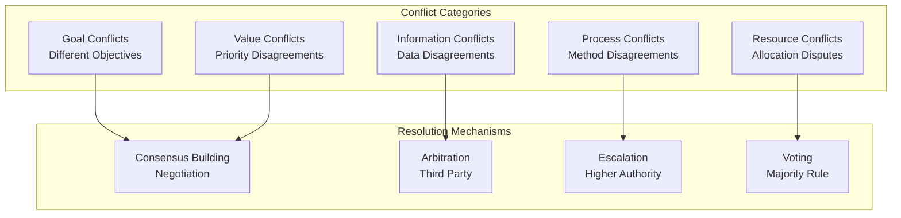

# Agent Conflict Resolution

## Overview

Conflict resolution addresses disagreements between agents in collaborative workflows. Multi-agent systems naturally generate conflicts when agents have different objectives, information, or interpretations. Effective conflict resolution mechanisms maintain system stability while preserving agent autonomy. This guide covers detecting, managing, and learning from agent conflicts.

## Conflict Types



## Conflict Detection

```python
def detect_agent_conflict(agent_outputs):
    """
    Detect conflicts between agent recommendations
    """

    conflicts = []

    # Type 1: Contradictory Recommendations
    recommendation_pairs = combinations(agent_outputs, 2)
    for rec_a, rec_b in recommendation_pairs:
        if is_contradictory(rec_a.recommendation, rec_b.recommendation):
            conflicts.append({
                'type': 'contradictory_recommendation',
                'agents': [rec_a.agent_id, rec_b.agent_id],
                'severity': calculate_contradiction_severity(rec_a, rec_b),
                'confidence_delta': abs(rec_a.confidence - rec_b.confidence)
            })

    # Type 2: Incompatible Actions
    for action_a, action_b in action_pairs:
        if are_incompatible(action_a, action_b):
            conflicts.append({
                'type': 'incompatible_actions',
                'agents': [action_a.agent_id, action_b.agent_id],
                'severity': 'high'  # Actions create cascading issues
            })

    # Type 3: Data Disagreement
    for data_claim_a, data_claim_b in data_claims:
        if data_claim_a.fact != data_claim_b.fact:
            conflicts.append({
                'type': 'information_conflict',
                'agents': [data_claim_a.agent_id, data_claim_b.agent_id],
                'fact_disputed': data_claim_a.fact,
                'verifiability': assess_verifiability(data_claim_a.fact)
            })

    return conflicts
```

## Conflict Resolution Strategies

### 1. Consensus Building

```yaml
consensus_mechanism:
  process:
    - step_1_initial_proposals:
        participants: "all_agents"
        duration_minutes: 5
        output: "individual_recommendations"

    - step_2_information_sharing:
        participants: "all_agents"
        activity: "explain_reasoning"
        duration_minutes: 5
        goal: "mutual_understanding"

    - step_3_objection_collection:
        participants: "all_agents"
        activity: "raise_concerns"
        duration_minutes: 5
        goal: "identify_core_disagreements"

    - step_4_solution_refinement:
        participants: "all_agents_or_subset"
        activity: "propose_compromises"
        duration_minutes: 10
        goal: "find_acceptable_path"

    - step_5_consensus_check:
        participants: "all_agents"
        decision: "accept_compromise_or_escalate"
        threshold: "80_percent_agreement"

  success_criteria:
    - consensus_achieved_percent: 0.80
    - time_to_resolution_minutes: 30
    - satisfaction_with_decision: 0.75
    - commitment_to_implementation: 0.90
```

### 2. Arbitration

```python
def arbitrate_conflict(conflicting_agents, conflict_details):
    """
    Third-party arbitrator resolves conflict
    """

    arbitrator = select_arbitrator(
        criteria=['no_prior_relationship_with_agents',
                  'domain_expertise',
                  'fairness_reputation']
    )

    # Arbitrator gathers evidence
    evidence = {}
    for agent in conflicting_agents:
        evidence[agent.agent_id] = {
            'position': agent.stated_position,
            'reasoning': agent.reasoning_chain,
            'confidence': agent.confidence_score,
            'supporting_data': agent.cited_sources
        }

    # Arbitrator evaluates evidence
    evaluation = arbitrator.evaluate_evidence(evidence, conflict_details)

    # Arbitrator issues binding decision
    decision = {
        'chosen_approach': evaluation.best_approach,
        'rationale': evaluation.reasoning,
        'binding': True,
        'appeal_allowed': True,
        'appeal_deadline_hours': 24
    }

    return decision
```

### 3. Voting

```yaml
voting_mechanism:
  applicable_for: "value_conflicts_or_tie_breaking"
  voting_rules:
    eligible_voters: "all_agents_or_designated_voting_panel"
    voting_method: "weighted_majority"
    weights:
      expertise_in_domain: 0.4
      years_of_experience: 0.3
      track_record_accuracy: 0.3
    threshold: 0.50  # Simple majority
    transparency: "votes_recorded_and_explained"

  process:
    - present_options: "all_viable_approaches"
    - discuss_tradeoffs: "agents_present_analysis"
    - vote: "weighted_voting"
    - announce_result: "with_rationale"
    - implement: "winning_option"

  appeal_mechanism:
    - grounds_for_appeal: ["new_information", "procedural_error"]
    - appeal_window_hours: 24
    - appeal_body: "senior_review_panel"
```

### 4. Escalation to Authority

```python
def escalate_to_authority(conflicting_agents, conflict_type):
    """
    Escalate unresolvable conflict to higher authority
    """

    # Determine authority level
    if conflict_type == 'goal_conflict':
        authority_level = 2  # Higher authority needed for goal changes
    elif conflict_type == 'information_conflict':
        authority_level = 1  # Can often resolve with data
    else:
        authority_level = 2

    # Find appropriate authority
    authority = find_authority_at_level(authority_level)

    # Prepare escalation package
    escalation_package = {
        'conflicting_agents': [a.agent_id for a in conflicting_agents],
        'conflict_type': conflict_type,
        'resolution_attempts': document_resolution_attempts(),
        'recommended_decision': get_majority_recommendation(conflicting_agents),
        'impact_if_unresolved': assess_impact(),
        'time_urgency': assess_urgency()
    }

    # Authority makes binding decision
    decision = authority.resolve_conflict(escalation_package)

    # Implement decision
    implement_decision(decision)

    # Document for organizational learning
    document_conflict_for_learning(
        conflict_type,
        escalation_reason,
        resolution_method,
        outcome
    )
```

## Conflict Prevention

```yaml
conflict_prevention_strategies:
  clear_objectives:
    strategy: "Explicitly align agent goals at start"
    implementation:
      - define_shared_goals: true
      - define_individual_goals: true
      - identify_goal_conflicts: "proactively"
      - resolve_before_execution: true

  information_transparency:
    strategy: "Ensure all agents have access to same data"
    implementation:
      - shared_knowledge_base: true
      - real_time_data_sync: true
      - conflict_on_data_interpretation: "resolve_via_experts"

  role_clarity:
    strategy: "Define who decides what"
    implementation:
      - authority_matrix: true
      - decision_ownership: "explicit"
      - escalation_paths: "predefined"

  resource_allocation:
    strategy: "Allocate resources fairly before conflicts emerge"
    implementation:
      - capacity_planning: true
      - priority_rules: "established"
      - overallocation_prevention: true

  communication_protocols:
    strategy: "Frequent coordination prevents surprises"
    implementation:
      - standup_frequency: "daily"
      - escalation_triggers: "defined"
      - handoff_procedures: "formal"
```

## Learning from Conflicts

```python
def analyze_conflict_for_learning(conflict_record):
    """
    Extract lessons from resolved conflicts
    """

    analysis = {
        'conflict_type': conflict_record.type,
        'root_cause': identify_root_cause(conflict_record),
        'resolution_method_used': conflict_record.resolution_method,
        'effectiveness': evaluate_resolution_effectiveness(conflict_record),
        'lessons_learned': []
    }

    # Extract lessons
    if conflict_record.root_cause == 'unclear_objectives':
        analysis['lessons_learned'].append({
            'lesson': 'Improve objective definition process',
            'recommendation': 'Require written objective alignment before agent collaboration',
            'affected_teams': identify_affected_teams(conflict_record)
        })

    elif conflict_record.root_cause == 'information_disagreement':
        analysis['lessons_learned'].append({
            'lesson': 'Improve data source agreement',
            'recommendation': 'Establish single source of truth for contested facts',
            'implementation': 'Update knowledge base procedures'
        })

    # Share learnings organization-wide
    distribute_learning(analysis)

    return analysis
```

## Conflict Resolution SLAs

```yaml
conflict_resolution_slas:
  detection_sla:
    target: "detect_within_15_minutes"
    measurement: "time_from_conflict_emergence_to_detection"

  initial_response_sla:
    target: "respond_within_30_minutes"
    measurement: "time_from_detection_to_first_intervention"

  resolution_by_type:
    information_conflicts:
      target: "resolve_within_4_hours"
      method: "data_verification"

    process_conflicts:
      target: "resolve_within_24_hours"
      method: "consensus_or_arbitration"

    goal_conflicts:
      target: "escalate_within_24_hours"
      method: "authority_decision"

    resource_conflicts:
      target: "resolve_within_8_hours"
      method: "reallocation_or_voting"

  escalation_sla:
    initial_appeal: "24_hours"
    final_resolution: "48_hours"
```

## Metrics for Conflict Management

| Metric | Target | Impact |
|--------|--------|--------|
| **Conflict Detection Time** | <15 min | Prevent escalation |
| **Resolution Rate First Attempt** | >70% | Efficiency |
| **Escalation Rate** | <20% | Self-resolution capacity |
| **Mean Time to Resolution** | <24 hours | System stability |
| **Conflict Recurrence Rate** | <10% | Learning effectiveness |

🔗 **Related Topics**: [Team Composition](AGENT_TEAM_COMPOSITION.md) | [Knowledge Sharing](AGENT_KNOWLEDGE_SHARING.md) | [Delegation Hierarchy](AGENT_DELEGATION_HIERARCHY.md) | [Continuous Learning](AGENT_CONTINUOUS_LEARNING.md) | [Performance Metrics](AGENT_PERFORMANCE_METRICS.md)
