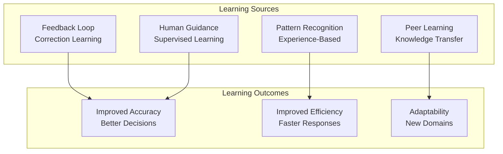

# Agent Continuous Learning

## Overview

Continuous learning enables agents to improve autonomously from experience, feedback, and new information. Unlike static agents with fixed training, continuously-learning agents adapt to changing environments, recover from failures, and discover novel patterns. This guide covers designing self-improving agent systems.

## Learning Mechanisms



## Feedback-Driven Learning

```python
def learn_from_feedback(agent_id, feedback_data):
    """
    Update agent based on feedback
    """

    agent = get_agent(agent_id)

    # Analyze feedback
    feedback_analysis = {
        'correct_decisions': analyze_correct_decisions(feedback_data),
        'incorrect_decisions': analyze_errors(feedback_data),
        'patterns': identify_patterns(feedback_data),
        'edge_cases': identify_edge_cases(feedback_data),
        'missing_knowledge': identify_knowledge_gaps(feedback_data)
    }

    # Extract learning
    if feedback_analysis['incorrect_decisions']:
        # Identify decision rule that needs updating
        failing_rule = identify_decision_rule(
            feedback_analysis['incorrect_decisions']
        )

        # Update rule or add exception
        agent.update_decision_rule(
            rule=failing_rule,
            correction=generate_correction(
                feedback_analysis['incorrect_decisions']
            )
        )

    # Learn from patterns
    if feedback_analysis['patterns']:
        for pattern in feedback_analysis['patterns']:
            agent.add_pattern_recognition(
                pattern_type=pattern['type'],
                confidence_threshold=pattern['confidence']
            )

    # Address edge cases
    if feedback_analysis['edge_cases']:
        for edge_case in feedback_analysis['edge_cases']:
            agent.add_edge_case_handling(edge_case)

    # Fill knowledge gaps
    if feedback_analysis['missing_knowledge']:
        agent.request_knowledge_update(
            topics=feedback_analysis['missing_knowledge'],
            priority='high'
        )

    return agent
```

## Self-Improvement Cycles

```yaml
continuous_improvement_framework:
  daily_cycle:
    activities:
      - review_feedback_on_decisions: "30_min"
      - identify_error_patterns: "20_min"
      - update_decision_rules: "20_min"
      - test_updates_on_sample_cases: "30_min"

  weekly_cycle:
    activities:
      - aggregate_performance_metrics: "1_hour"
      - identify_skill_gaps: "1_hour"
      - plan_learning_activities: "1_hour"
      - assess_knowledge_updates: "1_hour"

  monthly_cycle:
    activities:
      - comprehensive_performance_analysis: "4_hours"
      - evaluate_decision_framework: "2_hours"
      - plan_major_improvements: "3_hours"
      - validate_improvements_on_test_set: "2_hours"

  quarterly_cycle:
    activities:
      - benchmark_against_peers: "2_hours"
      - identify_emerging_trends: "2_hours"
      - plan_capability_expansion: "2_hours"
      - major_retraining_if_needed: "variable"
```

## Learning Performance Measurement

```python
def measure_agent_learning_effectiveness(agent_id, period_months=3):
    """
    Measure how much agent has improved from learning
    """

    # Get baseline and current performance
    baseline_metrics = get_agent_metrics(agent_id, days=-period_months*30)
    current_metrics = get_agent_metrics(agent_id, days=-1)

    learning_metrics = {
        'accuracy_improvement': {
            'baseline': baseline_metrics['accuracy'],
            'current': current_metrics['accuracy'],
            'improvement_percent': calculate_improvement(
                baseline_metrics['accuracy'],
                current_metrics['accuracy']
            )
        },
        'speed_improvement': {
            'baseline': baseline_metrics['avg_response_time'],
            'current': current_metrics['avg_response_time'],
            'improvement_percent': calculate_improvement(
                baseline_metrics['avg_response_time'],
                current_metrics['avg_response_time'],
                is_lower_better=True
            )
        },
        'error_reduction': {
            'baseline': baseline_metrics['error_rate'],
            'current': current_metrics['error_rate'],
            'reduction_percent': calculate_improvement(
                baseline_metrics['error_rate'],
                current_metrics['error_rate'],
                is_lower_better=True
            )
        },
        'adaptation_speed': {
            'days_to_adapt_to_new_domain': measure_adaptation_speed(agent_id),
            'improvement_from_previous': compare_adaptation_speeds(agent_id)
        }
    }

    # Calculate learning velocity
    learning_velocity = (
        learning_metrics['accuracy_improvement']['improvement_percent'] * 0.35 +
        learning_metrics['speed_improvement']['improvement_percent'] * 0.25 +
        learning_metrics['error_reduction']['reduction_percent'] * 0.25 +
        learning_metrics['adaptation_speed']['improvement_from_previous'] * 0.15
    )

    return {
        'learning_metrics': learning_metrics,
        'learning_velocity': learning_velocity,
        'improvements_made': list_improvements_implemented(agent_id, period_months),
        'trajectory': assess_improvement_trajectory(agent_id)
    }
```

## Knowledge Acquisition and Integration

```yaml
knowledge_acquisition_framework:
  sources:
    - human_feedback:
        frequency: "continuous"
        integration: "immediate_for_errors"
        priority: "high"
        retention: "permanent"

    - peer_knowledge:
        frequency: "weekly_knowledge_sharing"
        integration: "batch_update"
        priority: "high"
        validation: "peer_review_required"

    - new_research:
        frequency: "monthly_synthesis"
        integration: "staged_evaluation"
        priority: "medium"
        validation: "expert_review"

    - customer_interactions:
        frequency: "continuous_monitoring"
        integration: "pattern_matching"
        priority: "high"
        retention: "knowledge_base"

  integration_process:
    - step_1_ingestion:
        validate_source: true
        check_consistency: true
        flag_contradictions: true

    - step_2_evaluation:
        test_against_known_facts: true
        check_logical_coherence: true
        assess_applicability: true

    - step_3_integration:
        update_decision_rules: true
        update_knowledge_graph: true
        version_tracking: true

    - step_4_testing:
        validate_on_test_cases: true
        check_for_regressions: true
        measure_improvement: true

    - step_5_deployment:
        gradual_rollout: true
        monitoring: "continuous"
        rollback_capability: true
```

## Adaptive Learning Rates

Adjust learning speed based on domain complexity:

```python
def calculate_adaptive_learning_rate(agent_id, domain_complexity):
    """
    Calculate learning rate appropriate for domain
    """

    # Base learning rate
    base_learning_rate = 0.1  # 10%

    # Adjust for domain complexity
    if domain_complexity < 0.3:
        # Simple domain - learn faster
        complexity_multiplier = 1.5
    elif domain_complexity < 0.7:
        # Moderate complexity - normal learning
        complexity_multiplier = 1.0
    else:
        # Complex domain - learn slower, be cautious
        complexity_multiplier = 0.6

    # Adjust for agent experience
    experience_level = get_agent_experience_level(agent_id)
    experience_multiplier = 1.0 + (experience_level * 0.2)

    # Adjust for recent errors
    error_rate = get_recent_error_rate(agent_id)
    if error_rate > 0.05:
        # High error rate - increase learning (more feedback)
        error_multiplier = 1.3
    else:
        error_multiplier = 1.0

    # Calculate final learning rate
    adaptive_learning_rate = (
        base_learning_rate *
        complexity_multiplier *
        experience_multiplier *
        error_multiplier
    )

    return min(adaptive_learning_rate, 1.0)  # Cap at 100%
```

## Continuous Learning Metrics

```json
{
  "continuous_learning_dashboard": {
    "agent_id": "analyzer_001",
    "period": "2026-Q1_90_days",
    "learning_velocity": {
      "accuracy_improvement_percent": 2.3,
      "speed_improvement_percent": 3.1,
      "error_reduction_percent": 4.5,
      "overall_learning_velocity": 0.031,
      "trajectory": "positive_linear_improvement"
    },
    "improvements_made": [
      {
        "improvement": "Added 15 new decision rules",
        "impact": "Accuracy +1.2%",
        "source": "Customer feedback"
      },
      {
        "improvement": "Learned 3 new patterns",
        "impact": "Coverage +2.1%",
        "source": "Experience analysis"
      },
      {
        "improvement": "Integrated 5 edge cases",
        "impact": "Error reduction -1.8%",
        "source": "Failure analysis"
      }
    ],
    "knowledge_sources_utilized": {
      "feedback_percentage": 0.45,
      "peer_learning_percentage": 0.25,
      "research_percentage": 0.20,
      "customer_interactions_percentage": 0.10
    },
    "adaptation_performance": {
      "days_to_new_domain_proficiency": 7,
      "improvement_from_previous": -2,
      "trend": "learning_faster"
    }
  }
}
```

## Preventing Negative Learning

```python
def prevent_negative_learning(agent_id, update_proposed):
    """
    Validate updates don't cause performance regression
    """

    # Test update on sample cases
    test_results = test_update_on_sample_cases(
        agent_id,
        update_proposed,
        sample_size=100
    )

    # Check for regressions
    regression_detected = False
    regression_details = []

    if test_results['accuracy_change'] < -0.01:  # 1% regression
        regression_detected = True
        regression_details.append('Accuracy regression detected')

    if test_results['new_errors'] > test_results['fixed_errors']:
        regression_detected = True
        regression_details.append('More errors created than fixed')

    if test_results['error_rate_increase'] > 0.02:
        regression_detected = True
        regression_details.append('Error rate increased > 2%')

    if regression_detected:
        return {
            'approved': False,
            'reason': 'Regression prevention',
            'details': regression_details,
            'recommendation': 'Refine update before applying'
        }
    else:
        return {
            'approved': True,
            'confidence': test_results['confidence'],
            'expected_improvement': test_results['accuracy_change']
        }
```

## Performance Metrics for Continuous Learning

| Metric | Target | Measurement |
|--------|--------|---|
| **Learning Velocity** | 0.02-0.03/month | Improvement rate |
| **Accuracy Improvement** | 2-3%/month | Baseline comparison |
| **Negative Learning Prevention** | >98% valid updates | Testing effectiveness |
| **Knowledge Integration Rate** | 90%+ acceptance | Quality of learning |
| **Adaptation Speed** | 7 days to new domain | Time to proficiency |

🔗 **Related Topics**: [Skill Development](AGENT_SKILL_DEVELOPMENT.md) | [Knowledge Sharing](AGENT_KNOWLEDGE_SHARING.md) | [Performance Metrics](AGENT_PERFORMANCE_METRICS.md) | [Burnout Prevention](AGENT_BURNOUT_PREVENTION.md) | [Team Composition](AGENT_TEAM_COMPOSITION.md)
