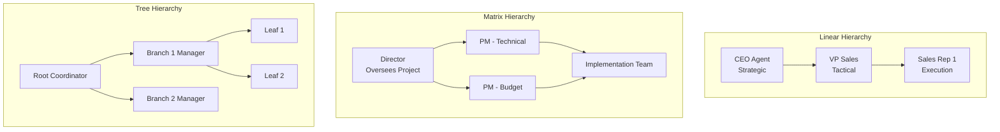

# Agent Delegation Hierarchy

## Overview

Delegation hierarchies enable complex problem-solving through coordinated agent teams with explicit authority relationships. Unlike peer-to-peer networks, hierarchical structures assign clear responsibility, establish escalation paths, and distribute computational load. This guide covers designing and implementing effective delegation structures for multi-agent systems.

## Hierarchy Types and Use Cases



## Designing Hierarchical Authority

### 1. Authority Assignment

Explicitly define what each agent can decide vs. must escalate:

```yaml
agent_authorization_matrix:
  agent_type: "junior_support_agent"
  authorization_level: 1
  autonomous_decision_authority:
    - refund_amount_max: 50
    - issue_types_resolvable: ["password_reset", "account_unlock", "billing_inquiry"]
    - customer_segments_supported: ["regular_users"]
    - resolution_time_target_minutes: 5
  escalation_triggers:
    - refund_amount_above: 50
    - issue_outside_resolvable_types: true
    - vip_customer_detected: true
    - satisfaction_likely_below: 0.7
  escalation_target: "senior_support_agent"

  senior_support_agent:
    authorization_level: 2
    autonomous_decision_authority:
      - refund_amount_max: 500
      - issue_types_resolvable: ["all_standard"]
      - customer_segments_supported: ["all"]
      - resolution_time_target_minutes: 15
    escalation_triggers:
      - refund_amount_above: 500
      - issue_type: "legal_implication"
      - customer_churn_risk_high: true
      - satisfaction_likely_below: 0.5
    escalation_target: "manager_agent"

  manager_agent:
    authorization_level: 3
    autonomous_decision_authority:
      - refund_amount_max: 5000
      - issue_types_resolvable: ["all"]
      - customer_segments_supported: ["all"]
      - exceptions_handling: true
    escalation_triggers:
      - refund_amount_above: 5000
      - policy_exception_required: true
      - legal_consultation_needed: true
    escalation_target: "director_agent"
```

### 2. Escalation Protocols

Define when and how escalation occurs:

```python
def escalate_issue(
    current_agent,
    issue_context,
    escalation_reason
):
    """
    Escalate issue up the hierarchy with full context
    """

    # Determine if escalation is justified
    escalation_decision = current_agent.evaluate_escalation_need(
        issue_context,
        escalation_reason
    )

    if not escalation_decision.should_escalate:
        return current_agent.attempt_resolution(issue_context)

    # Build escalation package
    escalation_package = {
        'originating_agent': current_agent.agent_id,
        'timestamp': now(),
        'escalation_reason': escalation_reason,
        'issue_context': issue_context,
        'attempts_made': current_agent.resolution_attempts,
        'confidence_score': current_agent.confidence_in_resolution,
        'recommended_handling': current_agent.recommended_approach,
        'customer_impact': issue_context.estimated_customer_impact,
        'time_to_resolution': escalation_decision.estimated_time_if_escalated,
        'audit_trail': current_agent.decision_log
    }

    # Route to appropriate higher agent
    higher_agent = determine_escalation_target(
        current_agent.authorization_level,
        escalation_reason,
        issue_context.priority
    )

    # Escalate with full context preservation
    result = higher_agent.handle_escalated_issue(
        escalation_package
    )

    # Log escalation for analysis
    log_escalation_metrics(
        from_agent=current_agent.agent_id,
        to_agent=higher_agent.agent_id,
        reason=escalation_reason,
        resolution_time=result.resolution_time,
        successful_resolution=result.success
    )

    return result
```

## Hierarchical Decision Making

### Multi-Level Approval Workflows

```yaml
purchase_approval_workflow:
  request_amount: "$100,000"
  approval_chain:
    - level: 1
      agent: "departmental_manager"
      authority_limit: "$25,000"
      decision_time_hours: 4
      decision: "requires_escalation"

    - level: 2
      agent: "director"
      authority_limit: "$250,000"
      decision_time_hours: 8
      decision: "requires_escalation"

    - level: 3
      agent: "vp_finance"
      authority_limit: "$1,000,000"
      decision_time_hours: 24
      decision: "approved"

  parallel_authority_paths:
    # For time-sensitive requests
    - path: "expedited"
      agents: ["department_head", "cfo"]
      total_approval_time: 4
      authorization_requirement: "both_must_approve"
```

## Responsibility Assignment in Hierarchies

Define clear ownership at each level:

```python
class HierarchicalAgentResponsibility:
    def __init__(self, agent_id, hierarchy_level):
        self.agent_id = agent_id
        self.hierarchy_level = hierarchy_level

        # Responsibility definitions
        self.direct_responsibilities = []
        self.delegated_responsibilities = []
        self.oversight_responsibilities = []

    def add_responsibility(self, responsibility_type, scope):
        """
        responsibility_type: 'direct', 'delegated', 'oversight'
        """
        if responsibility_type == 'direct':
            # This agent makes decisions and takes action
            self.direct_responsibilities.append(scope)

        elif responsibility_type == 'delegated':
            # This agent can delegate to lower agents
            self.delegated_responsibilities.append(scope)

        elif responsibility_type == 'oversight':
            # This agent monitors and reviews lower agents' work
            self.oversight_responsibilities.append(scope)

    def can_decide(self, decision_type):
        """Check if agent has authority for this decision"""
        return decision_type in self.direct_responsibilities

    def can_delegate(self, decision_type):
        """Check if agent can delegate this decision"""
        return decision_type in self.delegated_responsibilities

    def must_review(self, decision_type):
        """Check if agent must review decisions of this type"""
        return decision_type in self.oversight_responsibilities

# Example usage
junior_support = HierarchicalAgentResponsibility('support_001', 1)
junior_support.add_responsibility('direct', 'password_resets')
junior_support.add_responsibility('direct', 'account_unlocks')

senior_support = HierarchicalAgentResponsibility('support_manager_001', 2)
senior_support.add_responsibility('direct', 'refund_decisions')
senior_support.add_responsibility('delegated', 'password_resets')
senior_support.add_responsibility('oversight', 'all_support_interactions')
```

## Information Flow in Hierarchies

Manage upward and downward information flow:

```yaml
information_flow_matrix:
  downward_flow:
    strategy_communication:
      from: "ceo_agent"
      to: ["vp_agent_1", "vp_agent_2"]
      frequency: "quarterly"
      information_type: "strategic_goals"

    tactical_direction:
      from: "vp_agent"
      to: ["manager_agent_1", "manager_agent_2"]
      frequency: "weekly"
      information_type: "operational_directives"

    task_assignment:
      from: "manager_agent"
      to: ["executor_agent_1", "executor_agent_2"]
      frequency: "daily"
      information_type: "specific_tasks"

  upward_flow:
    progress_reporting:
      from: ["executor_agent_1", "executor_agent_2"]
      to: "manager_agent"
      frequency: "daily"
      information_type: "task_completion_status"
      required_metrics:
        - completion_percentage
        - quality_score
        - exceptions_encountered

    exception_escalation:
      from: "any_agent"
      to: "immediate_superior"
      frequency: "real_time"
      information_type: "issues_requiring_higher_authority"

    performance_aggregation:
      from: "manager_agent"
      to: "vp_agent"
      frequency: "weekly"
      information_type: "team_metrics_aggregated"

  horizontal_flow:
    peer_coordination:
      between: "agents_same_level"
      frequency: "as_needed"
      information_type: "shared_context"
      constraint: "escalate_conflicts_to_superior"
```

## Load Balancing Across Hierarchy Levels

Distribute work to avoid bottlenecks:

```python
def distribute_workload_across_hierarchy(
    incoming_requests,
    agent_hierarchy,
    load_balancing_strategy='least_loaded'
):
    """
    Distribute incoming work across agents at appropriate levels
    """

    # Categorize requests by complexity
    simple_requests = []
    standard_requests = []
    complex_requests = []

    for request in incoming_requests:
        complexity = assess_request_complexity(request)

        if complexity.score < 0.3:
            simple_requests.append(request)
        elif complexity.score < 0.7:
            standard_requests.append(request)
        else:
            complex_requests.append(request)

    # Assign to appropriate hierarchy level
    results = {
        'simple': assign_to_level(
            simple_requests,
            agent_hierarchy.level_1,  # Junior agents
            load_balancing_strategy
        ),
        'standard': assign_to_level(
            standard_requests,
            agent_hierarchy.level_2,  # Senior agents
            load_balancing_strategy
        ),
        'complex': assign_to_level(
            complex_requests,
            agent_hierarchy.level_3,  # Manager agents
            load_balancing_strategy
        )
    }

    return results
```

## Practical Example: Customer Service Hierarchy

Structure a support team with clear delegation:

```
CEO Agent (Policy)
└── Support Director
    ├── Support Manager 1 (US)
    │   ├── Senior Agent (Billing)
    │   ├── Senior Agent (Technical)
    │   └── 5 Junior Agents
    └── Support Manager 2 (EMEA)
        ├── Senior Agent (Billing)
        ├── Senior Agent (Technical)
        └── 5 Junior Agents

Typical customer request flow:
1. Incoming request → Route to appropriate junior agent
2. If junior can't resolve within 5 min → Escalate to senior
3. If senior can't resolve within 15 min → Escalate to manager
4. If manager can't resolve → Escalate to director
5. If policy interpretation required → Director consults CEO agent
```

## Performance Monitoring in Hierarchies

Track metrics at each hierarchy level:

```json
{
  "hierarchy_performance_dashboard": {
    "timestamp": "2026-03-19T14:30:00Z",
    "level_1_metrics": {
      "agents_active": 15,
      "avg_cases_per_agent": 8,
      "resolution_rate_percent": 65,
      "avg_resolution_time_minutes": 5,
      "customer_satisfaction": 0.82,
      "escalation_rate_percent": 35
    },
    "level_2_metrics": {
      "agents_active": 5,
      "avg_cases_per_agent": 20,
      "resolution_rate_percent": 85,
      "avg_resolution_time_minutes": 15,
      "customer_satisfaction": 0.88,
      "escalation_rate_percent": 15
    },
    "level_3_metrics": {
      "agents_active": 1,
      "avg_cases_per_agent": 50,
      "resolution_rate_percent": 95,
      "avg_resolution_time_minutes": 30,
      "customer_satisfaction": 0.92,
      "escalation_rate_percent": 5
    },
    "bottleneck_analysis": {
      "level_with_highest_wait_time": "level_2",
      "recommended_action": "hire_additional_senior_agent"
    }
  }
}
```

## Performance Metrics for Hierarchical Agents

| Metric | Target | Measurement |
|--------|--------|---|
| **Average Escalation Rate** | 25-35% | Healthy distribution |
| **Response Time by Level** | 5min/15min/30min | Level 1/2/3 |
| **First Contact Resolution** | 65%+ at Level 1 | Training effectiveness |
| **Escalation Justification Rate** | 95%+ | Decision quality |
| **Bottleneck Detection** | <2 hour wait | Workload balancing |

🔗 **Related Topics**: [Specialization Patterns](AGENT_SPECIALIZATION_PATTERNS.md) | [Team Composition](AGENT_TEAM_COMPOSITION.md) | [Role Rotation](AGENT_ROLE_ROTATION.md) | [Conflict Resolution](AGENT_CONFLICT_RESOLUTION.md) | [Knowledge Sharing](AGENT_KNOWLEDGE_SHARING.md)
