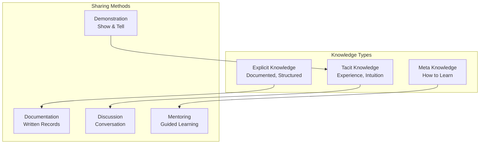

# Agent Knowledge Sharing

## Overview

Knowledge sharing enables agents to learn from each other's experiences, insights, and discoveries. Effective knowledge sharing mechanisms prevent knowledge silos, accelerate learning, and improve collective intelligence. This guide covers designing knowledge repositories, facilitating exchanges, and measuring knowledge transfer effectiveness.

## Knowledge Sharing Mechanisms



## Knowledge Repository Structure

```yaml
knowledge_repository:
  organization: "multi_tiered"
  tiers:
    - tier: "core_knowledge"
      content:
        - domain_fundamentals
        - standard_procedures
        - decision_frameworks
        - best_practices
      ownership: "knowledge_team"
      update_frequency: "quarterly"
      versioning: "strict"

    - tier: "specialist_knowledge"
      content:
        - deep_expertise_by_domain
        - advanced_techniques
        - edge_case_handling
        - expert_insights
      ownership: "specialist_agents"
      update_frequency: "monthly"
      contribution: "by_nominated_experts"

    - tier: "collaborative_knowledge"
      content:
        - peer_discoveries
        - lessons_learned
        - tips_and_tricks
        - cautionary_tales
      ownership: "all_agents"
      update_frequency: "continuous"
      contribution: "by_any_agent"

  structure:
    domains:
      - domain_name: "financial_analysis"
        sub_areas: ["valuation", "risk_assessment", "compliance"]
        expert_owners: ["analyst_001", "analyst_002"]

    decision_trees:
      - decision_name: "loan_approval_criteria"
        version: 3.2
        last_updated: "2026-01-15"
        success_rate: 0.94

    case_studies:
      - case_id: "case_2025_07_001"
        domain: "healthcare"
        challenge: "complex_diagnosis"
        solution: "multi_agent_collaboration"
        outcome: "positive"
        lessons: ["value_of_consensus", "importance_of_data_quality"]
```

## Knowledge Exchange Protocols

```python
def facilitate_knowledge_exchange(
    knowledge_type,
    participating_agents
):
    """
    Facilitate structured knowledge exchange
    """

    exchange = {
        'session_id': generate_session_id(),
        'knowledge_type': knowledge_type,
        'participants': participating_agents,
        'format': determine_format(knowledge_type),
        'duration': determine_duration(len(participating_agents))
    }

    # Step 1: Prepare knowledge for sharing
    prepared_knowledge = []
    for agent in participating_agents:
        knowledge_items = agent.identify_shareable_knowledge(knowledge_type)
        prepared_items = agent.prepare_for_sharing(knowledge_items)
        prepared_knowledge.append(prepared_items)

    # Step 2: Facilitate exchange
    if knowledge_type == 'explicit':
        # Document-based exchange
        exchange_result = facilitate_documentation_sharing(
            prepared_knowledge,
            review_process=True,
            quality_check=True
        )

    elif knowledge_type == 'tacit':
        # Discussion-based exchange
        exchange_result = facilitate_discussion(
            participants=participating_agents,
            discussion_format='structured_conversation',
            moderator=assign_moderator(),
            record=True
        )

    elif knowledge_type == 'meta':
        # Mentoring exchange
        exchange_result = facilitate_mentoring_session(
            mentor=identifying_expert(participating_agents),
            mentees=other_agents(participating_agents),
            duration_minutes=60,
            focus_area=knowledge_type
        )

    # Step 3: Capture insights
    insights = capture_exchange_insights(exchange_result)

    # Step 4: Integrate into knowledge repository
    integrate_into_repository(insights, knowledge_type)

    return exchange_result
```

## Knowledge Quality Control

```yaml
knowledge_quality_framework:
  validation_criteria:
    - accuracy:
        target: 0.95  # 95% accuracy threshold
        verification: "peer_review_by_experts"
        testing: "validated_against_known_outcomes"

    - clarity:
        target: "understandable_by_target_audience"
        verification: "readability_assessment"
        examples: "at_least_3_per_concept"

    - completeness:
        target: "covers_major_use_cases"
        verification: "completeness_checklist"
        missing_items: "documented_as_future_work"

    - currency:
        target: "reflects_latest_best_practices"
        last_review_months_ago: "max_6"
        version_control: "tracked"

    - applicability:
        target: "relevant_and_useful"
        feedback_score: "minimum_4.0_of_5"
        usage_tracking: "monitored"

  review_process:
    - submission: "agent_proposes_knowledge"
    - peer_review: "2_agents_from_domain"
    - expert_validation: "senior_agent_or_external"
    - final_approval: "knowledge_team"
    - publication: "to_repository"

  maintenance:
    - quarterly_review: "flag_outdated_content"
    - annual_refresh: "comprehensive_update"
    - user_feedback_loop: "continuous"
```

## Knowledge Measurement

```python
def measure_knowledge_sharing_effectiveness(
    time_period_months=3
):
    """
    Measure effectiveness of knowledge sharing program
    """

    metrics = {
        'knowledge_contribution_rate': calculate_contribution_rate(),
        'knowledge_consumption_rate': calculate_consumption_rate(),
        'knowledge_application_rate': calculate_application_rate(),
        'knowledge_quality_score': calculate_quality_score(),
        'knowledge_currency_score': calculate_currency_score()
    }

    # Calculate aggregate effectiveness
    effectiveness_score = (
        metrics['knowledge_contribution_rate'] * 0.20 +
        metrics['knowledge_consumption_rate'] * 0.20 +
        metrics['knowledge_application_rate'] * 0.40 +
        metrics['knowledge_quality_score'] * 0.15 +
        metrics['knowledge_currency_score'] * 0.05
    )

    # Identify gaps
    gaps = identify_knowledge_gaps()
    underutilized = identify_underutilized_knowledge()

    return {
        'overall_effectiveness': effectiveness_score,
        'detailed_metrics': metrics,
        'gaps_identified': gaps,
        'recommendations': generate_recommendations(gaps, underutilized)
    }
```

## Knowledge Sharing Tools and Platforms

```yaml
knowledge_sharing_tools:
  documentation_platform:
    features:
      - version_control: true
      - collaboration_editing: true
      - search_capability: "full_text"
      - tagging_system: "multi_label"
      - access_control: "role_based"
    tools: ["Wiki", "Confluence", "Notion"]

  discussion_forum:
    features:
      - async_discussion: true
      - threading: true
      - expert_tagging: true
      - topic_categorization: true
      - notification_system: true
    tools: ["Slack", "Discord", "MS Teams"]

  knowledge_base:
    features:
      - semantic_search: true
      - category_browsing: true
      - related_items: "automatically_suggested"
      - usage_analytics: true
      - feedback_collection: true
    tools: ["Zendesk", "Freshdesk", "GitBook"]

  case_study_repository:
    features:
      - structured_case_format: true
      - outcome_tracking: true
      - lesson_extraction: true
      - similar_case_recommendation: true
    tools: ["custom_built", "internal_database"]
```

## Knowledge Sharing Incentives

```yaml
incentive_structure:
  contribution_recognition:
    - published_knowledge_pieces: "visible_credit"
    - expert_designation: "based_on_contributions"
    - peer_acknowledgment: "appreciated_publicly"

  career_advancement:
    - knowledge_sharing: "factor_in_promotion"
    - mentoring: "recognized_accomplishment"
    - expertise_building: "valued_progression"

  performance_evaluation:
    - knowledge_contribution_weight: 0.15  # 15% of evaluation
    - knowledge_quality_weight: 0.10      # 10% of evaluation
    - peer_feedback_on_sharing: "collected"

  rewards:
    - high_contributors: "recognized_quarterly"
    - quality_improvements: "incentivized"
    - cross_domain_sharing: "bonus_multiplier"

  transparency:
    - contribution_tracking: "public"
    - impact_measurement: "visible"
    - recognition_visible: "to_all_agents"
```

## Practical Example: Lessons Learned Capture

```python
def capture_lessons_learned_from_case(case_id, agents_involved):
    """
    Systematically capture lessons from completed cases
    """

    case = get_case(case_id)

    # Debrief agents
    debrief_sessions = conduct_debrief_with_agents(agents_involved)

    # Extract lessons
    lessons = {
        'what_went_well': debrief_sessions.get_successes(),
        'what_could_improve': debrief_sessions.get_improvements(),
        'surprising_discoveries': debrief_sessions.get_surprises(),
        'decision_points': debrief_sessions.get_decision_analysis()
    }

    # Document lessons
    lessons_document = {
        'case_id': case_id,
        'date': now(),
        'agents_involved': agents_involved,
        'domain': case.domain,
        'complexity_level': case.complexity,
        'outcome': case.outcome,
        'lessons': lessons,
        'applicability': identify_applicable_domains(lessons),
        'recommended_actions': recommend_process_improvements(lessons)
    }

    # Share with organization
    publish_lesson_learned(lessons_document)

    # Track impact
    track_lesson_impact(lessons_document.id)
```

## Performance Metrics for Knowledge Sharing

| Metric | Target | Measurement |
|--------|--------|---|
| **Knowledge Contribution Rate** | >80% agents contributing | Documents submitted/quarter |
| **Knowledge Consumption Rate** | >90% knowledge items accessed | Views tracked per item |
| **Application Rate** | >60% of knowledge applied | Post-action surveys |
| **Quality Score** | >4.0 of 5.0 | Peer reviews |
| **Search Success Rate** | >80% find-on-first-try | Search analytics |

🔗 **Related Topics**: [Continuous Learning](AGENT_CONTINUOUS_LEARNING.md) | [Skill Development](AGENT_SKILL_DEVELOPMENT.md) | [Role Rotation](AGENT_ROLE_ROTATION.md) | [Conflict Resolution](AGENT_CONFLICT_RESOLUTION.md) | [Performance Metrics](AGENT_PERFORMANCE_METRICS.md)
