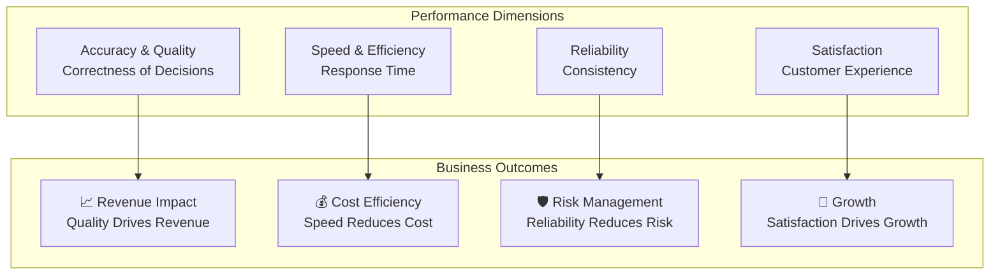

# Agent Performance Metrics

## Overview

Performance metrics quantify agent effectiveness across multiple dimensions including accuracy, speed, efficiency, and customer satisfaction. Comprehensive metrics enable data-driven optimization, fair evaluation, and continuous improvement. This guide covers defining, measuring, and acting on agent performance metrics.

## Core Performance Dimensions



## Metric Definition Framework

```yaml
performance_metric_template:
  metric_name: "first_contact_resolution_rate"
  dimension: "quality"
  definition: "Percentage of customer issues resolved without escalation"
  formula: "(issues_resolved_on_first_contact / total_issues_handled) * 100"

  measurement:
    frequency: "daily"
    granularity: "per_agent"
    data_sources: ["case_management_system", "customer_feedback"]

  targets:
    industry_benchmark: 0.75
    our_target: 0.82
    stretch_target: 0.90

  tracking:
    dashboard: "real_time"
    alerts_threshold: 0.70  # Alert if drops below
    trending: "30_day_rolling_average"

  improvement_factors:
    - training_on_faq
    - access_to_knowledge_base
    - authority_to_make_decisions
    - tools_and_systems_quality

  consequences:
    high_performance: "recognition_bonus"
    low_performance: "coaching_plan"
```

## Key Performance Indicators by Domain

### Customer Support Domain

```yaml
support_kpis:
  quality_metrics:
    - first_contact_resolution: 0.82
    - customer_satisfaction_csat: 0.85
    - net_promoter_score_nps: 45
    - accuracy_of_solution: 0.92

  speed_metrics:
    - average_handle_time_minutes: 5.2
    - time_to_first_response_minutes: 1.5
    - average_wait_time_minutes: 2.1
    - resolution_time_hours: 24

  efficiency_metrics:
    - calls_handled_per_day: 25
    - cost_per_call: 8.50
    - wrap_up_time_minutes: 1.2
    - availability_percent: 0.95

  reliability_metrics:
    - consistency_score: 0.88
    - adherence_to_schedule_percent: 0.92
    - quality_assurance_score: 0.89
    - error_rate_percent: 0.03
```

### Sales Domain

```yaml
sales_kpis:
  output_metrics:
    - calls_per_day: 30
    - meetings_set_per_day: 3
    - proposals_sent_per_month: 12
    - deals_closed_per_month: 4

  conversion_metrics:
    - call_to_meeting_rate: 0.10
    - proposal_to_deal_rate: 0.33
    - sales_cycle_days: 45
    - win_rate_against_competition: 0.35

  quality_metrics:
    - average_deal_size: 25000
    - customer_retention_rate: 0.85
    - repeat_business_rate: 0.60
    - customer_satisfaction: 0.80

  efficiency_metrics:
    - revenue_per_agent: 300000
    - cost_of_sales_percent: 0.15  # % of revenue
    - pipeline_to_quota_ratio: 2.5
    - activity_per_opportunity: 8
```

## Performance Measurement Implementation

```python
def calculate_agent_performance_score(agent_id, period_days=30):
    """
    Calculate comprehensive performance score for agent
    """

    agent = get_agent(agent_id)
    performance_data = get_performance_data(agent_id, days=period_days)

    # Define weighted metrics
    metrics = {
        'accuracy': {
            'value': calculate_accuracy(performance_data),
            'weight': 0.35,
            'target': 0.95
        },
        'speed': {
            'value': calculate_speed(performance_data),
            'weight': 0.25,
            'target': 0.90
        },
        'reliability': {
            'value': calculate_reliability(performance_data),
            'weight': 0.20,
            'target': 0.95
        },
        'customer_satisfaction': {
            'value': calculate_satisfaction(performance_data),
            'weight': 0.20,
            'target': 0.85
        }
    }

    # Calculate weighted score
    weighted_score = sum(
        metric['value'] * metric['weight'] / metric['target']
        for metric in metrics.values()
    ) / len(metrics)

    # Cap at 1.0
    weighted_score = min(weighted_score, 1.0)

    # Classify performance
    performance_class = classify_performance(weighted_score)

    return {
        'agent_id': agent_id,
        'overall_score': weighted_score,
        'performance_class': performance_class,
        'metric_breakdown': metrics,
        'comparison_to_team': compare_to_team(agent_id, metrics),
        'trends': analyze_trends(agent_id, period_days),
        'recommendations': generate_improvement_recommendations(metrics)
    }
```

## Performance Classes

```yaml
performance_classification:
  classes:
    - class: "exceptional"
      score_range: [0.90, 1.0]
      description: "Exceeds expectations significantly"
      actions:
        - recognition_bonus: 20_percent
        - advancement_consideration: true
        - mentoring_role: "assign_mentee"

    - class: "exceeds_expectations"
      score_range: [0.80, 0.90]
      description: "Consistently exceeds targets"
      actions:
        - recognition_bonus: 10_percent
        - advancement_consideration: true

    - class: "meets_expectations"
      score_range: [0.70, 0.80]
      description: "Meets performance standards"
      actions:
        - bonus: "standard_50_percent"
        - coaching: "optional"

    - class: "below_expectations"
      score_range: [0.60, 0.70]
      description: "Not consistently meeting targets"
      actions:
        - coaching_plan: "required"
        - performance_monitoring: "monthly"
        - improvement_timeline: "90_days"

    - class: "needs_immediate_attention"
      score_range: [0.0, 0.60]
      description: "Significant performance issues"
      actions:
        - intensive_coaching: "required"
        - performance_improvement_plan: "formal"
        - monitoring_frequency: "weekly"
        - escalation_timeline: "30_days"
```

## Real-Time Performance Dashboards

```json
{
  "agent_performance_dashboard": {
    "agent_id": "analyzer_001",
    "period": "2026-03-19",
    "current_shift": "morning",
    "overall_score": 0.88,
    "performance_class": "exceeds_expectations",
    "metrics": {
      "accuracy": {
        "current": 0.94,
        "target": 0.95,
        "variance": -0.01,
        "trend": "stable",
        "status": "green"
      },
      "speed": {
        "current": 0.91,
        "target": 0.90,
        "variance": 0.01,
        "trend": "improving",
        "status": "green"
      },
      "reliability": {
        "current": 0.88,
        "target": 0.95,
        "variance": -0.07,
        "trend": "degrading",
        "status": "yellow",
        "alert": "Schedule adherence declining"
      },
      "satisfaction": {
        "current": 0.86,
        "target": 0.85,
        "variance": 0.01,
        "trend": "stable",
        "status": "green"
      }
    },
    "current_shift_activity": {
      "cases_handled": 12,
      "average_resolution_time_minutes": 4.8,
      "customer_satisfaction_today": 0.87,
      "errors_today": 0
    },
    "week_to_date": {
      "cases_handled": 48,
      "weekly_accuracy": 0.95,
      "weekly_speed": 0.92,
      "on_track_for_targets": true
    },
    "recommendations": [
      "Maintain current accuracy level",
      "Address schedule adherence issues",
      "Continue strong customer satisfaction results"
    ]
  }
}
```

## Metric Benchmarking

Compare agent performance against benchmarks:

```python
def benchmark_agent_performance(agent_id, peer_group):
    """
    Compare agent metrics against peer group
    """

    agent_metrics = get_agent_metrics(agent_id)
    peer_metrics = get_peer_group_metrics(peer_group)

    benchmark_analysis = {
        'agent_id': agent_id,
        'peer_group': peer_group,
        'metrics_comparison': {}
    }

    for metric_name, agent_value in agent_metrics.items():
        peer_distribution = peer_metrics[metric_name]
        percentile = calculate_percentile(
            agent_value,
            peer_distribution
        )

        benchmark_analysis['metrics_comparison'][metric_name] = {
            'agent_value': agent_value,
            'peer_median': peer_distribution['median'],
            'peer_mean': peer_distribution['mean'],
            'peer_std_dev': peer_distribution['std_dev'],
            'percentile_rank': percentile,
            'classification': 'above_average' if percentile > 0.50 else 'below_average'
        }

    return benchmark_analysis
```

## Performance Improvement Plans

When metrics fall below expectations:

```yaml
performance_improvement_plan:
  trigger: "performance_score < 0.70"
  duration: "90_days"

  components:
    - goal_setting:
        smart_goals: true
        specific_metrics: 3
        timeline: "30_60_90_days"

    - coaching:
        frequency: "weekly"
        focus: "underperforming_areas"
        coach: "senior_agent_or_manager"

    - skill_development:
        training_hours: 10
        areas: "specific_weaknesses"

    - monitoring:
        frequency: "bi_weekly"
        metrics_tracked: "daily"

    - support:
        additional_resources: true
        tool_improvements: true
        workload_adjustment: "if_needed"

  success_criteria:
    - reach_target_score: 0.75
    - demonstrate_improvement_trajectory: true
    - positive_feedback_from_customers: true

  outcomes:
    - success: "return_to_standard_monitoring"
    - continued_below_target: "escalation_to_management"
```

## Performance Metrics by Domain

| Domain | Key Metric 1 | Key Metric 2 | Key Metric 3 |
|--------|---|---|---|
| **Support** | FCR Rate 82% | CSAT 85% | AHT <6 min |
| **Sales** | Win Rate 35% | Deal Size $25k | Cycle 45 days |
| **Medical** | Diagnosis Accuracy 96% | Patient Satisfaction 90% | Turnaround <4h |
| **Legal** | Accuracy 98% | Client Satisfaction 85% | Document Turnaround <2d |

🔗 **Related Topics**: [Burnout Prevention](AGENT_BURNOUT_PREVENTION.md) | [Continuous Learning](AGENT_CONTINUOUS_LEARNING.md) | [Team Composition](AGENT_TEAM_COMPOSITION.md) | [Skill Development](AGENT_SKILL_DEVELOPMENT.md) | [Role Rotation](AGENT_ROLE_ROTATION.md)
