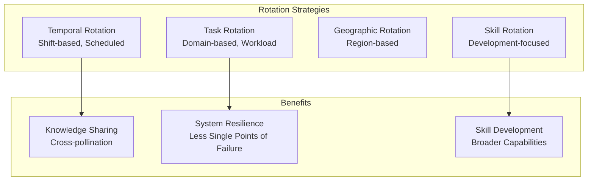

# Agent Role Rotation

## Overview

Role rotation refers to systematically changing agent responsibilities, domains, or positions to prevent specialization bias, distribute workload, and develop diverse capabilities. Unlike fixed assignments, rotation patterns improve system resilience, reduce burnout, and create knowledge sharing. This guide covers designing rotation schedules and managing role transitions.

## Rotation Types and Timing



## Designing Rotation Schedules

### 1. Temporal Rotation (Shift-Based)

Agents rotate through different time zones or shift patterns:

```yaml
temporal_rotation_schedule:
  agent: "analyzer_001"
  rotation_type: "shift_rotation"
  schedule:
    - period: "week_1_to_4"
      shift: "morning"  # 6am-2pm UTC
      region: "north_america"
      tasks: ["fast_moving_issues"]

    - period: "week_5_to_8"
      shift: "afternoon"  # 2pm-10pm UTC
      region: "europe"
      tasks: ["standard_processing"]

    - period: "week_9_to_12"
      shift: "night"  # 10pm-6am UTC
      region: "asia_pacific"
      tasks: ["batch_processing"]

  rotation_benefits:
    - work_life_balance: "distributed_across_time_zones"
    - availability: "24/7_coverage_maintained"
    - agent_rest: "prevents_fatigue_from_single_shift"

  transition_protocol:
    - handoff_meeting: "30_minutes"
    - knowledge_transfer: "previous_shift_brief"
    - buffer_time: "no_immediate_handoff"
```

### 2. Task Rotation (Domain-Based)

Agents rotate through different problem domains:

```yaml
task_rotation_schedule:
  agent: "support_agent_003"
  rotation_duration_months: 3

  rotation_path:
    - quarter: "Q1"
      domain: "billing"
      complexity: "medium"
      volume: "high"
      skills_developed: ["financial_analysis", "regulatory_knowledge"]

    - quarter: "Q2"
      domain: "technical"
      complexity: "high"
      volume: "medium"
      skills_developed: ["architecture_knowledge", "troubleshooting"]

    - quarter: "Q3"
      domain: "account_management"
      complexity: "medium"
      volume: "medium"
      skills_developed: ["relationship_management", "business_acumen"]

    - quarter: "Q4"
      domain: "special_projects"
      complexity: "high"
      volume: "low"
      skills_developed: ["problem_solving", "cross_functional_work"]

  expectations_at_rotation:
    - current_domain_handoff: "comprehensive"
    - incoming_domain_onboarding: "2_week_overlap"
    - knowledge_documentation: "updated_for_successor"
```

## Rotation Implementation

```python
def execute_role_rotation(
    agent_id,
    rotation_schedule
):
    """
    Execute planned role rotation for an agent
    """

    agent = get_agent(agent_id)
    current_rotation_period = rotation_schedule.current_period

    # Step 1: Notify stakeholders
    notify_all_stakeholders(
        agent_id=agent_id,
        new_role=rotation_schedule.next_role,
        effective_date=rotation_schedule.next_start_date,
        notice_days=14
    )

    # Step 2: Identify knowledge to transfer
    knowledge_to_transfer = identify_critical_knowledge(
        agent.current_domain,
        agent.active_cases,
        agent.specialized_skills
    )

    # Step 3: Identify successor
    successor = identify_qualified_successor(
        target_domain=agent.current_domain,
        capability_level='intermediate_or_above',
        development_goals='includes_current_domain'
    )

    # Step 4: Begin overlap period
    overlap_duration_days = 14
    begin_overlap_period(
        current_agent=agent,
        successor=successor,
        duration=overlap_duration_days,
        activities=[
            'case_shadowing',
            'knowledge_transfer_sessions',
            'relationship_handoff_with_customers'
        ]
    )

    # Step 5: Complete rotation
    complete_rotation(
        agent=agent,
        new_role=rotation_schedule.next_role,
        successor=successor,
        archival_of_work=knowledge_to_transfer
    )

    # Step 6: Monitor transition
    monitor_transition_metrics(
        agent_id=agent_id,
        period_days=30,
        metrics=[
            'new_role_proficiency',
            'successor_capability',
            'customer_satisfaction_delta'
        ]
    )

    return {
        'rotation_status': 'completed',
        'agent_new_role': rotation_schedule.next_role,
        'transition_quality': evaluate_transition_quality()
    }
```

## Knowledge Transfer During Rotation

Ensure critical knowledge transfers from outgoing to incoming agent:

```yaml
knowledge_transfer_protocol:
  phases:
    - phase: "pre_rotation_planning"
      duration_days: 7
      activities:
        - document_critical_procedures
        - identify_key_relationships
        - catalog_open_items
        - create_checklists

    - phase: "overlap_period"
      duration_days: 14
      outgoing_agent_responsibilities: 0.5  # 50% focus on new role
      incoming_agent_responsibilities: 0.5  # 50% focus on current role
      joint_activities:
        - daily_standup_15min
        - customer_introduction
        - case_handoff_meeting
        - decision_framework_discussion

    - phase: "post_rotation_support"
      duration_days: 30
      outgoing_agent_availability: "on_call_for_questions"
      check_in_frequency: "weekly"
      goal: "incoming_agent_independent_within_30_days"

  knowledge_transfer_methods:
    - documentation:
        format: "markdown_with_examples"
        completeness: "step_by_step_procedures"
        validation: "successor_walkthrough"
    - synchronous_training:
        format: "paired_programming_style"
        frequency: "daily_30min_sessions"
        topics: "decision_trees_and_edge_cases"
    - reference_materials:
        format: "video_recordings"
        topics: "common_scenarios_and_resolutions"
        availability: "24_7_async_access"
```

## Measuring Rotation Success

Track metrics to ensure rotation effectiveness:

```json
{
  "rotation_success_metrics": {
    "agent_id": "analyzer_001",
    "rotation_from": "billing_domain",
    "rotation_to": "technical_support",
    "rotation_date": "2026-03-01",
    "measurement_period": "30_days_post_rotation",
    "metrics": {
      "new_role_proficiency": {
        "target": 0.80,
        "measured": 0.82,
        "status": "exceeded"
      },
      "customer_satisfaction_delta": {
        "previous_role_avg": 0.88,
        "new_role_initial": 0.85,
        "change_percent": -3.4,
        "status": "acceptable_during_transition"
      },
      "successor_capability": {
        "days_to_independence": 18,
        "target_days": 21,
        "status": "ahead_of_schedule"
      },
      "knowledge_transfer_completeness": {
        "critical_items_transferred": 48,
        "critical_items_total": 50,
        "completion_percent": 0.96,
        "status": "complete"
      },
      "error_rate_new_role": {
        "initial_errors_per_100_cases": 4.2,
        "target_errors_per_100_cases": 2.0,
        "trajectory": "improving_toward_target"
      }
    }
  }
}
```

## Rotation Schedule Management

```python
def manage_rotation_schedule(organization_level='team'):
    """
    Manage all rotations for team or organization
    """

    rotations = get_scheduled_rotations(organization_level)

    rotation_calendar = {
        'next_30_days': [],
        'next_90_days': [],
        'next_year': []
    }

    for rotation in rotations:
        if rotation.scheduled_date <= now() + timedelta(days=30):
            rotation_calendar['next_30_days'].append(rotation)
        elif rotation.scheduled_date <= now() + timedelta(days=90):
            rotation_calendar['next_90_days'].append(rotation)
        else:
            rotation_calendar['next_year'].append(rotation)

    # Identify potential conflicts
    conflicts = identify_rotation_conflicts(rotation_calendar)

    if conflicts:
        reschedule_for_conflict_resolution(conflicts)

    # Prepare succession planning
    for rotation in rotation_calendar['next_30_days']:
        prepare_rotation(
            agent=rotation.agent,
            target_role=rotation.next_role,
            successor=identify_successor(rotation.current_role)
        )

    return rotation_calendar
```

## Practical Example: Agent Development Path

Design rotation paths for career development:

```
Year 1: Individual Contributor
├── Q1: Domain A (Billing)
├── Q2: Domain B (Technical)
├── Q3: Domain A (Billing - Advanced)
└── Q4: Special Projects

Year 2: Team Lead
├── Q1-Q2: Lead billing team (overlapping with individual cases)
├── Q3-Q4: Lead technical team

Year 3: Manager
├── Oversee multiple teams
├── Strategic planning focus
└── Mentoring focus

Competency development through rotation:
- Domain expertise: 3 separate domains
- Team leadership: 2 team lead rotations
- Strategic thinking: Special projects exposure
```

## Performance Metrics for Agent Rotation

| Metric | Target | Measurement |
|--------|--------|---|
| **Rotation Frequency** | 1 per 3-6 months | Career development |
| **Time to Proficiency** | <30 days | Transition effectiveness |
| **Knowledge Transfer Rate** | >95% | Successor capability |
| **Customer Satisfaction Stability** | ±3% during rotation | Service continuity |
| **Retention Rate** | >90% 1 year post-rotation | Career engagement |

🔗 **Related Topics**: [Skill Development](AGENT_SKILL_DEVELOPMENT.md) | [Burnout Prevention](AGENT_BURNOUT_PREVENTION.md) | [Knowledge Sharing](AGENT_KNOWLEDGE_SHARING.md) | [Team Composition](AGENT_TEAM_COMPOSITION.md) | [Continuous Learning](AGENT_CONTINUOUS_LEARNING.md)
