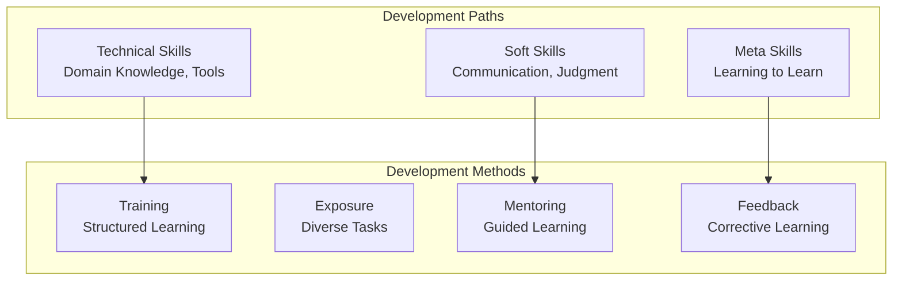

# Agent Skill Development

## Overview

Skill development involves systematically improving agent capabilities through training, exposure, and feedback. Effective skill development programs create agents that improve over time, adapt to changing requirements, and develop breadth alongside depth. This guide covers designing and implementing agent learning systems.

## Skill Development Dimensions



## Skill Assessment Framework

```yaml
skill_assessment_matrix:
  agent_id: "analyzer_001"
  assessment_date: "2026-03-19"
  skills:
    technical_skills:
      - domain_knowledge:
          current_level: "intermediate"
          target_level: "advanced"
          progress: 0.65
          months_to_target: 4
      - tool_proficiency:
          current_level: "advanced"
          target_level: "expert"
          progress: 0.80
          months_to_target: 2

    soft_skills:
      - communication_clarity:
          current_level: "good"
          target_level: "excellent"
          progress: 0.70
          months_to_target: 3
      - decision_quality:
          current_level: "good"
          target_level: "excellent"
          progress: 0.65
          months_to_target: 6

    meta_skills:
      - learning_velocity:
          current_level: "above_average"
          target_level: "exceptional"
          progress: 0.75
          months_to_target: 6
      - error_analysis:
          current_level: "average"
          target_level: "excellent"
          progress: 0.55
          months_to_target: 8
```

## Skill Development Plans

Design personalized development paths:

```python
def create_skill_development_plan(
    agent_id,
    current_skills,
    target_skills,
    timeline_months=12
):
    """
    Create personalized development plan for agent
    """

    agent = get_agent(agent_id)
    gaps = identify_skill_gaps(current_skills, target_skills)

    # Prioritize by impact and effort
    prioritized_skills = prioritize_skill_development(
        gaps,
        criteria=['business_impact', 'prerequisite_dependencies', 'effort_required']
    )

    development_plan = {
        'agent_id': agent_id,
        'timeline_months': timeline_months,
        'target_skills': target_skills,
        'development_activities': []
    }

    for skill_index, skill in enumerate(prioritized_skills):
        # Allocate months based on skill difficulty
        months_allocated = allocate_months(
            skill.difficulty,
            timeline_months,
            num_skills=len(prioritized_skills),
            index=skill_index
        )

        development_activities = {
            'skill': skill.name,
            'months': months_allocated,
            'activities': [
                {
                    'type': 'training',
                    'duration_hours': 20,
                    'content': generate_training_content(skill),
                    'delivery': 'self_paced_with_weekly_checkin'
                },
                {
                    'type': 'exposure',
                    'duration_weeks': 4,
                    'challenge': f'Take on 3 {skill.name} tasks per week',
                    'mentor': assign_mentor(skill)
                },
                {
                    'type': 'project',
                    'duration_weeks': 4,
                    'project': f'Lead {skill.name} initiative',
                    'success_criteria': generate_success_criteria(skill)
                },
                {
                    'type': 'assessment',
                    'method': 'practical_evaluation',
                    'criteria': generate_assessment_criteria(skill),
                    'pass_threshold': 0.85
                }
            ]
        }

        development_plan['development_activities'].append(development_activities)

    return development_plan
```

## Training Methodologies

### 1. Self-Paced Learning

```yaml
self_paced_learning:
  format: "structured_curriculum"
  structure:
    - module: "fundamentals"
      duration_hours: 10
      content_types: ["video", "documentation", "interactive_exercises"]
      assessment: "quiz_80_percent_required"

    - module: "intermediate"
      duration_hours: 15
      prerequisite: "fundamentals_complete"
      content_types: ["case_studies", "simulations", "real_examples"]
      assessment: "scenario_based_problems"

    - module: "advanced"
      duration_hours: 20
      prerequisite: "intermediate_complete"
      content_types: ["deep_dives", "research_papers", "expert_interviews"]
      assessment: "capstone_project"

  support:
    - weekly_office_hours_with_mentor
    - discussion_forums_with_peers
    - access_to_expert_library
    - progress_tracking_dashboard
```

### 2. Learning by Doing

```python
def learning_by_doing_program(agent_id, skill, num_months=3):
    """
    Develop skills through guided task exposure
    """

    month_plan = {}

    for month in range(1, num_months + 1):
        difficulty_progression = 0.3 + (month / num_months * 0.5)  # Ramp 30% to 80%

        tasks = get_tasks_for_skill(
            skill=skill,
            difficulty=difficulty_progression,
            num_tasks=8  # 2 tasks per week
        )

        month_plan[f'month_{month}'] = {
            'difficulty_progression': difficulty_progression,
            'tasks': tasks,
            'mentor_involvement': 1.0 - (month / num_months * 0.5),  # Decrease over time
            'reflection_required': True,
            'weekly_checkin': True
        }

    return month_plan
```

### 3. Mentoring and Coaching

```yaml
mentoring_program:
  mentor_assignment:
    criteria:
      - expertise_in_skill: true
      - 3_plus_years_experience: true
      - coaching_certification: preferred
      - availability_hours_per_week: 2

  frequency:
    frequency_type: "weekly"
    session_duration_minutes: 60
    frequency_per_month: 4

  session_structure:
    - review_progress: 15_minutes
    - discuss_challenges: 20_minutes
    - provide_guidance: 15_minutes
    - assignment_next_week: 10_minutes

  mentoring_outcomes:
    - skill_improvement_target: 0.15  # 15% improvement per month
    - confidence_increase: "measurable"
    - knowledge_sharing: "both_directions"
    - relationship_building: "peer_connection"

  success_metrics:
    - mentee_skill_improvement: 0.85  # 85% reach target
    - satisfaction_rating: 4.0  # Out of 5.0
    - knowledge_retention: 0.80  # Demonstrated 30 days later
```

## Feedback-Driven Development

Use performance data to guide skill development:

```python
def analyze_performance_and_recommend_development(agent_id):
    """
    Analyze agent performance and recommend skill development
    """

    performance_data = get_agent_performance(agent_id, days=90)

    # Identify weakness patterns
    error_analysis = analyze_errors(performance_data)
    strengths = identify_strengths(performance_data)
    growth_opportunities = identify_growth_opportunities(performance_data)

    # Match to skill gaps
    skill_gaps = map_performance_to_skills(
        error_analysis,
        strengths,
        growth_opportunities
    )

    # Prioritize by impact
    recommendations = prioritize_recommendations(skill_gaps)

    # Create targeted development plan
    development_plan = create_focused_development_plan(
        agent_id=agent_id,
        recommendations=recommendations,
        focus_areas=3,  # Top 3 development areas
        timeline_months=3
    )

    return development_plan
```

## Skill Mastery Levels

Define clear progression from novice to expert:

```yaml
skill_progression_model:
  levels:
    - level: 1_novice
      description: "Learning the basics"
      accuracy_target: 0.60
      independence: "requires_supervision"
      time_to_next: "2_months"

    - level: 2_beginner
      description: "Can perform basic tasks"
      accuracy_target: 0.75
      independence: "needs_guidance"
      time_to_next: "4_months"

    - level: 3_intermediate
      description: "Handles standard cases independently"
      accuracy_target: 0.85
      independence: "mostly_independent"
      time_to_next: "6_months"

    - level: 4_advanced
      description: "Handles complex cases"
      accuracy_target: 0.92
      independence: "fully_independent"
      time_to_next: "12_months"

    - level: 5_expert
      description: "Trains others, leads initiatives"
      accuracy_target: 0.96
      independence: "autonomous"
      mentoring_role: "leads_mentoring"
```

## Continuous Development Metrics

Track development progress:

```json
{
  "agent_development_dashboard": {
    "agent_id": "analyzer_001",
    "period": "2026-Q1",
    "active_development_areas": 3,
    "skill_progress": {
      "domain_knowledge": {
        "level_start": "intermediate",
        "level_current": "intermediate_high",
        "progress_percent": 65,
        "velocity": "on_track"
      },
      "communication": {
        "level_start": "good",
        "level_current": "good",
        "progress_percent": 30,
        "velocity": "slower_than_expected"
      },
      "decision_quality": {
        "level_start": "good",
        "level_current": "good_high",
        "progress_percent": 55,
        "velocity": "on_track"
      }
    },
    "activity_compliance": {
      "training_hours_completed": 24,
      "training_hours_target": 30,
      "completion_percent": 80,
      "mentor_sessions_attended": 11,
      "mentor_sessions_scheduled": 12,
      "attendance_percent": 92
    },
    "learning_velocity": {
      "skill_improvement_rate": 0.12,
      "target_improvement_rate": 0.10,
      "trajectory": "exceeding_expectations"
    }
  }
}
```

## Performance Metrics for Agent Development

| Metric | Target | Measurement |
|--------|--------|---|
| **Skill Improvement Rate** | 10-15%/month | Measured competency assessments |
| **Training Completion Rate** | >90% | Course enrollment vs completion |
| **Mentor Session Attendance** | >90% | Sessions attended vs scheduled |
| **Performance Improvement from Baseline** | 15-25% | 90-day review vs baseline |
| **Knowledge Retention** | >80% | Re-assessment 30 days post-training |

🔗 **Related Topics**: [Continuous Learning](AGENT_CONTINUOUS_LEARNING.md) | [Knowledge Sharing](AGENT_KNOWLEDGE_SHARING.md) | [Role Rotation](AGENT_ROLE_ROTATION.md) | [Burnout Prevention](AGENT_BURNOUT_PREVENTION.md) | [Performance Metrics](AGENT_PERFORMANCE_METRICS.md)
