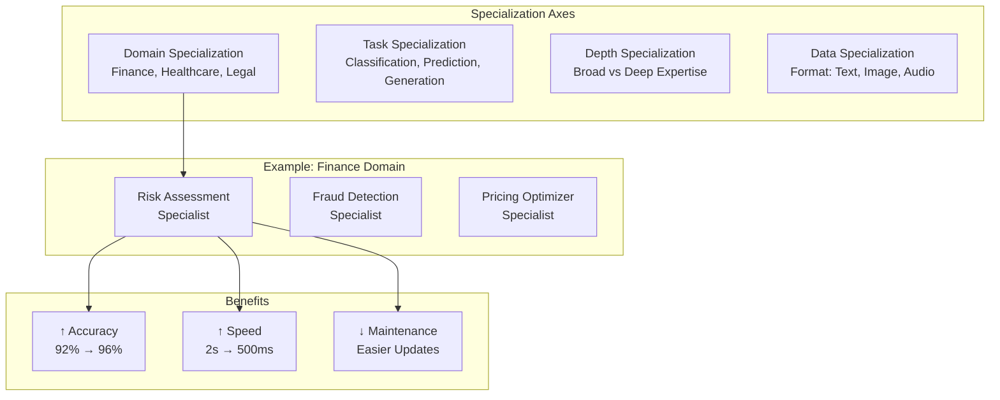
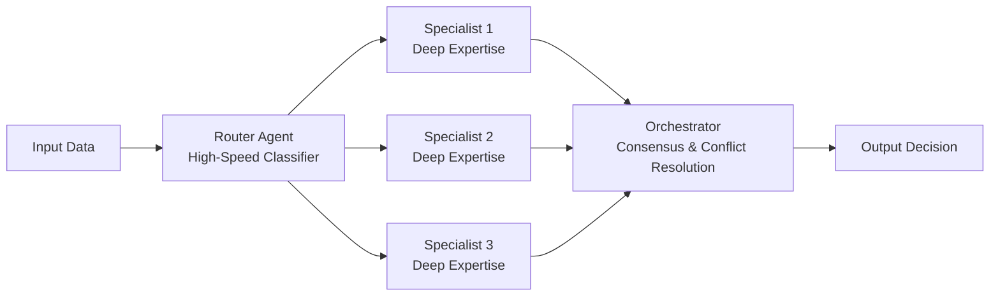

# Agent Specialization Patterns

## Overview

Agent specialization refers to designing agents with narrowly-focused expertise rather than attempting to build generalist agents. Specialized agents achieve higher accuracy, faster response times, and easier maintenance compared to multi-purpose agents. This guide covers designing, training, and deploying specialized agent architectures across complex workflows.

## Specialization Dimensions

Agents can specialize along multiple dimensions simultaneously:



## Core Specialization Strategies

### 1. Domain Specialization

Train agents on specific industry vertical with deep domain knowledge:

```yaml
specialization_strategy: domain
domain_expert_agent:
  domain: "healthcare_radiology"
  training_data:
    sources:
      - radiology_images: 50000
      - radiologist_reports: 50000
      - clinical_outcomes: 30000
    domain_specific_terminology: 2500
    medical_knowledge_base: "specialized_ontology"

  expertise_areas:
    - chest_x_ray_interpretation
    - tumor_detection_and_classification
    - comparative_analysis_prior_scans
    - treatment_response_assessment

  performance_targets:
    sensitivity: 0.95  # Detect 95% of abnormalities
    specificity: 0.92  # Avoid false alarms
    inter_rater_agreement: 0.90  # Match radiologist decisions
```

### 2. Task Specialization

Create dedicated agents for specific tasks in a pipeline:

```
Document Input → Classification Agent → Extraction Agent → Validation Agent → Storage

Each agent highly optimized for single task type
Classification Agent: >99% accuracy on 10 document types
Extraction Agent: >98% field-level accuracy
Validation Agent: >99.5% consistency verification
```

### 3. Scale Specialization

Design agents for different data scale characteristics:

```yaml
micro_batch_agent:
  optimized_for: "small_volumes_high_accuracy"
  batch_size: 1-10
  latency_requirement: "<100ms"
  use_case: "real_time_customer_service"
  model: "gpt-4"
  temperature: 0.0

macro_batch_agent:
  optimized_for: "large_volumes_cost_efficiency"
  batch_size: 10000+
  latency_requirement: "<1_hour"
  use_case: "nightly_batch_processing"
  model: "gpt-3.5-turbo"
  temperature: 0.1
```

## Agent Profile Architecture

Define comprehensive profiles for specialized agents:

```json
{
  "agent_profile": {
    "agent_id": "ra_healthcare_radiology_001",
    "specialization_type": "domain_expert",
    "domain": "Healthcare Radiology",
    "model_configuration": {
      "base_model": "gpt-4-vision",
      "temperature": 0.1,
      "max_tokens": 1500,
      "system_prompt": "You are a board-certified radiologist specializing in thoracic imaging with 15+ years experience..."
    },
    "training_specification": {
      "training_data_sources": [
        {
          "source": "stanford_radiology_dataset",
          "records": 15000,
          "annotations": "expert_radiologist"
        },
        {
          "source": "mimic_chest_xray",
          "records": 371920,
          "annotations": "clinical_outcomes"
        }
      ],
      "fine_tuning_approach": "supervised_finetuning",
      "validation_set_percent": 0.20,
      "test_set_percent": 0.10
    },
    "expertise_coverage": {
      "modalities": ["chest_xray", "ct_thorax", "pet_ct"],
      "pathologies": [
        "pneumonia",
        "pulmonary_nodules",
        "pneumothorax",
        "pleural_effusion",
        "mass_lesions"
      ],
      "comparative_analysis": true,
      "quantitative_assessment": true
    },
    "performance_metrics": {
      "sensitivity_target": 0.95,
      "specificity_target": 0.92,
      "auc_target": 0.96,
      "inter_rater_agreement": 0.90,
      "case_studies": "10_published_validations"
    },
    "operational_constraints": {
      "max_concurrent_cases": 50,
      "average_turnaround_minutes": 3,
      "quality_assurance": "human_verification_for_critical",
      "escalation_protocol": "to_senior_radiologist_if_confidence_below_0.80"
    },
    "knowledge_cutoff_date": "2025-06-01",
    "continuing_education": {
      "retraining_frequency": "quarterly",
      "new_literature_integration": "monthly",
      "conference_updates": "annual"
    }
  }
}
```

## Multi-Specialist Team Orchestration

Design workflows where multiple specialists collaborate:

```python
def orchestrate_specialized_agents_for_loan_application(application_id):
    """
    Loan approval workflow using specialized agents
    """
    application = get_application(application_id)

    # Stage 1: Document verification
    document_specialist = get_agent('document_analyzer_specialist')
    document_quality = document_specialist.verify_all_documents(
        application.documents,
        required_documents=[
            'paystubs',
            'tax_returns',
            'bank_statements',
            'proof_of_employment'
        ]
    )

    if document_quality.completeness < 0.90:
        return request_additional_documents(application_id, document_quality.missing)

    # Stage 2: Financial analysis
    financial_specialist = get_agent('financial_analyst_specialist')
    financial_assessment = financial_specialist.analyze_finances(
        income_documents=document_quality.verified_documents['income'],
        asset_documents=document_quality.verified_documents['assets'],
        liability_documents=document_quality.verified_documents['liabilities']
    )

    # Stage 3: Risk assessment
    risk_specialist = get_agent('credit_risk_specialist')
    risk_score = risk_specialist.assess_risk(
        credit_history=get_credit_report(application.ssn),
        financial_metrics=financial_assessment.metrics,
        employment_stability=financial_assessment.employment_verification,
        collateral_value=application.collateral_value
    )

    # Stage 4: Underwriting decision
    underwriting_specialist = get_agent('underwriting_specialist')
    decision = underwriting_specialist.make_approval_decision(
        risk_score=risk_score,
        financial_assessment=financial_assessment,
        loan_amount=application.requested_amount,
        loan_term=application.requested_term
    )

    # Consensus check
    if decision.recommendation == 'decline' and risk_score.confidence < 0.85:
        # Escalate for human review
        escalate_to_human_underwriter(
            application_id=application_id,
            reason='low_confidence_automated_decision',
            agents_involved=[
                document_specialist.agent_id,
                financial_specialist.agent_id,
                risk_specialist.agent_id
            ]
        )
    else:
        execute_decision(decision)
```

## Specialization Trade-offs

```yaml
specialization_dimensions:
  expertise_depth:
    high_specialization:
      advantages:
        - accuracy_improvement: "5-10%"
        - latency_improvement: "30-50%"
        - easier_debugging: true
      disadvantages:
        - coverage_reduction: "may miss edge cases outside specialty"
        - training_data_requirements: "large domain-specific dataset"

  coverage_breadth:
    narrow_specialist:
      advantages:
        - domain_mastery: "deep expertise"
        - maintainability: "easy to update specific domain"
      disadvantages:
        - coordination_overhead: "need orchestration layer"
        - data_requirements: "each agent needs training"

  training_efficiency:
    specialized_agents:
      training_time: "faster convergence on narrow task"
      validation_time: "more precise metrics"
      update_complexity: "isolated changes"
```

## Practical Example: Specialized Customer Support

Build specialized support agents by issue type:

```python
def route_customer_issue_to_specialist(issue_description, customer_id):
    """Route to most appropriate specialist agent"""

    # Classify issue type
    issue_classifier = get_agent('issue_type_classifier')
    issue_type = issue_classifier.classify(issue_description)
    confidence = issue_type.confidence

    # Route to specialist
    if issue_type.primary_category == 'billing' and confidence > 0.85:
        specialist = get_agent('billing_specialist_agent')
        resolution_path = 'billing_resolution'

    elif issue_type.primary_category == 'technical' and confidence > 0.85:
        specialist = get_agent('technical_support_specialist_agent')
        resolution_path = 'technical_troubleshooting'

    elif issue_type.primary_category == 'account' and confidence > 0.85:
        specialist = get_agent('account_management_specialist_agent')
        resolution_path = 'account_modification'

    else:
        # Low confidence or ambiguous
        specialist = get_agent('general_support_agent')
        resolution_path = 'escalation_needed'

    # Execute specialized resolution
    result = specialist.resolve_issue(
        issue=issue_description,
        customer_id=customer_id,
        resolution_path=resolution_path
    )

    return {
        'resolution': result,
        'specialist_agent': specialist.agent_id,
        'confidence': issue_type.confidence,
        'routing_logic': resolution_path
    }
```

## Specialization Maintenance

Update specialized agents when domain knowledge evolves:

```yaml
agent_update_protocol:
  quarterly_reviews:
    - validate_training_data_freshness
    - measure_accuracy_degradation
    - identify_emerging_patterns
    - update_knowledge_base

  annual_retraining:
    - collect_new_training_data
    - evaluate_newer_models
    - benchmark_against_competitors
    - validate_on_holdout_test_set

  continuous_monitoring:
    - track_inference_distribution
    - detect_domain_shift
    - alert_on_accuracy_drop_threshold: 0.02  # 2% drop
    - monitor_emerging_failure_modes
```

## Integration Patterns for Specialist Agents



## Performance Metrics for Specialized Agents

| Metric | Specialist | Generalist | Improvement |
|--------|---|---|---|
| **Accuracy** | 96.2% | 91.5% | +5.1% |
| **Latency** | 450ms | 650ms | -31% |
| **False Positive Rate** | 2.1% | 5.3% | -60% |
| **Training Time** | 40 hours | 60 hours | -33% |
| **Update Complexity** | Low | High | +40% easier |

🔗 **Related Topics**: [Team Composition](AGENT_TEAM_COMPOSITION.md) | [Delegation Hierarchy](AGENT_DELEGATION_HIERARCHY.md) | [Role Rotation](AGENT_ROLE_ROTATION.md) | [Skill Development](AGENT_SKILL_DEVELOPMENT.md) | [Performance Metrics](AGENT_PERFORMANCE_METRICS.md)
