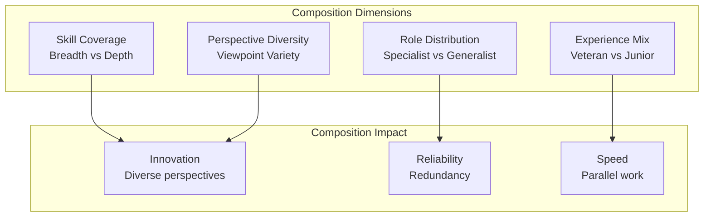

# Agent Team Composition

## Overview

Team composition refers to selecting the right mix of agent types, specializations, and capabilities to accomplish complex goals efficiently. Effective teams balance diversity (needed for complex problems) with coherence (needed for coordination). This guide covers designing team structures that maximize performance across different problem domains.

## Core Team Composition Dimensions



## Team Archetypes

### 1. All-Star Team

High-capability agents across all dimensions:

```yaml
team_archetype: "all_star_team"
composition:
  - agent_type: "expert_specialist_1"
    expertise: "domain_a_deep"
    capability_level: "expert"
    years_equivalent: 15
    reliability: 0.98
  - agent_type: "expert_specialist_2"
    expertise: "domain_b_deep"
    capability_level: "expert"
    years_equivalent: 12
    reliability: 0.97
  - agent_type: "generalist_bridge"
    expertise: "cross_domain"
    capability_level: "advanced"
    reliability: 0.96

performance_characteristics:
  output_quality: "superior"  # Top 10%
  cost_efficiency: "poor"     # High cost
  reliability: "superior"
  problem_solving_speed: "very_fast"
  scalability: "limited"      # Bottleneck at top

best_for:
  - high_stakes_decisions
  - innovation_projects
  - strategic_planning
  - crisis_management
```

### 2. Balanced Team

Mix of specialist and generalist agents:

```yaml
team_archetype: "balanced_team"
composition:
  - agents_specialist: 2     # Deep expertise in key domains
  - agents_generalist: 2     # Cross-domain coordination
  - agents_junior: 2         # Development and support

performance_characteristics:
  output_quality: "good"     # Top 25%
  cost_efficiency: "good"
  reliability: "good"
  scalability: "good"
  knowledge_transfer: "organic"

best_for:
  - ongoing_operations
  - standard_projects
  - continuous_improvement
  - team_development
```

### 3. Diverse Perspectives Team

Agents with different viewpoints and approaches:

```yaml
team_archetype: "diverse_perspectives"
composition:
  - optimist_agent:          # Sees opportunities
      tendency: "opportunity_focused"
      strength: "innovation"
  - skeptic_agent:           # Questions assumptions
      tendency: "risk_focused"
      strength: "problem_prevention"
  - pragmatist_agent:        # Focused on practical outcomes
      tendency: "results_focused"
      strength: "execution"
  - creative_agent:          # Generates alternatives
      tendency: "possibility_thinking"
      strength: "novel_solutions"

decision_making_improvement:
  decision_quality: "+25%"
  missed_risks: "-40%"
  missed_opportunities: "-30%"
  decision_time: "+15%"     # Longer but better
```

## Composition Formulas by Domain

### Software Development Team

```yaml
team_structure:
  total_agents: 6
  composition:
    architects: 1           # 17% - System design
    senior_engineers: 2     # 33% - Complex problems
    mid_level_engineers: 2  # 33% - Core features
    junior_engineers: 1     # 17% - Support tasks

  domain_coverage:
    backend_systems: 1.5 agents
    frontend_ui: 1.5 agents
    data_layer: 1 agent
    devops: 1 agent

  skill_distribution:
    system_design: 1
    code_quality: 2
    testing: 1.5
    documentation: 1
    mentoring: 1
```

### Customer Support Team

```yaml
team_structure:
  total_agents: 10
  composition:
    manager: 1              # Leadership, escalation
    senior_agents: 2        # Complex issues, coaching
    standard_agents: 5      # Regular support
    junior_agents: 2        # Basic tasks, learning

  specialization:
    technical_support: 3
    billing_support: 3
    account_management: 2
    escalation_pool: 2      # Cross-trained

  experience_distribution:
    > 5_years: 2
    2_5_years: 4
    < 2_years: 4
```

## Balancing Team Characteristics

### Skill Distribution Formula

```python
def calculate_optimal_team_composition(
    problem_complexity,
    available_budget,
    timeline_constraints
):
    """
    Calculate optimal team composition based on constraints
    """

    # Base calculation: complexity determines specialist ratio
    specialist_ratio = problem_complexity / 10  # 0.0-1.0
    generalist_ratio = 1 - specialist_ratio

    # Budget constraint: junior agents reduce cost
    cost_per_expert = 100  # Relative units
    cost_per_generalist = 60
    cost_per_junior = 20

    # Time constraint: more agents for faster delivery
    # But communication overhead increases > 7 agents
    time_multiplier = calculate_time_impact(timeline_constraints)

    # Calculate composition
    team_size = calculate_team_size(
        complexity=problem_complexity,
        budget=available_budget,
        timeline=timeline_constraints
    )

    specialists = int(team_size * specialist_ratio)
    generalists = int(team_size * generalist_ratio * 0.6)
    juniors = team_size - specialists - generalists

    return {
        'team_size': team_size,
        'specialists': specialists,
        'generalists': generalists,
        'juniors': juniors,
        'estimated_cost': (specialists * cost_per_expert +
                          generalists * cost_per_generalist +
                          juniors * cost_per_junior)
    }
```

## Team Dynamics and Interactions

```yaml
team_interaction_patterns:
  hub_and_spoke:
    structure: "Central coordinator with specialist spokes"
    strengths:
      - clear_communication_lines
      - bottleneck_detection_easy
    weaknesses:
      - single_point_of_failure_at_hub
    best_for: "hierarchical_organizations"

  full_mesh:
    structure: "All agents communicate with all others"
    strengths:
      - resilient
      - knowledge_sharing_natural
    weaknesses:
      - communication_overhead_high
      - O_n_squared_complexity
    best_for: "small_teams_less_than_7"

  core_and_periphery:
    structure: "Core team communicates fully; periphery integrated loosely"
    strengths:
      - scalable
      - focused_core
    weaknesses:
      - periphery_may_be_out_of_sync
    best_for: "medium_to_large_teams"

  subteam_clusters:
    structure: "Multiple teams organized by domain"
    strengths:
      - scales_to_hundreds
      - domain_focus
    weaknesses:
      - inter_team_communication_complex
    best_for: "large_organizations"
```

## Team Composition Scenarios

### Scenario 1: Crisis Response Team

```yaml
crisis_team_composition:
  team_size: 4
  roles:
    - incident_commander:
        agent_type: "experienced_generalist"
        responsibility: "overall_coordination"
    - technical_specialist:
        agent_type: "domain_expert"
        responsibility: "technical_analysis"
    - communication_officer:
        agent_type: "communication_specialist"
        responsibility: "stakeholder_updates"
    - research_agent:
        agent_type: "information_specialist"
        responsibility: "context_gathering"

  decision_structure: "hierarchical_with_rapid_escalation"
  communication_frequency: "continuous"
  expected_duration: "4_72_hours"
```

### Scenario 2: Innovation Project Team

```yaml
innovation_team_composition:
  team_size: 5
  roles:
    - innovation_lead:
        agent_type: "creative_thinker"
        contribution: "idea_generation"
    - feasibility_analyst:
        agent_type: "pragmatist_specialist"
        contribution: "reality_testing"
    - research_agent:
        agent_type: "deep_researcher"
        contribution: "foundation_knowledge"
    - cross_functional_agent:
        agent_type: "bridge_specialist"
        contribution: "integration"
    - documentation_agent:
        agent_type: "process_specialist"
        contribution: "knowledge_capture"

  creative_freedom: "high"
  risk_acceptance: "moderate"
  timeline: "flexible"
```

## Performance Metrics for Team Composition

| Metric | Balanced Team | Specialist Team | Diverse Team |
|--------|---|---|---|
| **Output Quality** | 85% | 92% | 88% |
| **Cost Efficiency** | 75% | 50% | 70% |
| **Reliability** | 90% | 93% | 92% |
| **Innovation Rate** | 70% | 60% | 85% |
| **Scalability** | 80% | 60% | 75% |
| **Decision Time** | Moderate | Slow | Slower |

🔗 **Related Topics**: [Specialization Patterns](AGENT_SPECIALIZATION_PATTERNS.md) | [Delegation Hierarchy](AGENT_DELEGATION_HIERARCHY.md) | [Skill Development](AGENT_SKILL_DEVELOPMENT.md) | [Knowledge Sharing](AGENT_KNOWLEDGE_SHARING.md) | [Continuous Learning](AGENT_CONTINUOUS_LEARNING.md)
