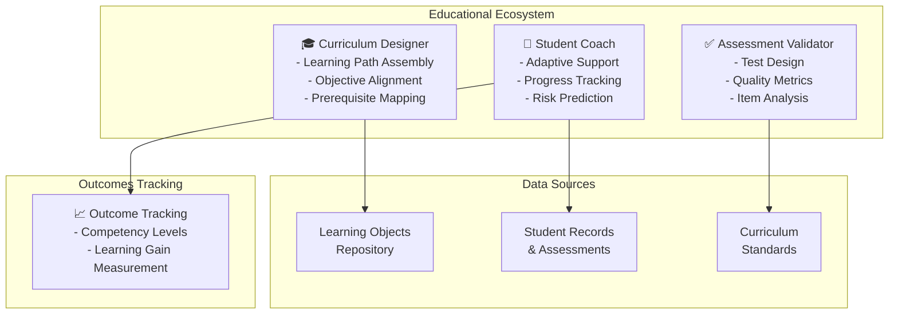

# Education Domain Adaptation

## Overview

Educational systems require AutoClaw agents optimized for personalized learning, curriculum design, student outcome prediction, and pedagogical assessment. Education agents differ from other domains through their focus on learner development, adaptive pacing, and assessment validity. This guide covers configuring agents for K-12, higher education, and corporate learning environments.

## Core Educational Agent Architecture

**Curriculum Designer Agent**: Assembles learning paths based on learning objectives, student prerequisites, and competency frameworks. Analyzes skill dependency graphs to sequence content optimally. Maps curricula to standards (Common Core, IB, state standards, professional certifications).

**Student Coach Agent**: Provides personalized learning support, identifies knowledge gaps, recommends remediation, and adapts teaching style to learner profile. Tracks progress toward learning outcomes and predicts at-risk students 60 days before assessment.

**Assessment Validator Agent**: Designs valid assessments aligned to objectives, analyzes assessment quality metrics (reliability, validity, discrimination index), and flags assessment anomalies.



## Implementation Details

### Configuration for Educational Agents

```yaml
education_domain:
  agents:
    curriculum_designer:
      model: "gpt-4"
      temperature: 0.3      # Some creativity in design
      tools:
        - competency_mapper
        - prerequisite_analyzer
        - objective_validator
        - content_recommender
        - standards_mapper

      competency_framework:
        standard: "bloom_taxonomy_revised"  # or ISTE, NGSS
        levels:
          - remember
          - understand
          - apply
          - analyze
          - evaluate
          - create

      learning_path_config:
        branching_factor: 2.5    # Avg paths per decision point
        min_prerequisites: 2
        max_sequence_length: 8   # Units per learning path
        diversity_requirement: 0.6  # Mix of content types

    student_coach:
      model: "gpt-4"
      temperature: 0.2     # Consistent, reliable feedback
      tools:
        - knowledge_gap_detector
        - learning_style_analyzer
        - progress_tracker
        - risk_predictor
        - intervention_recommender

      learning_styles:
        - visual
        - auditory
        - reading_writing
        - kinesthetic
        - multimodal

      intervention_triggers:
        assessment_score_below: 0.65
        no_progress_for_days: 7
        high_error_rate: 0.40
        off_target_prediction: 0.70
        engagement_decline: 0.50

    assessment_validator:
      model: "gpt-4"
      tools:
        - test_design_assistant
        - item_analyzer
        - reliability_calculator
        - validity_checker

      quality_thresholds:
        cronbach_alpha: 0.70     # Internal consistency
        discrimination_index: 0.20  # Item quality
        difficulty_index: 0.55   # Optimal challenge
        coverage_target: 0.90    # Learning objective coverage

  learning_outcome_tracking:
    retention: "permanent"      # Educational records
    assessment_schedule: "quarterly"
    competency_grid_updates: "weekly"
    risk_review_cadence: "bi-weekly"
```

### Adaptive Learning Path Algorithm

Students with identical prerequisites may follow different paths based on learning style, pace preference, and career goals:

```python
def generate_adaptive_learning_path(
    student_profile,
    learning_objectives,
    available_resources,
    constraints
):
    # Extract learning characteristics
    learning_style = student_profile.learning_style  # e.g., visual
    pace_preference = student_profile.pace  # 0.5 = slow, 1.5 = fast
    career_goal = student_profile.goal

    # Filter resources matching learning style
    preferred_resources = [
        r for r in available_resources
        if r.modality == learning_style
    ]

    # Adjust content duration by pace
    adjusted_resources = [
        adjust_duration(r, pace_preference) for r in preferred_resources
    ]

    # Sort by prerequisite dependency
    ordered_path = topological_sort(
        adjusted_resources,
        by=lambda r: r.prerequisites
    )

    # Inject career-aligned content
    path_with_career = interleave_career_content(
        ordered_path,
        career_goal
    )

    return path_with_career
```

## Practical Example: At-Risk Student Detection

Configure agents to predict students at risk of course failure 60 days before final exam:

**Input Features** (collected weekly):
- Assessment performance trend (declining vs. stable vs. improving)
- Assignment submission timeliness (late submissions flagged)
- Engagement metrics (login frequency, time-on-task)
- Office hours attendance
- Peer collaboration indicators

**Risk Scoring Model**:

```python
def calculate_student_risk_score(student_data):
    score = 0.0

    # Performance trajectory (30% weight)
    perf_trend = calculate_performance_trend(student_data.assessments)
    if perf_trend < 0:  # Declining
        score += 0.25
    elif perf_trend < 0.02:  # Flat
        score += 0.10

    # Engagement (25% weight)
    engagement_ratio = student_data.engagement_hours / expected_hours
    if engagement_ratio < 0.6:
        score += 0.25

    # Submission patterns (20% weight)
    late_submission_rate = count_late(student_data.submissions) / len(student_data.submissions)
    score += late_submission_rate * 0.20

    # Prerequisite mastery (25% weight)
    prereq_mastery = calculate_prerequisite_competency(student_data)
    if prereq_mastery < 0.70:
        score += 0.25

    return min(score, 1.0)

# When score > 0.65: Trigger intervention
# When score > 0.80: Escalate to instructor
```

## Intervention Recommendations

When risk score exceeds threshold:

1. **Score 0.65-0.75 (Moderate Risk)**: Automated coach sends additional practice problems, schedules office hours, pairs with peer mentor
2. **Score 0.75-0.85 (High Risk)**: Instructor notified, student receives structured tutoring plan, weekly check-ins mandatory
3. **Score > 0.85 (Critical Risk)**: Department intervention, possible course continuation, extended deadline consideration

## Assessment Quality Metrics

Every assessment must meet minimum quality standards:

| Metric | Calculation | Target | Meaning |
|--------|-----------|--------|---------|
| **Cronbach's Alpha** | Internal consistency | 0.70-0.90 | Items measure same construct |
| **Discrimination Index** | (% passing high-scorers) - (% passing low-scorers) | >0.20 | Item effectively distinguishes abilities |
| **Difficulty Index** | % students answering correctly | 0.40-0.60 | Optimal challenge level |
| **Item-Total Correlation** | Correlation of item with total score | >0.30 | Item relates to overall construct |

## Curriculum Standards Mapping

Maintain bidirectional mapping between learning objectives and standards:

```json
{
  "learning_objective": "Understanding photosynthesis mechanisms",
  "bloom_level": "understand",
  "standards_mapping": [
    {
      "standard_set": "NGSS",
      "standard_id": "MS-LS1-1",
      "grade_level": "6-8"
    },
    {
      "standard_set": "Common_Core",
      "standard_id": "RST.6-8.3",
      "correlation": 0.85
    }
  ],
  "assessment_items": [
    {
      "item_id": "photosynthesis_mcq_001",
      "difficulty": 0.55,
      "discrimination": 0.42,
      "validates_objective": true
    }
  ]
}
```

## Integration with Educational Systems

- **LMS platforms**: Canvas, Blackboard, Moodle API integration
- **Assessment platforms**: TestWright, Examplify for proctoring
- **Student information systems**: Enrollment, transcript, demographic data
- **Academic advisement**: Degree audit, prerequisite verification
- **Virtual environments**: Simulations, lab software for hands-on learning

## Performance Metrics for Educational Agents

| Metric | Target | Measurement |
|--------|--------|-------------|
| **Prediction Accuracy** | >85% | At-risk students correctly identified |
| **Intervention Effectiveness** | >70% | Students improve after intervention |
| **Learning Gain Variance Reduction** | <15% | Narrowing achievement gaps |
| **Assessment Reliability** | α > 0.75 | Consistent, valid assessments |
| **Content Freshness** | 95% current | Learning objects updated annually |

🔗 **Related Topics**: [Performance Metrics](AGENT_PERFORMANCE_METRICS.md) | [Skill Development](AGENT_SKILL_DEVELOPMENT.md) | [Retention Analysis](ANALYTICS_RETENTION_ANALYSIS.md) | [Acceptance Criteria](TESTING_ACCEPTANCE_CRITERIA.md) | [Continuous Learning](AGENT_CONTINUOUS_LEARNING.md)
