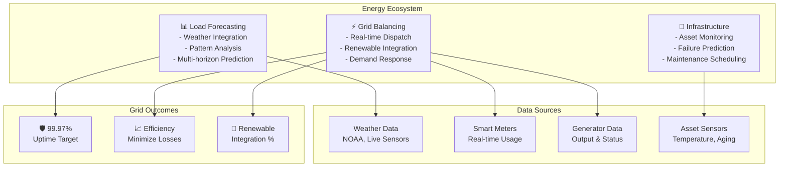

# Energy Domain Adaptation

## Overview

Energy systems require agents optimized for demand forecasting, grid balancing, renewable integration, and predictive infrastructure maintenance. Energy agents operate in mission-critical environments where failures affect millions of consumers, regulatory compliance is non-negotiable, and real-time decisions determine system stability. This guide covers configuring agents for electricity generation, distribution, and consumption optimization.

## Core Energy Agent Architecture

**Load Forecasting Agent**: Predicts electricity demand across regions 1 hour to 7 days ahead using weather data, historical patterns, time-of-day effects, and economic activity. Incorporates customer class segmentation (residential, commercial, industrial).

**Grid Balancing Agent**: Maintains supply-demand equilibrium in real-time, manages renewable intermittency, optimizes generator dispatch, and coordinates demand response programs. Prevents brownouts and blackouts through dynamic load balancing.

**Infrastructure Maintenance Agent**: Monitors grid assets (transformers, circuit breakers, transmission lines) for degradation, predicts failures, and schedules maintenance. Prioritizes high-impact assets serving dense population areas.



## Implementation Details

### Configuration for Energy Agents

```yaml
energy_domain:
  agents:
    load_forecasting:
      model: "gpt-4-turbo"
      temperature: 0.15     # Precision critical
      tools:
        - weather_data_integrator
        - time_series_analyzer
        - ensemble_forecaster
        - anomaly_detector
        - forecast_evaluator

      forecasting_config:
        horizons:
          short_term: 1      # Hours ahead
          medium_term: 7     # Days ahead
          long_term: 365     # Annual planning
        update_frequency: "every_15_minutes"

        customer_segments:
          - residential:
              weight: 0.35
              weather_sensitivity_high: true
              time_of_day_peaks: ["7-9am", "5-10pm"]
          - commercial:
              weight: 0.40
              weather_sensitivity_medium: true
              time_of_day_peaks: ["9am-5pm"]
          - industrial:
              weight: 0.25
              weather_sensitivity_low: false
              patterns: "continuous"

        external_signals:
          - weather:
              inputs: ["temperature", "humidity", "cloud_cover", "wind_speed"]
              lag_hours: [0, 1, 3]
          - economic:
              inputs: ["day_of_week", "holiday", "calendar_effects"]
          - behavioral:
              inputs: ["recent_consumption_trend", "customer_class_distribution"]

        ensemble_methods:
          - exponential_smoothing:
              weight: 0.25
              damping_factor: 0.1
          - arima:
              weight: 0.25
              auto_parameters: true
          - prophet:
              weight: 0.20
              seasonality_mode: "additive"
          - neural_network:
              weight: 0.30
              architecture: "lstm_3_layers"

        accuracy_targets:
          short_term_mape: 0.05      # 5% error acceptable
          medium_term_mape: 0.10
          long_term_mape: 0.15

    grid_balancing:
      model: "gpt-4-turbo"
      temperature: 0.05     # Extremely precise
      tools:
        - demand_response_coordinator
        - generator_dispatcher
        - renewable_integrator
        - frequency_regulator
        - emergency_protocol_executor

      balancing_config:
        update_interval_seconds: 5   # Real-time decisions
        planning_horizons:
          - real_time: "seconds"
          - regulation: "seconds_to_minutes"
          - contingency: "minutes"
          - unit_commitment: "4_hours"

        renewable_integration:
          solar_forecast_method: "cloud_cover_nowcasting"
          wind_forecast_method: "numerical_weather_prediction"
          forecast_update_frequency_minutes: 15
          variability_buffer_percent: 20  # Reserve capacity

        demand_response_programs:
          - name: "peak_shaving"
            trigger_condition: "predicted_peak_demand"
            duration_minutes: 120
            participant_percent: 0.15  # 15% of customers
            incentive_rate_multiplier: 2.5
          - name: "emergency_load_reduction"
            trigger_condition: "frequency_below_59.5_hz"
            duration_minutes: 30
            participant_percent: 0.30
            incentive_rate_multiplier: 5.0

        generator_dispatch:
          algorithm: "unit_commitment_optimization"
          objective: "minimize_generation_cost"
          constraints:
            - ramp_rate_limits
            - minimum_up_down_time
            - reserve_margin_requirement: 0.15  # 15% reserve

        frequency_control:
          target_frequency_hz: 60.0
          acceptable_range_hz: [59.95, 60.05]
          primary_response: "automatic_governor_control"
          secondary_response: "agc_signal"  # Automatic Generation Control
          emergency_threshold: 59.5
          emergency_actions:
            - rolling_blackouts
            - demand_shedding
            - islanding_zones

    infrastructure_maintenance:
      model: "gpt-4"
      temperature: 0.10
      tools:
        - asset_sensor_analyzer
        - degradation_modeler
        - failure_risk_calculator
        - maintenance_optimizer
        - spare_parts_coordinator

      maintenance_config:
        assets_monitored:
          - transformers:
              critical_count: 150
              sensors: ["oil_temperature", "vibration", "partial_discharge"]
              failure_risk_factors:
                - operating_temperature
                - overload_history
                - age_years
                - previous_failures
          - circuit_breakers:
              critical_count: 500
              sensors: ["trip_count", "coil_resistance", "contact_resistance"]
          - transmission_lines:
              critical_count: 2500
              sensors: ["vibration", "sag", "wind_speed", "current_load"]

        predictive_model:
          method: "weibull_distribution"  # Time-to-failure modeling
          parameters_updated: "quarterly"
          failure_prediction_accuracy_target: 0.92

        maintenance_scheduling:
          preventive_schedule:
            transformers: "every_18_months"
            circuit_breakers: "every_24_months"
          priority_ranking:
            - criticality_score  # Impact of failure
            - failure_probability
            - repair_complexity
            - spare_parts_availability
          optimization_window: "30_days"

        emergency_response:
          response_time_minutes:
            critical_asset: 15
            high_impact_asset: 30
            standard_asset: 60
          mobile_repair_units: 5
          parts_warehouses: 3
          supplier_sla_hours: 24

  grid_reliability_targets:
    availability_percent: 99.97        # ~2.6 hours downtime per year
    frequency_stability_hz: 0.05       # Within ±0.05 Hz
    voltage_stability_percent: 5.0     # Within ±5% nominal
    renewable_integration_target: 0.50 # 50% of generation by 2030

  emergency_protocols:
    blackout_prevention: "automatic_load_shedding"
    frequency_nadir_recovery: 59.5
    voltage_support_activation: 0.95   # p.u. (per unit)
```

### Load Forecasting with Multiple Horizons

```python
def forecast_load_multi_horizon(
    region_id,
    historical_data,
    weather_forecast,
    forecast_horizons=[1, 24, 168, 2016]  # hours: 1h, 1d, 1w, 12w
):
    forecasts = {}

    for horizon in forecast_horizons:
        if horizon <= 24:  # Short-term: use high-frequency data
            model = lstm_neural_network(
                input_sequence=historical_data[-336:],  # Last 2 weeks
                lookback_hours=24,
                horizon=horizon
            )
        elif horizon <= 168:  # Medium-term: ensemble approach
            model = ensemble_method([
                prophet_model(seasonal_periods=[24, 168]),
                arima_model(),
                exponential_smoothing_model()
            ])
        else:  # Long-term: structural model
            model = structural_time_series_model(
                components=['trend', 'seasonal_day', 'seasonal_week', 'seasonal_year']
            )

        # Generate forecast
        base_forecast = model.predict(horizon)

        # Adjust for weather
        if horizon <= 168:
            weather_adjustment = calculate_weather_sensitivity(
                region_id,
                weather_forecast[:horizon],
                sensitivity_matrix=load_elasticity_data
            )
            base_forecast = base_forecast * (1 + weather_adjustment)

        # Add confidence intervals
        confidence_std = calculate_forecast_uncertainty(model, historical_data)
        confidence_interval = {
            'point': base_forecast,
            'upper_95': base_forecast + 1.96 * confidence_std,
            'lower_5': base_forecast - 1.96 * confidence_std
        }

        forecasts[horizon] = confidence_interval

    return forecasts
```

## Practical Example: Extreme Weather Event Response

When a hurricane approaches, coordinate agents across forecasting, balancing, and maintenance:

1. **Load Forecast Update**: Incorporate weather impacts (shutdowns, reduced demand, outages)
2. **Pre-positioning**: Move repair crews and equipment to expected impact zones
3. **Generator Preparation**: Stage backup generation at critical facilities (hospitals, water treatment)
4. **Demand Response**: Pre-enroll customers in voluntary load reduction programs
5. **Contingency Planning**: Identify critical infrastructure requiring uninterrupted power

```python
def execute_hurricane_protocol(hurricane_category, impact_zones):
    # Pre-position resources 24 hours before impact
    repair_teams = redistribute_crews(impact_zones)
    spare_parts = stage_inventory(impact_zones)

    # Update load forecasts
    for region in impact_zones:
        new_forecast = forecast_load_multi_horizon(
            region,
            external_event='hurricane_category_' + str(hurricane_category),
            event_parameters={
                'expected_outages_percent': calculate_outage_rate(hurricane_category),
                'duration_hours': 12 + (hurricane_category * 6),
                'customer_voluntary_reduction': 0.10
            }
        )

    # Activate contingency protocols
    activate_demand_response_program('emergency_load_reduction')
    mobilize_backup_generation(capacity_mw=500)
    establish_emergency_islanding_zones([
        'hospital_cluster_1',
        'water_treatment_facility_2',
        'emergency_operations_center'
    ])

    # Establish incident command
    incident_commander = assign_incident_commander(region=impact_zones[0])
    incident_commander.establish_communication_protocols()
```

## Frequency Regulation and Grid Stability

Maintain grid frequency within ±0.05 Hz of 60 Hz nominal:

```json
{
  "frequency_event": {
    "timestamp": "2026-03-19T14:32:15Z",
    "frequency_hz": 59.8,
    "nadir": 59.4,
    "recovery_time_seconds": 45,
    "event_cause": "large_generator_trip",
    "response_sequence": [
      {
        "stage": "primary_frequency_response",
        "timing_seconds": 0,
        "action": "automatic_governor_droop",
        "generators_activated": 150,
        "mw_provided": 250
      },
      {
        "stage": "secondary_frequency_response",
        "timing_seconds": 5,
        "action": "agc_raise_signal_executed",
        "generators_ramped": 75,
        "additional_mw": 150
      },
      {
        "stage": "demand_response",
        "timing_seconds": 15,
        "action": "automatic_load_shedding",
        "loads_shed_mw": 100,
        "customers_affected": 12500
      }
    ],
    "recovery_achieved": true,
    "frequency_restored_hz": 60.0,
    "recovery_time_minutes": 3
  }
}
```

## Integration with Energy Systems

- **SCADA systems**: Supervisory Control and Data Acquisition for grid monitoring
- **EMS**: Energy Management Systems for real-time optimization
- **Weather data**: NOAA, Weather Underground APIs
- **Meter data**: Advanced Metering Infrastructure (AMI) and smart meters
- **Renewable data**: NREL datasets for solar/wind generation
- **Market systems**: ISO/RTO platforms for power trading

## Performance Metrics for Energy Agents

| Metric | Target | Measurement |
|--------|--------|---|
| **Load Forecast Accuracy (MAPE)** | <5% (1-day), <10% (7-day) | Reduces generation costs |
| **Grid Availability** | 99.97% | <2.6 hours downtime/year |
| **Frequency Stability** | ±0.05 Hz | 99% of time |
| **Renewable Integration %** | 50% by 2030 | Reduces emissions |
| **Preventive Maintenance Ratio** | 85% | Reduces unplanned outages |
| **MTBF (Mean Time Between Failures)** | >15,000 hours | Critical assets |

🔗 **Related Topics**: [Time Series Analysis](ANALYTICS_COHORT_ANALYSIS.md) | [Continuous Learning](AGENT_CONTINUOUS_LEARNING.md) | [Performance Metrics](AGENT_PERFORMANCE_METRICS.md) | [Message Queues](INTEGRATION_MESSAGE_QUEUES.md) | [Webhook Handling](INTEGRATION_WEBHOOK_HANDLING.md)
