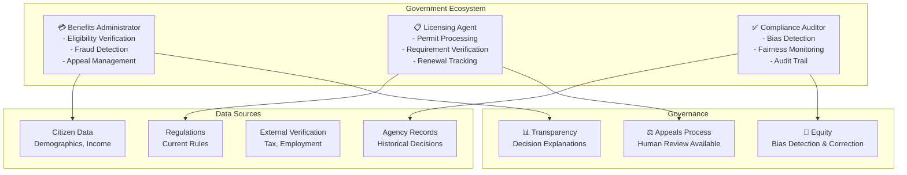

# Government & Public Sector Domain Adaptation

## Overview

Government systems require agents optimized for policy compliance, citizen services delivery, fraud prevention, and regulatory enforcement. Government agents operate under strict transparency requirements, audit obligations, and fairness constraints. This guide covers configuring agents for benefits administration, licensing, tax assessment, and public services.

## Core Government Agent Architecture

**Benefits Administrator Agent**: Processes applications for social security, unemployment benefits, food assistance, and housing support. Validates eligibility criteria, processes claims, and detects fraudulent applications. Maintains audit trail for every decision supporting appeals.

**Licensing & Permits Agent**: Manages professional licensing, building permits, environmental permits, and vehicle registrations. Automates routine approvals while escalating complex cases. Enforces regulatory requirements across jurisdictions.

**Compliance Auditor Agent**: Monitors policy adherence, detects discrimination patterns, identifies fairness issues, and tracks regulatory compliance. Flags systemic biases in algorithmic decisions and generates reports for oversight bodies.



## Implementation Details

### Configuration for Government Agents

```yaml
government_domain:
  agents:
    benefits_administrator:
      model: "gpt-4"
      temperature: 0.05     # Conservative - fairness critical
      tools:
        - eligibility_verifier
        - income_validator
        - fraud_detector
        - decision_generator
        - appeal_processor

      benefits_config:
        program_types:
          - snap:  # Food assistance
              max_income_multiplier: 1.30  # 130% of federal poverty level
              asset_limit_dollars: 2500
              verification_sources: ["irs", "ssn", "employer"]
              fraud_rules: 15
          - unemployment:
              eligibility_requirements: ["job_loss_involuntary", "wage_history", "availability"]
              max_weekly_benefit: 600
              duration_weeks: 26
          - housing_assistance:
              income_limit_percent: 0.60  # 60% area median income
              rent_burden_limit_percent: 0.30
              criminal_background_check: true
          - medicaid:
              income_threshold: "varies_by_state"
              categorical_requirements: ["low_income", "child", "disabled", "pregnant"]
              verification_sources: ["irs", "ssn", "employer", "health_records"]

        eligibility_verification:
          data_sources:
            - internal_agency_records:
                priority: 1
                freshness_days: 0
            - external_verification:
                priority: 2
                sources: ["irs_database", "social_security", "employers"]
                batch_verification_frequency: "daily"
            - self_reported_data:
                priority: 3
                verification_required: true
                supporting_docs: ["pay_stubs", "lease_agreements"]

        fraud_detection:
          patterns_monitored:
            - duplicate_applications_same_person
            - mismatched_identity_information
            - unreported_income
            - undisclosed_assets
            - invalid_citizenship_status
            - deceased_benefit_recipient
            - sibling_cohabitation_unreported
          rule_based_system: true
          investigation_triggers:
            - fraud_score_above_0.70
            - rule_violation_detected
            - inconsistency_in_documentation

        decision_generation:
          decision_components:
            - eligibility_determination: true
            - benefit_calculation: true
            - coverage_level: true
            - justification_narrative: "required"
            - appeal_instructions: "always_provided"
          decision_format: "plain_language"
          readability_target: "grade_8_level"

        appeal_process:
          appeal_window_days: 30
          hearing_availability: "within_60_days"
          independent_reviewer: true
          reversal_rate_monitoring: "monthly"

    licensing_agent:
      model: "gpt-4"
      temperature: 0.10     # Some judgment required
      tools:
        - requirement_verifier
        - document_analyzer
        - background_checker
        - permit_generator
        - renewal_tracker

      licensing_config:
        license_types:
          - professional_licenses:
              categories: ["medical", "legal", "engineering", "cosmetology"]
              renewal_frequency_years: 2
              continuing_education_requirement: true
              background_check: "required"
          - building_permits:
              processing_time_days: 14
              environmental_assessment_required: "conditional"
              public_notice_required: true
              inspection_requirements: ["initial", "midway", "final"]
          - business_licenses:
              processing_time_days: 3
              background_check: "standard"
              zoning_verification: true
              operating_restrictions: "by_location"

        requirement_verification:
          verification_types:
            - education_verification:
                providers: ["national_student_clearinghouse", "registrar_direct"]
                verification_time_days: 5
            - background_checks:
                scope: ["criminal", "civil", "credit"]
                rejection_criteria: ["felony_conviction", "fraud_conviction"]
            - competency_verification:
                types: ["exam_score", "professional_certification"]

        processing_automation:
          routine_applications_percent: 0.70
          automated_approval_decision: "eligible_if_all_verified"
          complex_applications_percent: 0.30
          escalation_criteria:
            - incomplete_documentation
            - background_concern_flagged
            - jurisdictional_ambiguity

        renewal_tracking:
          automated_reminders: "180_days_before_expiration"
          grace_period_days: 30
          late_renewal_penalty: "license_suspension"

    compliance_auditor:
      model: "gpt-4"
      temperature: 0.05     # Strict fairness monitoring
      tools:
        - bias_detector
        - fairness_analyzer
        - audit_logger
        - discrepancy_reporter
        - explainability_monitor

      compliance_config:
        monitoring_areas:
          - protected_class_equity:
              protected_classes:
                - race_ethnicity
                - gender
                - age
                - disability_status
                - national_origin
              monitoring_metric: "disparate_impact_ratio"
              threshold_alert: 0.80  # If minority group approval < 80%
          - appeal_outcomes:
              monitoring: "reversal_rate_by_demographic"
              acceptable_variance_percent: 5
          - processing_time:
              monitoring: "by_demographic_group"
              acceptable_variance_percent: 10
          - decision_consistency:
              monitoring: "similar_cases_similar_decisions"
              consistency_target: 0.95

        fairness_metrics:
          - demographic_parity:
              target: "similar_approval_rates_all_groups"
          - equalized_odds:
              target: "similar_false_positive_false_negative_rates"
          - calibration:
              target: "accuracy_consistent_across_groups"

        audit_trail_requirements:
          log_every_decision: true
          record_components:
            - timestamp
            - user_id
            - decision_factors
            - decision_rationale
            - confidence_score
            - protected_class_data
            - appeal_triggered
          retention_years: 7
          access_controls: "restricted"

        explainability_requirements:
          decision_explanation_required: true
          explanation_format: "plain_language"
          technical_reasoning_available: true
          counterfactual_explanation: "on_appeal"
          human_interpretability: "verified_quarterly"

        regulatory_reporting:
          monthly_compliance_report: true
          quarterly_fairness_audit: true
          annual_third_party_audit: true
          public_transparency_reporting: "required"

  government_service_targets:
    application_approval_time_days: 14
    citizen_satisfaction_percent: 80
    appeal_reversal_monitoring: "monthly"
    fraud_detection_success_rate: 0.35
    fairness_bias_incident_response_hours: 24

  transparency_requirements:
    decision_explainability: "always_provided"
    appeals_available: "always_available"
    human_review_available: "for_any_decision"
    audit_trail_completeness: 100
    protected_class_monitoring: "mandatory"
```

### Eligibility Determination with Explainability

```python
def determine_benefits_eligibility(
    application_id,
    program='snap'
):
    application = get_application(application_id)

    # Step 1: Verify identity and basic eligibility
    identity_verified = verify_identity_via_ssn(application.ssn)
    citizenship_verified = check_citizenship_status(application)

    if not identity_verified or not citizenship_verified:
        return generate_ineligible_decision(
            reason='identity_or_citizenship_verification_failed',
            appeal_available=True,
            explanation_required=True
        )

    # Step 2: Verify income
    reported_income = application.monthly_household_income
    verified_income = verify_income_sources([
        ('employer_w2', application.employer),
        ('self_employment', application.business),
        ('other_income', application.other_sources)
    ])

    # Flag if discrepancy > 10%
    income_discrepancy = abs(reported_income - verified_income) / verified_income
    if income_discrepancy > 0.10:
        discrepancy_reason = 'income_mismatch_flagged'
    else:
        discrepancy_reason = None

    # Step 3: Check income limit
    income_limit = get_income_limit_for_program(program, application.household_size)
    income_eligible = verified_income <= income_limit

    # Step 4: Check assets
    reported_assets = application.total_assets
    asset_limit = get_asset_limit_for_program(program)
    asset_eligible = reported_assets <= asset_limit

    # Step 5: Fraud check
    fraud_score = detect_fraud_indicators(application)
    fraud_risk = 'high' if fraud_score > 0.70 else 'medium' if fraud_score > 0.40 else 'low'

    # Generate decision
    if income_eligible and asset_eligible and fraud_risk != 'high':
        decision = 'eligible'
        benefit_amount = calculate_benefit_amount(program, verified_income)
    else:
        decision = 'ineligible'
        benefit_amount = 0

    # Generate explanation
    explanation = generate_plain_language_explanation(
        decision=decision,
        income_eligible=income_eligible,
        asset_eligible=asset_eligible,
        fraud_risk=fraud_risk,
        income_limit=income_limit,
        verified_income=verified_income,
        discrepancy_reason=discrepancy_reason
    )

    return {
        'decision': decision,
        'benefit_amount': benefit_amount,
        'explanation': explanation,
        'appeal_available': True,
        'appeal_deadline_days': 30,
        'audit_trail': {
            'timestamp': now(),
            'application_id': application_id,
            'decision_factors': {
                'income_eligible': income_eligible,
                'asset_eligible': asset_eligible,
                'fraud_risk': fraud_risk
            },
            'protected_class': application.protected_class,
            'case_worker_id': get_current_user_id(),
            'retention_years': 7
        }
    }
```

## Practical Example: Fair Lending Monitoring

Monitor benefits decisions for disparate impact across protected classes:

```python
def monitor_fairness_disparate_impact(
    program='snap',
    period='last_30_days'
):
    decisions = get_all_decisions(program, period)

    fairness_report = {
        'period': period,
        'total_decisions': len(decisions),
        'by_protected_class': {}
    }

    protected_classes = ['race_ethnicity', 'gender', 'age_group']

    for protected_class in protected_classes:
        approval_by_group = calculate_approval_rate_by_group(
            decisions,
            protected_class
        )

        # Calculate disparate impact
        # Rule: 4/5ths rule - approval rate of protected group should be >= 80% of majority group
        majority_group_rate = max(approval_by_group.values())
        disparate_impact_threshold = majority_group_rate * 0.80

        fairness_report['by_protected_class'][protected_class] = {
            'approval_rates': approval_by_group,
            'threshold': disparate_impact_threshold,
            'violations': [
                group for group, rate in approval_by_group.items()
                if rate < disparate_impact_threshold
            ],
            'action_required': len([g for g, r in approval_by_group.items() if r < disparate_impact_threshold]) > 0
        }

    # Alert if violations detected
    for pclass, data in fairness_report['by_protected_class'].items():
        if data['action_required']:
            escalate_to_compliance_officer(
                issue=f'Disparate impact detected in {pclass}',
                details=data,
                response_deadline_days=5
            )

    return fairness_report
```

## Decision Explanation Example

Every decision must include plain-language explanation:

```
BENEFITS DETERMINATION NOTICE
Application ID: SNAP-2026-03-15-001234
Program: Supplemental Nutrition Assistance Program (SNAP)
Decision: ELIGIBLE

WHY WE MADE THIS DECISION:
We reviewed your application for SNAP benefits. To qualify, you must meet income
and resource limits. Here's what we found:

1. INCOME CHECK: ✓ PASSED
   - Your household reported $1,800/month income
   - We verified this with your employer
   - The income limit for a family of 3 is $2,128/month
   - Your income is below the limit

2. RESOURCE CHECK: ✓ PASSED
   - You reported $1,200 in savings
   - The resource limit is $2,500
   - You meet this requirement

3. FRAUD CHECK: ✓ PASSED
   - All information in your application is consistent
   - No issues found

WHAT HAPPENS NEXT:
- You will receive SNAP benefits effective April 1, 2026
- Your monthly benefit is $250
- You will receive an EBT card in the mail within 7-10 days
- Benefits renew annually on March 15, 2027

YOU HAVE RIGHTS:
- If you disagree with this decision, you may appeal
- You must request an appeal by April 14, 2026 (30 days from this notice)
- You will have a fair hearing with an independent reviewer
- You can continue receiving benefits while your appeal is pending
```

## Integration with Government Systems

- **Eligibility Verification**: Social Security Administration, IRS interfaces
- **Identity Verification**: SAVE system (E-Verify), state vital records
- **Case Management**: Salesforce Government Cloud, Deloitte systems
- **Analytics**: Qlik, Tableau for program monitoring
- **Cybersecurity**: FedRAMP certified platforms for data security
- **Transparency**: Public-facing dashboards for performance tracking

## Performance Metrics for Government Agents

| Metric | Target | Impact |
|--------|--------|--------|
| **Processing Time** | <14 days | Citizen experience |
| **Accuracy Rate** | >98% | Fraud prevention |
| **Appeal Reversal Rate** | <10% | Decision quality |
| **Fairness (Disparate Impact)** | 4/5ths rule compliance | Legal compliance |
| **Citizen Satisfaction** | >80% | Trust in government |
| **Fraud Detection Rate** | >35% of fraudulent claims | Improper payment prevention |

🔗 **Related Topics**: [Fairness & Bias Testing](TESTING_CHAOS_ENGINEERING.md) | [Audit Logging](SECURITY_VALIDATION.md) | [Integration Testing](TESTING_INTEGRATION_TESTING.md) | [Explainability](AGENT_SPECIALIZATION_PATTERNS.md) | [Compliance Monitoring](TESTING_SECURITY_VALIDATION.md)
