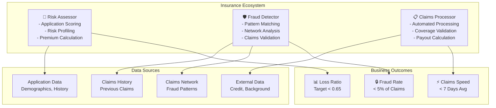

# Insurance Domain Adaptation

## Overview

Insurance systems require agents optimized for risk assessment, fraud detection, claims processing, and pricing optimization. Insurance agents operate in regulated environments with high financial stakes, where incorrect decisions create liability exposure. This guide covers configuring agents for property & casualty, life, health, and commercial insurance.

## Core Insurance Agent Architecture

**Risk Assessment Agent**: Evaluates policyholder risk profiles using application data, credit history, claims history, and behavioral signals. Assigns accurate premiums reflecting true risk. Identifies high-risk applicants requiring additional underwriting or exclusions.

**Fraud Detection Agent**: Identifies suspicious claims using pattern matching, outlier detection, and network analysis. Detects organized fraud rings and prevents staged claims. Routes edge cases to human adjusters.

**Claims Processor Agent**: Automates routine claims processing, validates coverage, calculates payouts, and detects coverage gaps. Escalates complex claims requiring human judgment. Meets SLA targets for claims resolution.



## Implementation Details

### Configuration for Insurance Agents

```yaml
insurance_domain:
  agents:
    risk_assessment:
      model: "gpt-4"
      temperature: 0.05     # Conservative - risk sensitive
      tools:
        - application_scorer
        - credit_analyzer
        - claims_history_reviewer
        - risk_classifier
        - premium_calculator

      risk_assessment_config:
        product_types:
          - auto_insurance:
              rating_factors: 20
              model_accuracy_target: 0.92
              loss_ratio_target: 0.60
          - homeowners_insurance:
              rating_factors: 25
              model_accuracy_target: 0.88
              loss_ratio_target: 0.65
          - commercial_liability:
              rating_factors: 35
              model_accuracy_target: 0.85
              loss_ratio_target: 0.58

        rating_factors_by_product:
          auto:
            - age: 0.20
            - driving_history_clean_years: 0.20
            - vehicle_type_and_age: 0.15
            - annual_mileage: 0.15
            - credit_score: 0.15
            - insurance_history: 0.10
            - claims_frequency: 0.05
          homeowners:
            - property_age: 0.15
            - construction_type: 0.15
            - roof_condition: 0.10
            - square_footage: 0.10
            - claims_history: 0.15
            - location_risk: 0.20
            - protective_devices: 0.10
            - distance_to_fire_station: 0.05

        risk_segmentation:
          - segment: "preferred_plus"
            criteria: "excellent_risk_profile"
            discount_percent: 0.25
            approval_automatic: true
          - segment: "preferred"
            criteria: "good_risk_profile"
            discount_percent: 0.15
            approval_automatic: true
          - segment: "standard"
            criteria: "average_risk"
            discount_percent: 0.0
            approval_automatic: true
          - segment: "nonstandard"
            criteria: "poor_credit_or_claims"
            surcharge_percent: 0.25
            approval_requires: "human_underwriter"
          - segment: "decline"
            criteria: "uninsurable_risk"
            approval_automatic: false
            decline_code: "unacceptable_risk"

        underwriting_rules:
          age_restrictions:
            under_18: "decline"
            18_25: "nonstandard_surcharge"
            65_plus: "additional_medical_exam"
          claims_history:
            claims_last_3_years: "surcharge_per_claim"
            total_losses_exceed_coverage: "decline"
            claims_frequency_high: "nonstandard_segment"
          credit_considerations:
            credit_score_below_600: "surcharge"
            credit_below_500: "decline"
            recent_bankruptcy: "decline"

        premium_calculation:
          base_rate: "actuarially_determined"
          rating_factor_application: "multiplicative"
          minimum_premium_auto: 400
          maximum_rate_increase_percent: 75  # From base
          regulatory_approval: "required_for_rates_above_threshold"

    fraud_detection:
      model: "gpt-4-turbo"
      temperature: 0.10     # Conservative - fraud prevention critical
      tools:
        - claims_analyzer
        - pattern_matcher
        - network_analyzer
        - outlier_detector
        - verification_coordinator

      fraud_detection_config:
        detection_methods:
          - rule_based:
              enabled: true
              examples:
                - claim_amount_exceeds_coverage
                - multiple_claims_same_incident
                - claim_filed_too_quickly
                - pre_loss_policy_modification
          - statistical:
              enabled: true
              method: "isolation_forest"
              contamination_rate: 0.03  # 3% of claims expected to be fraudulent
          - network_analysis:
              enabled: true
              detects: "organized_fraud_rings"
              lookback_months: 36
          - behavioral:
              enabled: true
              signals:
                - claimant_behavior_unusual
                - provider_relationship_suspicious
                - supporting_documentation_inconsistent

        fraud_indicators_by_type:
          staged_auto_claims:
            - multiple_claimants_at_scene
            - emergency_room_visit_unnecessary
            - pre_loss_premium_increase
            - claim_amount_exactly_policy_limit
            - previous_claims_similar_type
          arson:
            - fire_department_investigation_pending
            - recent_policy_enhancement
            - financial_motive_indicators
            - origin_pattern_suspicious
            - witness_information_incomplete
          workers_comp_fraud:
            - claimant_surveillance_contradicts_claim
            - social_media_activity_inconsistent
            - medical_provider_previous_fraud
            - claim_timing_suspicious
            - wage_loss_claim_inflated

        fraud_scoring:
          score_range: [0.0, 1.0]
          threshold_automatic_decline: 0.85
          threshold_additional_investigation: 0.60
          threshold_approve_with_conditions: 0.35

        investigation_protocol:
          investigation_triggers:
            - fraud_score_above_0.60
            - rule_violation_detected
            - claim_value_above_threshold
          investigation_types:
            - desktop_investigation
            - field_investigation
            - medical_record_review
            - surveillance
          investigation_timeline_days: 30

    claims_processor:
      model: "gpt-4"
      temperature: 0.05     # Precise
      tools:
        - coverage_validator
        - claims_calculator
        - documentation_analyzer
        - reserve_estimator
        - appeal_coordinator

      claims_processing_config:
        processing_types:
          routine_claims:
            description: "Simple, documented claims under threshold"
            automation_percent: 0.90
            processing_time_target_days: 2
          standard_claims:
            description: "Claims requiring standard investigation"
            automation_percent: 0.50
            processing_time_target_days: 7
          complex_claims:
            description: "High-value or complex claims"
            automation_percent: 0.10
            processing_time_target_days: 30

        coverage_validation:
          items_checked:
            - policy_active_at_loss_time
            - loss_covered_under_policy
            - coverage_limits_apply
            - deductible_applies
            - exclusions_applicable
            - policy_cancellation_pending

        payout_calculation:
          components:
            - coverage_amount
            - deductible_application
            - policy_limits
            - coinsurance_if_applicable
            - previous_payments_if_recurring
          tax_implications_considered: true
          state_regulations_applied: true

        documentation_requirements:
          auto_insurance:
            - police_report
            - repair_estimate
            - accident_description
            - photo_evidence
          homeowners:
            - loss_description
            - itemized_inventory
            - repair_estimates
            - proof_of_loss
            - photo_evidence
          workers_comp:
            - incident_report
            - medical_records
            - wage_loss_documentation
            - employer_statement

        reserve_estimation:
          method: "expected_value_calculation"
          components:
            - immediate_expenses
            - medical_costs_projected
            - indemnity_costs
            - litigation_likelihood
            - investigation_costs
          reserve_adequacy_review: "quarterly"

  regulatory_compliance:
    solvency_ratio_minimum: 1.50
    loss_ratio_target_maximum: 0.65
    combined_ratio_target_maximum: 0.95  # Loss ratio + expense ratio
    reserve_adequacy: "100_percent"
    fraud_investigation_success_rate: 0.40

  financial_metrics:
    average_claim_value_auto: 3500
    average_claim_value_home: 5000
    average_processing_time_days: 7
    customer_satisfaction_target_percent: 85
```

### Risk Assessment Scoring Model

```python
def calculate_insurance_risk_score(
    applicant_profile,
    product_type='auto_insurance'
):
    score = 0.0

    if product_type == 'auto_insurance':
        # Age factor (20% weight)
        age = applicant_profile.age
        if age < 25:
            score += 0.35 * 0.20
        elif age < 30:
            score += 0.20 * 0.20
        elif age < 65:
            score += 0.10 * 0.20
        else:
            score += 0.15 * 0.20

        # Driving history (20% weight)
        violations = applicant_profile.driving_violations_3_years
        accidents = applicant_profile.accidents_3_years
        driving_score = (violations * 0.05) + (accidents * 0.10)
        score += min(driving_score, 1.0) * 0.20

        # Vehicle risk (15% weight)
        vehicle_risk = get_vehicle_rating(
            applicant_profile.vehicle_make,
            applicant_profile.vehicle_model,
            applicant_profile.vehicle_year
        )
        score += vehicle_risk * 0.15

        # Annual mileage (15% weight)
        annual_miles = applicant_profile.estimated_annual_miles
        if annual_miles > 15000:
            score += min(annual_miles / 30000, 1.0) * 0.15
        else:
            score += 0.05 * 0.15

        # Credit score (15% weight)
        credit_score = applicant_profile.credit_score
        if credit_score < 600:
            score += 0.40 * 0.15
        elif credit_score < 700:
            score += 0.20 * 0.15
        else:
            score += 0.05 * 0.15

        # Insurance history (10% weight)
        prior_claims = applicant_profile.prior_claims_3_years
        score += min(prior_claims / 3, 1.0) * 0.10

        # Claims frequency pattern (5% weight)
        claims_frequency = applicant_profile.claims_frequency_ratio
        if claims_frequency > 0.5:  # > 1 claim per 2 years
            score += 0.30 * 0.05

    # Apply regulatory constraints
    score = apply_fair_lending_constraints(score, applicant_profile)

    # Segment assignment
    if score < 0.20:
        segment = 'preferred_plus'
    elif score < 0.35:
        segment = 'preferred'
    elif score < 0.60:
        segment = 'standard'
    elif score < 0.80:
        segment = 'nonstandard'
    else:
        segment = 'decline'

    return {
        'risk_score': min(score, 1.0),
        'segment': segment,
        'premium_adjustment_percent': calculate_premium_adjustment(score, segment)
    }
```

## Practical Example: Claims Fraud Detection

Configure fraud detection agent to identify staged auto claims:

```python
def detect_staged_auto_claim_fraud(claim_id):
    claim = get_claim_data(claim_id)

    # Red flags for staged collision
    red_flags = []

    # Flag 1: Multiple claimants from same accident
    claimants_same_accident = count_claimants_same_incident(claim.incident_id)
    if claimants_same_accident > 4:
        red_flags.append(('multiple_claimants', 0.30))

    # Flag 2: ER visit without serious injury indicators
    if claim.emergency_room_visit and not claim.serious_injuries:
        red_flags.append(('unnecessary_er_visit', 0.20))

    # Flag 3: Policy enhancement before loss
    time_between_policy_change_and_loss = calculate_days(
        claim.recent_policy_enhancement_date,
        claim.loss_date
    )
    if time_between_policy_change_and_loss < 30:
        red_flags.append(('recent_policy_enhancement', 0.25))

    # Flag 4: Claim amount matches policy limit exactly
    if abs(claim.claim_amount - claim.policy_limit) < 100:
        red_flags.append(('claim_matches_limit', 0.15))

    # Flag 5: Previous similar claims
    similar_prior_claims = find_similar_claims(
        claimant=claim.claimant,
        claim_type='collision',
        time_window_months=60
    )
    if len(similar_prior_claims) > 1:
        red_flags.append(('previous_similar_claims', len(similar_prior_claims) * 0.15))

    # Flag 6: Claimant in fraud network
    if is_claimant_in_fraud_network(claim.claimant):
        red_flags.append(('fraud_network_member', 0.40))

    # Calculate composite fraud score
    fraud_score = sum([weight for _, weight in red_flags])
    fraud_score = min(fraud_score, 1.0)

    return {
        'claim_id': claim_id,
        'fraud_score': fraud_score,
        'red_flags': red_flags,
        'recommendation': 'decline' if fraud_score > 0.85 else 'investigate' if fraud_score > 0.60 else 'approve'
    }
```

## Integration with Insurance Systems

- **Policy Administration**: Duck Creek, Insurity for policy management
- **Claims Management**: Guidewire for claims processing
- **Fraud Detection**: SAS, Experian for fraud analytics
- **Risk Assessment**: Moody's Analytics for underwriting
- **Document Processing**: Hyperscience, Kofax for OCR/document processing
- **Regulatory Compliance**: Thomson Reuters for compliance management

## Performance Metrics for Insurance Agents

| Metric | Target | Impact |
|--------|--------|--------|
| **Loss Ratio** | <65% | Profitability |
| **Fraud Detection Rate** | >40% of fraudulent claims | Loss prevention |
| **False Positive Rate** | <5% of flagged claims | Customer satisfaction |
| **Claims Processing Speed** | <7 days average | Customer satisfaction |
| **Customer Satisfaction (NPS)** | 50+ | Retention and referrals |
| **Underwriting Accuracy** | >92% loss prediction | Pricing correctness |

🔗 **Related Topics**: [Risk Prediction](ANALYTICS_CHURN_PREDICTION.md) | [Fraud Pattern Detection](TESTING_CHAOS_ENGINEERING.md) | [Integration Testing](TESTING_INTEGRATION_TESTING.md) | [Data Connectors](INTEGRATION_DATA_CONNECTORS.md) | [Continuous Learning](AGENT_CONTINUOUS_LEARNING.md)
