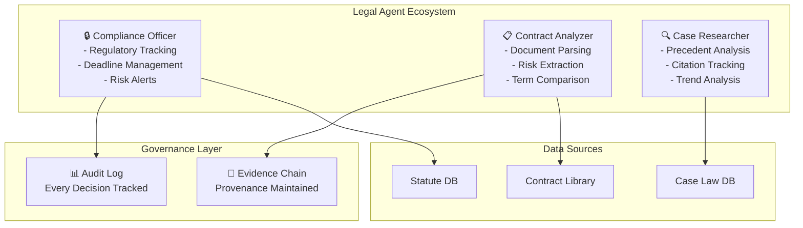

# Legal Domain Adaptation

## Overview

The legal domain presents unique challenges for AutoClaw agents: regulatory compliance, evidence chain management, adversarial reasoning, and precedent-based decision making. Legal AI systems must handle multi-jurisdictional requirements, maintain audit trails for every decision, and reason through conflicting statutes and case law. This guide details how to configure agents specifically for legal domain applications.

## Core Legal Agent Architecture

Legal domain adaptation requires three specialized agent roles:

**Compliance Officer Agent**: Monitors regulatory requirements across jurisdictions, tracks deadline calendars, and flags potential violations. This agent maintains a knowledge store indexed by statute, regulation number, and effective date. Critical capability: cross-referencing multiple regulatory frameworks simultaneously (e.g., GDPR vs. CCPA vs. local data protection laws).

**Contract Analysis Agent**: Parses legal documents, identifies risk clauses, extracts key terms, and compares against template libraries. Uses NLP for section classification (liability, indemnification, termination, etc.). Maintains provenance for every extracted term to support audit requirements.

**Case Law Researcher Agent**: Synthesizes precedent, identifies analogous cases, and tracks legal trends. This agent requires enhanced search capabilities for case citation databases, law review articles, and regulatory guidance documents.



## Implementation Details

### Configuration for Legal Agents

```yaml
legal_domain:
  agents:
    compliance:
      model: "gpt-4-turbo"  # High accuracy needed
      temperature: 0.1      # Precise, conservative responses
      max_tokens: 2000      # Complex regulatory text
      tools:
        - statute_search
        - deadline_tracker
        - jurisdiction_mapper
        - cross_reference_engine
      knowledge_store:
        tier: "hot"          # Always accessible
        retention: "permanent"  # Legal records
        indexed_by:
          - statute_id
          - jurisdiction
          - effective_date
          - expiration_date

    contract_analyzer:
      model: "gpt-4-turbo"
      temperature: 0.05     # Extremely precise
      tools:
        - pdf_extractor
        - section_classifier
        - risk_scorer
        - term_matcher
      risk_thresholds:
        critical: 0.85
        high: 0.65
        medium: 0.40

    case_researcher:
      model: "gpt-4"
      tools:
        - case_law_search
        - citation_parser
        - precedent_synthesizer
        - jurisdiction_filter

  audit_requirements:
    log_every_decision: true
    decision_format: "structured_json"
    fields_required:
      - timestamp
      - agent_id
      - source_documents
      - reasoning_chain
      - confidence_score
      - applicable_law
      - recommended_action
      - human_review_flag
```

### Risk Flagging System

Legal agents must identify high-risk scenarios and escalate to human review:

**Red Flag Categories**:
- Conflict of laws situations (different jurisdictions contradict)
- Ambiguous statutory language requiring interpretation
- Recent regulatory changes (< 30 days) affecting domain
- Missing required disclosures or notices
- Unusual indemnification or liability caps in contracts
- Non-standard termination clauses or change-of-control provisions

Implement risk scoring: (0.0 = completely safe, 1.0 = immediate escalation required)

```python
def calculate_legal_risk_score(document, jurisdiction, agent_context):
    base_score = 0.0

    # Jurisdiction-specific multipliers
    if has_conflict_of_laws(document):
        base_score += 0.35

    # Recency penalty for new regulations
    days_since_effective = calculate_days_since_effective_date(
        document.regulatory_effective_date
    )
    if days_since_effective < 30:
        base_score += 0.20

    # Missing compliance elements
    missing_elements = check_required_disclosures(document)
    base_score += len(missing_elements) * 0.15

    # Non-standard contract language
    anomaly_score = detect_contract_anomalies(document)
    base_score += anomaly_score * 0.30

    return min(base_score, 1.0)
```

## Practical Example: Multi-Jurisdictional Data Protection

A company expanding to Europe, Singapore, and Brazil requires handling GDPR, PDPA, and LGPD simultaneously. Configure agents to:

1. **Map requirements**: Each jurisdiction's data retention requirements (GDPR: 3 years, LGPD: 5 years, PDPA: varies)
2. **Identify conflicts**: GDPR requires data deletion; LGPD allows indefinite retention for certain purposes
3. **Flag gaps**: Determine strictest interpretation (take GDPR requirements as baseline)
4. **Generate audit trail**: Document every data processing decision with jurisdictional justification

Run this annually with deadline reminders 120 days before regulatory changes.

## Audit Trail Requirements

Every legal decision requires immutable documentation:

```json
{
  "decision_id": "legal_decision_2026_03_19_001",
  "timestamp": "2026-03-19T14:32:00Z",
  "agent_id": "compliance_officer_alpha",
  "decision_type": "regulatory_compliance_assessment",
  "jurisdiction": ["EU", "US-CA"],
  "applicable_law": [
    "GDPR Article 6(1)(a)",
    "California Consumer Privacy Act Section 1798.100",
    "PDPA Section 18"
  ],
  "source_documents": [
    "document_hash_sha256_xyz",
    "statute_gdpr_article_6",
    "guidance_edpb_2024_01"
  ],
  "reasoning_chain": [
    "Step 1: Identified three applicable jurisdictions",
    "Step 2: Extracted conflicting retention requirements",
    "Step 3: Applied strictest interpretation principle",
    "Step 4: Flagged requirement gap in current system"
  ],
  "confidence_score": 0.92,
  "recommended_action": "escalate_to_legal_team",
  "human_review_required": true,
  "review_deadline": "2026-03-26",
  "tags": ["data_retention", "multi_jurisdiction", "urgent"]
}
```

## Performance Metrics for Legal Agents

Track these specific KPIs:

| Metric | Target | Measurement |
|--------|--------|-------------|
| **Regulatory Accuracy** | >99% | Compare recommendations against legal counsel review |
| **False Positive Rate** | <5% | Non-binding red flags that don't require escalation |
| **Response Time** | <5 min | Time from query to risk assessment |
| **Audit Trail Completeness** | 100% | All decisions documented with reasoning |
| **Deadline Miss Rate** | 0% | Regulatory deadlines not missed |
| **Coverage Percentage** | >95% | Documents analyzed vs. documents received |

## Integration with Legal Workflows

- **E-signature platforms**: Auto-extract signer identities and verify authority
- **Legal research databases**: LexisNexis, Westlaw API integration for case law
- **Document management**: Automatic classification and retention scheduling
- **Docketing systems**: Calendar integration for deadline tracking
- **CRM systems**: Flag related matters and conflicts of interest

## Risk Mitigation

Always maintain human-in-the-loop for:
- Novel legal theories not covered in training data
- Jurisdictions with fewer than 50 documented cases in knowledge base
- Matters involving personal injury or criminal liability
- Regulatory interpretation that contradicts guidance < 2 years old

🔗 **Related Topics**: [Agent Specialization Patterns](AGENT_SPECIALIZATION_PATTERNS.md) | [Conflict Resolution](AGENT_CONFLICT_RESOLUTION.md) | [Security Validation](TESTING_SECURITY_VALIDATION.md) | [Data Connectors](INTEGRATION_DATA_CONNECTORS.md) | [Knowledge Sharing](AGENT_KNOWLEDGE_SHARING.md)
