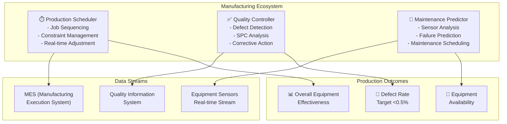

# Manufacturing Domain Adaptation

## Overview

Manufacturing environments require agents optimized for production scheduling, quality control, predictive maintenance, and process optimization. Manufacturing agents operate in high-stakes environments where equipment failures cause cascading delays, quality defects impact reputation, and energy costs affect competitiveness. This guide covers configuring agents for discrete and process manufacturing across multiple production facilities.

## Core Manufacturing Agent Architecture

**Production Scheduler Agent**: Optimizes job sequencing across machines, balances workload to prevent bottlenecks, manages changeovers, and adjusts schedules for equipment failures or rush orders. Coordinates upstream material availability with downstream customer commitments.

**Quality Controller Agent**: Analyzes incoming materials for defects, monitors in-process quality metrics, performs statistical process control, and predicts defect rates before customer impact. Triggers corrective actions when control limits exceed thresholds.

**Maintenance Predictor Agent**: Monitors equipment sensor data (vibration, temperature, runtime hours) to predict failures 7-30 days in advance. Schedules preventive maintenance during planned downtime. Tracks maintenance cost vs. risk trade-offs.



## Implementation Details

### Configuration for Manufacturing Agents

```yaml
manufacturing_domain:
  agents:
    production_scheduler:
      model: "gpt-4"
      temperature: 0.15     # Precision critical
      tools:
        - constraint_solver
        - job_sequencer
        - changeover_optimizer
        - bottleneck_detector
        - schedule_adjuster

      scheduling_config:
        optimization_horizon: 7  # Days ahead
        replanning_frequency: "every_4_hours"
        constraint_priority:
          - equipment_capacity
          - material_availability
          - delivery_commitments
          - changeover_time
          - worker_shifts

        job_sequencing:
          algorithm: "genetic_algorithm"  # or branch_and_bound
          objective_functions:
            - minimize_makespan       # Total completion time
            - minimize_tardiness      # Late deliveries
            - maximize_throughput     # Units per period
            - minimize_changeover     # Setup time reduction
          weights:
            makespan: 0.25
            tardiness: 0.40
            throughput: 0.20
            changeover: 0.15

        changeover_optimization:
          tracked_changeovers:
            - machine_1: ["color_change", "size_change", "material_change"]
            - machine_2: ["setup_type", "fixture_change"]
          smart_sequencing: true  # Group similar jobs

        rush_order_handling:
          priority_premium: 0.30  # Allow 30% schedule delay for rush
          escalation_protocol: "auto_approve_under_24h"
          margin_protection: "maintain_minimum_2_percent"

    quality_controller:
      model: "gpt-4"
      temperature: 0.05     # Extremely conservative
      tools:
        - defect_detector
        - spc_analyzer
        - trend_analyzer
        - root_cause_analyzer
        - corrective_action_recommender

      quality_config:
        control_limits:
          upper_control_limit: 3.0  # Sigma
          lower_control_limit: -3.0
          warning_limit: 2.0

        sampling_plan:
          incoming_material: "AQL_1.0"  # 1% acceptable quality level
          in_process: "continuous_sampling"  # Every Nth unit
          finished_goods: "AQL_0.65"

        defect_tracking:
          root_cause_categories:
            - material_defect
            - equipment_malfunction
            - operator_error
            - setup_incorrect
            - environmental_factor
          resolution_time_days: 3

        spc_rules_applied:
          - one_point_beyond_3_sigma
          - nine_points_in_row_same_side
          - six_points_increasing_trend
          - fourteen_points_alternating
          - pattern_detection: true

        defect_rate_targets:
          critical_defects: 0.001  # < 0.1%
          major_defects: 0.005    # < 0.5%
          minor_defects: 0.020    # < 2%
          tpm_target: 0.985       # Total Product Measurable

    maintenance_predictor:
      model: "gpt-4-turbo"  # Higher token limit for sensor data
      temperature: 0.10
      tools:
        - sensor_processor
        - anomaly_detector
        - failure_predictor
        - maintenance_scheduler
        - spare_parts_recommender

      maintenance_config:
        prediction_horizon_days: 14
        sensors_monitored:
          - vibration_hz: [50, 5000]     # Frequency range
          - temperature_celsius: [20, 100]
          - pressure_bar: [0, 50]
          - runtime_hours: null           # Counter
          - power_draw_kw: [0, 500]
          - acoustic_db: [50, 120]

        anomaly_detection:
          method: "isolation_forest"
          contamination_rate: 0.01  # 1% of data is anomalous
          retraining_frequency: "monthly"
          immediate_alert_threshold: 0.95  # 95% anomaly probability

        failure_prediction_thresholds:
          critical_risk_days: 3
          high_risk_days: 7
          medium_risk_days: 14
          preventive_action_trigger: "medium_risk"

        maintenance_types:
          preventive:
            frequency_hours: [8760, 2000]  # Equipment dependent
            duration_hours: 4
            parts_replacement: true
          predictive:
            trigger: "anomaly_detection"
            lead_time_days: 7
            parts_staging: true
          reactive:
            response_time_hours: 4
            emergency_crew_on_call: true

        spare_parts_management:
          critical_parts_stock: "3_months"
          standard_parts_stock: "1_month"
          reorder_point_triggered: 25  # Units
          supplier_lead_time_days: 10

  oee_targets:
    availability_percent: 0.90      # Equipment uptime
    performance_percent: 0.95       # Run speed vs design
    quality_percent: 0.985          # Defect-free production
    overall_oee_target: 0.85        # 90% * 95% * 98.5%

  facility_parameters:
    number_of_machines: 15
    shifts_per_day: 3
    planned_maintenance_days_per_month: 2
    average_changeover_minutes: 45
```

### Production Scheduling Algorithm

```python
def optimize_production_schedule(
    jobs,
    machines,
    horizon_days=7
):
    # Initialize schedule slots
    schedule = initialize_empty_schedule(machines, horizon_days)

    # Constraint solver approach
    solver = create_constraint_solver()

    # Add machines as resources
    for machine in machines:
        solver.add_resource(machine.id, capacity=8*shifts_per_day)

    # Add jobs as tasks with constraints
    for job in jobs:
        task = solver.add_task(
            job_id=job.id,
            duration=job.processing_time,
            resource=select_capable_machines(job, machines),
            priority=calculate_job_priority(job)
        )

        # Add precedence constraints
        if job.predecessor_jobs:
            for pred in job.predecessor_jobs:
                solver.add_precedence_constraint(pred, job)

        # Add deadline constraint
        if job.due_date:
            solver.add_deadline(task, job.due_date)

    # Add changeover constraints
    for machine in machines:
        changeover_matrix = get_changeover_times(machine)
        solver.add_changeover_constraints(
            machine.id,
            changeover_matrix,
            cost_factor=0.15
        )

    # Solve with optimization objectives
    solution = solver.solve(
        objectives=[
            minimize_makespan(),
            minimize_tardiness(),
            maximize_throughput(),
            minimize_changeover()
        ],
        objective_weights=[0.25, 0.40, 0.20, 0.15]
    )

    return solution
```

## Practical Example: Preventive Maintenance Coordination

Configure agents to balance maintenance costs against equipment downtime:

1. **Data Collection**: Stream sensor data (vibration, temperature, runtime) at 10 Hz from each machine
2. **Anomaly Detection**: Flag anomalies with >90% probability using isolation forest
3. **Failure Prediction**: Given anomalies, predict failure probability for next 7, 14, 30 days
4. **Risk Scoring**: Calculate cost of failure (lost production) vs. preventive maintenance cost
5. **Scheduling**: Schedule maintenance during planned downtime windows to minimize impact

```python
def calculate_maintenance_risk_score(machine_id, sensor_data):
    # Anomaly probability from isolation forest
    anomaly_prob = detect_anomaly(sensor_data)

    # Historical failure pattern
    similar_signatures = find_similar_sensor_signatures(sensor_data)
    historical_failure_rate = calculate_failure_rate(similar_signatures)

    # Time since last maintenance
    hours_since_maintenance = get_runtime_hours(machine_id)
    preventive_schedule_ratio = hours_since_maintenance / preventive_interval_hours

    # Combine signals
    risk_score = (
        anomaly_prob * 0.50 +
        historical_failure_rate * 0.30 +
        min(preventive_schedule_ratio, 1.0) * 0.20
    )

    return risk_score

# Risk scoring thresholds:
# 0.0-0.33: Low - Continue normal operation
# 0.33-0.66: Medium - Schedule maintenance within 2 weeks
# 0.66-0.85: High - Schedule maintenance within 1 week
# >0.85: Critical - Schedule immediate maintenance or add spare equipment
```

## Statistical Process Control (SPC)

Monitor production quality using control charts:

```json
{
  "process": "injection_molding_machine_1",
  "product_type": "plastic_housing_xyz",
  "control_chart_type": "X_bar_R_chart",
  "sample_size": 5,
  "frequency": "every_hour",
  "control_limits": {
    "upper_control_limit": 50.12,
    "center_line": 50.00,
    "lower_control_limit": 49.88,
    "warning_limit_upper": 50.08,
    "warning_limit_lower": 49.92
  },
  "recent_samples": [
    {"timestamp": "2026-03-19T10:00:00Z", "mean": 50.02, "range": 0.15, "status": "in_control"},
    {"timestamp": "2026-03-19T11:00:00Z", "mean": 50.05, "range": 0.18, "status": "in_control"},
    {"timestamp": "2026-03-19T12:00:00Z", "mean": 50.09, "range": 0.22, "status": "warning"},
    {"timestamp": "2026-03-19T13:00:00Z", "mean": 50.15, "range": 0.25, "status": "out_of_control"}
  ],
  "trigger_actions": [
    {"sample_index": 3, "rule_violated": "one_point_beyond_3_sigma"},
    {"action": "stop_production", "assigned_to": "shift_supervisor"},
    {"action": "investigate_root_cause", "assigned_to": "quality_engineer"},
    {"action": "adjust_machine_calibration", "assigned_to": "maintenance_technician"}
  ]
}
```

## OEE (Overall Equipment Effectiveness) Tracking

Calculate and monitor OEE for each asset:

```python
def calculate_oee_metrics(machine_id, period_hours=8):
    # Availability = (Actual Runtime / Planned Production Time) * 100
    planned_time = period_hours * 60  # minutes
    downtime = get_downtime_logs(machine_id, period_hours)
    actual_runtime = planned_time - sum(downtime.values())
    availability = (actual_runtime / planned_time) * 100

    # Performance = (Total Count * Ideal Cycle Time) / Actual Runtime
    total_count = get_production_count(machine_id, period_hours)
    ideal_cycle_time = get_design_cycle_time(machine_id)
    actual_runtime_minutes = actual_runtime
    performance = (total_count * ideal_cycle_time / actual_runtime_minutes) * 100

    # Quality = Good Count / Total Count
    defect_count = get_defect_count(machine_id, period_hours)
    good_count = total_count - defect_count
    quality = (good_count / total_count) * 100 if total_count > 0 else 0

    # OEE = Availability * Performance * Quality
    oee = (availability * performance * quality) / 10000

    return {
        'availability': availability,
        'performance': performance,
        'quality': quality,
        'oee': oee,
        'period_hours': period_hours,
        'status': classify_oee(oee)  # World class > 85%
    }
```

## Integration with Manufacturing Systems

- **MES**: Siemens Opcenter, Apriso for production tracking
- **ERP**: SAP, Oracle for inventory and logistics
- **IoT platforms**: GE Predix, Siemens MindSphere for sensor data
- **Quality systems**: Minitab, JMP for SPC and data analysis
- **Maintenance management**: Computerized Maintenance Management System (CMMS)
- **Sensor networks**: Edge devices, MQTT brokers for real-time data

## Performance Metrics for Manufacturing Agents

| Metric | Target | Impact |
|--------|--------|--------|
| **Overall Equipment Effectiveness (OEE)** | >85% | Indicates world-class operations |
| **Mean Time Between Failures (MTBF)** | +20% improvement | Reduces unplanned downtime |
| **Defect Rate** | <0.5% | Improves customer satisfaction |
| **Schedule Adherence** | >98% | Meets customer commitments |
| **Changeover Time Reduction** | 15-25% reduction | Improves throughput |
| **Preventive Maintenance Ratio** | 80-85% | Reduces reactive maintenance |

🔗 **Related Topics**: [Performance Profiling](TESTING_PERFORMANCE_PROFILING.md) | [Anomaly Detection](TESTING_CHAOS_ENGINEERING.md) | [Message Queues](INTEGRATION_MESSAGE_QUEUES.md) | [Database Sync](INTEGRATION_DATABASE_SYNC.md) | [Performance Metrics](AGENT_PERFORMANCE_METRICS.md)
