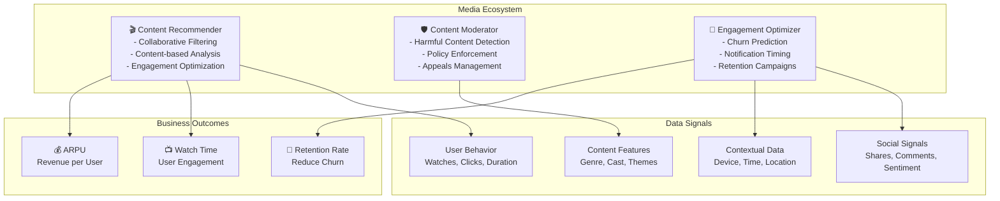

# Media & Entertainment Domain Adaptation

## Overview

Media and entertainment systems require agents optimized for content recommendation, audience engagement prediction, content moderation, and revenue optimization. Media agents operate in highly competitive environments where attention is currency and algorithmic decisions drive billions in advertising revenue. This guide covers configuring agents for streaming, publishing, and digital media platforms.

## Core Media Agent Architecture

**Content Recommendation Agent**: Personalizes content suggestions using collaborative filtering, content features, and user engagement signals. Optimizes simultaneously for user satisfaction and platform revenue (watch time, engagement, conversions).

**Moderation Agent**: Detects harmful content (violence, abuse, misinformation) at scale using computer vision and NLP. Maintains content policy compliance while minimizing false positives. Routes edge cases to human reviewers.

**Audience Engagement Agent**: Predicts user churn, identifies drop-off points in content consumption, and optimizes notification timing/messaging to maximize engagement. A/B tests notificationstrategies continuously.



## Implementation Details

### Configuration for Media Agents

```yaml
media_domain:
  agents:
    content_recommender:
      model: "gpt-4"
      temperature: 0.4      # Balance exploration vs exploitation
      tools:
        - collaborative_filter
        - content_analyzer
        - engagement_tracker
        - contextual_bandit
        - a_b_test_manager

      recommendation_config:
        algorithm_weights:
          collaborative_filtering: 0.40
          content_features: 0.25
          social_signals: 0.20
          contextual_bandit: 0.15

        optimization_objectives:
          primary: "maximize_watch_time"
          secondary: "maximize_user_satisfaction"
          tertiary: "increase_subscription_conversions"
          weight_by_user_segment:
            free_users: [watch_time: 0.5, satisfaction: 0.25, conversion: 0.25]
            premium_users: [watch_time: 0.4, satisfaction: 0.6, conversion: 0.0]

        content_types:
          - series: {avg_duration_minutes: 420, engagement_target: 0.7}
          - movies: {avg_duration_minutes: 120, engagement_target: 0.65}
          - shorts: {avg_duration_minutes: 15, engagement_target: 0.55}
          - live: {avg_duration_minutes: 90, engagement_target: 0.60}

        personalization_breadth:
          new_users: [popular: 0.60, diverse: 0.40]
          active_users: [personalized: 0.70, discovery: 0.30]
          at_risk_users: [highly_relevant: 0.85, discovery: 0.15]

        ranking_factors:
          - relevance_score: 0.35
          - recency_boost: 0.15  # Recent releases ranked higher
          - diversity_penalty: 0.15  # Avoid recommending similar content
          - cold_start_bias: 0.20  # Boost new/trending content
          - user_satisfaction_history: 0.15

        exploration_vs_exploitation:
          thompson_sampling_enabled: true
          exploration_rate: 0.15  # 15% random recommendations
          exploitation_rate: 0.85  # 85% optimal predictions

        a_b_test_framework:
          enabled: true
          concurrent_tests: 5
          test_duration_days: 14
          variant_allocation:
            control: 0.50
            variant_a: 0.25
            variant_b: 0.25
          success_metrics:
            - watch_time_increase_percent
            - user_satisfaction_increase_percent
            - churn_reduction_percent

    content_moderator:
      model: "gpt-4-vision"
      temperature: 0.05     # Conservative - err on side of caution
      tools:
        - image_classifier
        - video_frame_analyzer
        - text_analyzer
        - audio_classifier
        - policy_matcher
        - appeals_processor

      moderation_config:
        policies_enforced:
          violence_level: 3  # On 1-5 scale; block if > 3
          sexual_content_level: 2
          hate_speech_confidence: 0.85  # Block if > 85% confidence
          misinformation_severity: "high"
          self_harm_content: "absolute_block"

        moderation_pipeline:
          - stage: "automated_scan"
            tools: ["image_classification", "text_nlp", "audio_analysis"]
            confidence_threshold: 0.90
            action_if_exceeded: "flag_for_review"
          - stage: "policy_matching"
            rules_engine: "custom_policy_rules"
            escalation_threshold: "any_violation"
          - stage: "human_review"
            reviewer_qualification: "trained_moderator"
            review_sla_hours: 4
            appeal_available: true
          - stage: "enforcement"
            actions: ["remove", "age_restrict", "label", "shadow_ban"]
            notification_to_creator: true
            archive_for_appeals: true

        false_positive_management:
          target_false_positive_rate: 0.02  # 2% of flagged content
          detection_accuracy_target: 0.98
          regular_auditing: "weekly"
          model_retraining: "monthly"

        context_awareness:
          educational_exceptions: true
          artistic_merit_consideration: true
          satire_detection: true
          news_reporting_exemptions: true

        creator_support:
          appeals_process: "transparent"
          appeals_turnaround_days: 3
          policy_training: "available"
          strike_system: "three_strikes"

    engagement_optimizer:
      model: "gpt-4"
      temperature: 0.2      # Some uncertainty acceptable
      tools:
        - churn_predictor
        - engagement_scorer
        - notification_optimizer
        - retention_planner
        - a_b_test_coordinator

      engagement_config:
        churn_prediction:
          horizon_days: 30
          prediction_accuracy_target: 0.80
          behavioral_signals:
            declining_watch_time: 0.30
            decreased_session_frequency: 0.25
            low_engagement_with_notifications: 0.20
            account_inactivity_days: 0.15
            content_satisfaction_declining: 0.10

        engagement_tiers:
          - tier: "highly_engaged"
            watch_time_hours_monthly: 20
            session_frequency: 8
            retention_rate_percent: 95
          - tier: "moderate"
            watch_time_hours_monthly: 5
            session_frequency: 3
            retention_rate_percent: 70
          - tier: "at_risk"
            watch_time_hours_monthly: 1
            session_frequency: 1
            retention_rate_percent: 30

        notification_strategy:
          optimal_timing:
            algorithm: "bayesian_optimization"
            factors:
              - user_timezone
              - historical_open_rate
              - content_relevance
              - frequency_cap
          frequency_caps:
            daily_max: 5
            weekly_max: 15
            per_content_series: 2
          message_personalization:
            language: "user_preference"
            tone: "user_segment_based"
            call_to_action: "a_b_tested"

        retention_offers:
          segments:
            - at_risk_users:
                offer_type: "free_premium_trial"
                duration_days: 30
                targeting_lift: 0.35
            - nearly_cancelled:
                offer_type: "discount_rate"
                discount_percent: 0.25
                targeting_lift: 0.50
            - seasonal_churners:
                offer_type: "family_plan_upgrade"
                discount_percent: 0.15
                targeting_lift: 0.20

  content_library:
    catalog_size: 500000  # 500k titles
    daily_ingest_rate: 500
    content_refresh_frequency: "daily"
    archive_retention_years: 7

  business_metrics:
    average_session_duration_minutes: 45
    completion_rate_percent: 62  # % of content completed
    subscriber_ltv_calculation: "arpu * average_lifetime_months"
```

### Content Recommendation Pipeline

```python
def generate_personalized_recommendations(
    user_id,
    context,
    num_recommendations=8
):
    user = get_user_profile(user_id)
    user_history = get_watch_history(user_id, days=90)

    # Collaborative filtering - users like you watched
    collab_items = collaborative_filter(
        user_id,
        k_nearest_neighbors=50,
        num_items=num_recommendations * 3
    )

    # Content-based - similar to what you watched
    content_items = content_based_filter(
        user_history.recent_watches,
        num_items=num_recommendations * 2
    )

    # Contextual bandits - exploit vs explore
    contextual_items = contextual_bandit.select(
        user_segment=user.segment,
        context={
            'device': context.device,
            'time_of_day': context.time_of_day,
            'day_type': determine_day_type(context.date)
        },
        num_items=num_recommendations * 2
    )

    # Blend recommendations
    all_candidates = merge_and_deduplicate([
        collab_items,
        content_items,
        contextual_items
    ])

    # Apply business rules and personalization
    final_recommendations = all_candidates[:]

    # Diversity constraint
    final_recommendations = apply_diversity_constraint(
        final_recommendations,
        max_same_genre_percent=0.40
    )

    # Recency boost for trending content
    if user.engagement_level == 'high':
        final_recommendations = apply_recency_boost(
            final_recommendations,
            boost_factor=0.15
        )

    # Cold start handling
    if len(user_history.recent_watches) < 5:
        final_recommendations = apply_popular_content_boost(
            final_recommendations,
            boost_factor=0.25
        )

    # Learning from past recommendations
    past_rec_performance = analyze_past_recommendation_performance(user_id)
    final_recommendations = rerank_by_performance(
        final_recommendations,
        past_performance=past_rec_performance
    )

    return final_recommendations[:num_recommendations]
```

## Practical Example: New Series Launch Campaign

When launching a high-budget series, coordinate all three agents:

```python
def execute_series_launch_campaign(series_id):
    series = get_series_metadata(series_id)

    # Content Recommender: Boost visibility
    recommendation_engine.set_promotion_boost(
        content_id=series_id,
        boost_multiplier=5.0,  # 5x visibility
        target_audience='all_users',
        duration_weeks=2
    )

    # Engagement Optimizer: Targeted notifications
    target_users = engagement_optimizer.identify_users_likely_to_enjoy(
        series_id,
        num_users=5000000,
        prediction_accuracy_threshold=0.75
    )
    engagement_optimizer.send_personalized_notification(
        users=target_users,
        message='New {series_name} launches today!',
        optimal_timing=True,
        a_b_test_variants=[
            {'message': 'dramatic', 'emoji': '🎬'},
            {'message': 'casual', 'emoji': '📺'},
            {'message': 'fan_focused', 'content': 'cast_highlights'}
        ]
    )

    # Content Moderation: Pre-screen content
    moderation_agent.pre_screen_content(
        series_id,
        priority='high',
        escalation_contact='senior_moderator'
    )

    # Measure success
    monitor_series_metrics = {
        'launch_day_watch_starts': 500000,
        'avg_episode_completion_rate': 0.65,
        'user_satisfaction_rating': 4.2,
        'conversion_rate_free_to_paid': 0.15
    }
```

## Content Moderation at Scale

```json
{
  "moderation_case": {
    "content_id": "VIDEO_XYZ_TIMESTAMP_1234",
    "submitted_by": "ai_scan",
    "timestamp": "2026-03-19T14:32:15Z",
    "content_type": "video_frame",
    "detected_issues": [
      {
        "policy_violation": "violence_level_4",
        "confidence": 0.92,
        "classifier_model": "violence_detector_v3",
        "description": "Graphic violence above policy threshold"
      },
      {
        "policy_violation": "hate_speech",
        "confidence": 0.78,
        "classifier_model": "hate_speech_detector_v2",
        "description": "Hateful slurs detected in audio"
      }
    ],
    "recommended_action": "remove_content",
    "severity": "high",
    "human_review_required": true,
    "reviewer_assignment": "qualified_moderator",
    "appeal_deadline": "2026-03-26T14:32:15Z",
    "creator_notification": {
      "sent": true,
      "explanation_provided": true,
      "appeal_instructions": true,
      "policy_link": true
    }
  }
}
```

## Integration with Media Platforms

- **Streaming infrastructure**: Akamai, Cloudflare for CDN
- **Analytics platforms**: Amplitude, Mixpanel for user tracking
- **Recommendation engines**: Recombee, Mux for personalization
- **Moderation tools**: Crisp Thinking, Two Hat Security for content filtering
- **Advertising platforms**: Programmatic ad networks for monetization
- **Creator platforms**: YouTube Studio, Twitch Creator Dashboard

## Performance Metrics for Media Agents

| Metric | Target | Impact |
|--------|--------|--------|
| **Watch Time per User** | +20% | Engagement increase |
| **User Retention Rate** | 75%+ | Reduce churn |
| **Content Completion Rate** | 65%+ | Content resonance |
| **Recommendation Conversion Rate** | 15-20% | Revenue generation |
| **Moderation False Positive Rate** | <2% | Creator satisfaction |
| **Notification Open Rate** | 20-30% | Engagement lift |

🔗 **Related Topics**: [User Behavior Analytics](ANALYTICS_USER_BEHAVIOR.md) | [Feature Impact](ANALYTICS_FEATURE_IMPACT.md) | [A/B Testing](TESTING_A_B_TESTING.md) | [Conversion Optimization](ANALYTICS_CONVERSION_OPTIMIZATION.md) | [Continuous Learning](AGENT_CONTINUOUS_LEARNING.md)
