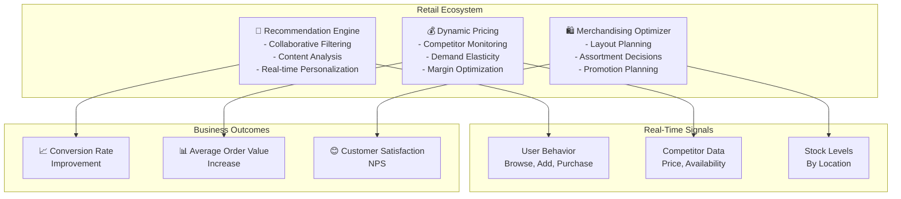

# Retail Domain Adaptation

## Overview

Retail environments require agents optimized for customer experience personalization, dynamic pricing, merchandising optimization, and omnichannel inventory coordination. Retail agents operate in real-time contexts where decisions impact customer satisfaction, margin, and competitive positioning within minutes. This guide covers configuring agents for modern retail operations across physical stores, online channels, and marketplaces.

## Core Retail Agent Architecture

**Recommendation Engine Agent**: Personalizes product suggestions using collaborative filtering, content-based analysis, and real-time behavior signals. Optimizes for both immediate conversion and long-term customer value. A/B tests recommendation algorithms continuously.

**Dynamic Pricing Agent**: Adjusts prices in real-time based on competitor pricing, inventory levels, demand elasticity, and customer segments. Maintains optimal price ceilings to avoid price perception damage while maximizing margin opportunity.

**Merchandising Optimizer Agent**: Plans shelf layouts, assortment depth/breadth decisions, seasonal promotions, and cross-selling strategies. Analyzes traffic patterns, dwell time, and conversion rates by product location.



## Implementation Details

### Configuration for Retail Agents

```yaml
retail_domain:
  agents:
    recommendation_engine:
      model: "gpt-4"
      temperature: 0.4      # Balance exploration vs exploitation
      tools:
        - collaborative_filter
        - content_analyzer
        - behavior_tracker
        - contextual_bandit
        - ab_test_runner

      recommendation_config:
        algorithm_mix:
          collaborative_filtering: 0.40  # Similar users
          content_based: 0.30             # Similar products
          behavioral: 0.20                # Browse patterns
          contextual: 0.10                # Time, device, location

        personalization_depth:
          anonymous_users: "demographic_segments"
          registered_users: "individual_profile"
          vip_customers: "real_time_behavior"

        a_b_test_framework:
          enabled: true
          min_sample_size: 1000
          statistical_significance: 0.95
          test_duration_days: 14
          variants:
            - algorithm_set_A
            - algorithm_set_B
            - control_group

        cold_start_strategy:
          new_users: "popularity_based"
          new_products: "content_similarity"
          fallback: "trending_items"

    dynamic_pricing:
      model: "gpt-4"
      temperature: 0.1      # Precision critical
      tools:
        - competitor_scraper
        - demand_elasticity_modeler
        - margin_calculator
        - price_optimizer
        - price_sensitivity_analyzer

      pricing_config:
        update_frequency: "real_time"  # Every 1-5 minutes
        repricing_algorithm: "contextual_bandit"
        max_price_adjustments_per_day: 5

        competitor_monitoring:
          tracked_competitors: ["amazon", "walmart", "target"]
          price_parity_threshold: 0.05  # Allow 5% variance
          critical_items_match_price: true
          non_critical_items_optimize_margin: true

        demand_elasticity_segments:
          - segment: "price_sensitive"
            elasticity: 1.8
            margin_optimization_priority: "medium"
          - segment: "brand_loyal"
            elasticity: 0.7
            margin_optimization_priority: "high"
          - segment: "convenience_focused"
            elasticity: 0.5
            margin_optimization_priority: "high"

        inventory_driven_pricing:
          inventory_high_percent: 0.20  # Discount when >120 days supply
          discount_level: 0.15
          inventory_low_percent: 0.05   # Premium when <20 days supply
          premium_level: 0.10

        segment_based_pricing:
          vip_discount_percent: 0.08
          clearance_members_discount_percent: 0.05
          seasonal_category_discount_percent: 0.12

    merchandising_optimizer:
      model: "gpt-4"
      temperature: 0.25     # Some creative layout
      tools:
        - traffic_analyzer
        - heatmap_generator
        - assortment_optimizer
        - promotion_planner
        - space_efficiency_analyzer

      merchandising_config:
        store_format: ["superstore", "specialty", "outlet"]
        optimization_period: "monthly"

        layout_planning:
          power_locations: ["front_entrance", "end_cap", "checkout"]
          power_location_selection: "high_margin_seasonal"
          moderate_velocity_products: "main_aisles"
          slow_moving_products: "lower_traffic_zones"

        assortment_strategy:
          destination_categories: ["fresh_produce", "pharmacy", "bakery"]
          high_turnover_items: 0.60  # 60% of shelf space
          cross_sell_opportunities: 0.25
          exploration_products: 0.15  # New items, ethnic brands

        promotion_planning:
          annual_promotional_calendar: "planned_quarterly"
          buy_one_get_one: "high_traffic_periods"
          bundle_deals: "complementary_categories"
          flash_sales: "inventory_management"

        traffic_optimization:
          dwell_time_target_minutes: 45
          zones_below_target: "refresh_planogram"
          high_yield_categories: "expand_assortment"

  experiment_platform:
    enabled: true
    concurrent_tests: 3
    minimum_test_duration_days: 7
    minimum_weekly_conversions: 100

  pricing_guardrails:
    max_price_increase_percent: 0.25  # Max 25% increase
    max_price_decrease_percent: 0.50  # Max 50% decrease
    competitor_price_floor: true
    psychological_price_points: [9.99, 19.99, 49.99]
```

### Personalization Pipeline

```python
def generate_personalized_recommendations(
    user_id,
    context,
    num_recommendations=5
):
    # Load user profile
    user = get_user_profile(user_id)

    # Determine user type for algorithm selection
    if is_vip_customer(user):
        algorithm_weights = {
            'collaborative': 0.35,
            'behavioral': 0.30,
            'content': 0.25,
            'contextual': 0.10
        }
    elif is_returning_customer(user):
        algorithm_weights = {
            'collaborative': 0.40,
            'content': 0.35,
            'behavioral': 0.15,
            'contextual': 0.10
        }
    else:  # New user
        algorithm_weights = {
            'collaborative': 0.20,
            'content': 0.40,
            'contextual': 0.40,
            'behavioral': 0.00
        }

    # Generate recommendations from each algorithm
    collab_recs = collaborative_filtering_recommender.recommend(
        user_id,
        num_recommendations * 2
    )
    content_recs = content_based_recommender.recommend(
        user.preferences,
        num_recommendations * 2
    )
    behavioral_recs = behavioral_recommender.recommend(
        user.recent_interactions,
        num_recommendations * 2
    )
    contextual_recs = contextual_bandit.select(
        user.segment,
        context,
        num_recommendations * 2
    )

    # Blend recommendations
    blended = blend_recommendations(
        [collab_recs, content_recs, behavioral_recs, contextual_recs],
        weights=algorithm_weights
    )

    # Apply business rules
    final_recs = apply_business_rules(
        blended,
        rules=[
            avoid_recently_purchased(),
            prefer_higher_margin(),
            enforce_category_diversity(),
            respect_inventory_levels()
        ]
    )

    return final_recs[:num_recommendations]
```

## Practical Example: Holiday Season Optimization

During peak retail periods, coordinate across all three agent types:

**Recommendation Engine**: Shift algorithm weights toward gift-purchasing signals (search history includes "gift", "for him/her"). Increase weight of cross-category recommendations (e.g., gift with greeting card, wrapping paper).

**Dynamic Pricing**: Apply category-based discounts aligned with promotional calendar. Competitor price matching tightens (max 5% variance). Premium products with low elasticity maintain higher margins.

**Merchandising**: Create gift bundles on end-caps. Feature high-margin holiday products. Increase assortment depth in gift categories. Deploy promotional signage.

```json
{
  "campaign_id": "holiday_2026_q4",
  "period": "2026-11-01T00:00:00Z to 2026-12-31T23:59:59Z",
  "recommendation_override": {
    "gift_search_boost": 2.5,
    "cross_category_weight": 0.35,
    "exclusion_rules": ["recently_purchased_within_days: 0"]
  },
  "pricing_override": {
    "discount_strategy": "category_based",
    "premium_categories": ["jewelry", "luxury_goods", "electronics"],
    "discount_categories": ["decorations", "seasonal_items"],
    "discount_percent": 0.20,
    "competitor_price_match_tolerance": 0.05
  },
  "merchandising_override": {
    "featured_categories": ["gifts", "decorations", "entertainment"],
    "bundle_offers": [
      {
        "bundle_id": "perfect_gift_her",
        "items": ["jewelry", "cosmetics", "accessories"],
        "discount": 0.15
      }
    ],
    "end_cap_rotation": "weekly"
  }
}
```

## Customer Segmentation for Personalization

Segment customers for tailored experiences:

| Segment | Identification | Recommendation Strategy | Pricing Strategy |
|---------|---|---|---|
| **VIP/Loyalty** | 15%+ annual spend, 10+ purchases/year | Real-time personalization, early access to sales | Loyalty discounts 8%, exclusive products |
| **Regular** | 3-10 purchases/year, engaged | Personalized via behavior, trending items | Standard pricing + periodic promotions |
| **Occasional** | 1-2 purchases/year | Popularity-based, category browsing | Seasonal discounts 10-15% |
| **One-Time** | Single purchase | Content-based, demographics | New customer discount 15% |
| **At-Risk** | No purchase > 90 days, was active | Reactivation campaigns, exclusive offers | Win-back discount 20% |

## Omnichannel Inventory Coordination

Maintain consistent experience across channels:

```python
def check_product_availability_omnichannel(
    sku_id,
    customer_location,
    channel
):
    # Check inventory across all channels
    available_inventory = {
        'online': get_inventory('online_warehouse', sku_id),
        'store_local': get_inventory(find_nearest_store(customer_location), sku_id),
        'stores_nearby': get_inventory(
            find_nearby_stores(customer_location, radius_miles=5),
            sku_id
        )
    }

    # Fulfill from best option
    if available_inventory['online'] > 5:
        return offer_shipment('online_warehouse')
    elif available_inventory['store_local'] > 0:
        return offer_buy_online_pickup_in_store('store_local')
    elif sum(available_inventory['stores_nearby'].values()) > 3:
        return offer_ship_from_nearby_store('stores_nearby')
    else:
        return offer_back_order_or_comparable_alternative()
```

## Integration with Retail Systems

- **POS systems**: Square, Toast, Oracle MICROS for transaction data
- **E-commerce platforms**: Shopify, Magento, custom platforms
- **Inventory management**: Fishbowl, Cin7 for stock tracking
- **Customer data**: CDP platforms like Segment, mParticle
- **Competitor monitoring**: Keepa, Sisense, custom APIs
- **Promotion management**: Promotech, Martech platforms

## Performance Metrics for Retail Agents

| Metric | Target | Measurement Method |
|--------|--------|---|
| **Recommendation Conversion Lift** | +15% | A/B test vs. baseline |
| **Average Order Value Lift** | +8% | Influenced order tracking |
| **Inventory Turnover** | 5-8x/year | Stock turns per category |
| **Gross Margin Expansion** | +2-3% | Pricing optimization impact |
| **Customer Satisfaction (NPS)** | 50+ | Post-purchase surveys |
| **Omnichannel Fulfillment Rate** | 98%+ | Orders fulfilled as requested |

🔗 **Related Topics**: [User Behavior Analytics](ANALYTICS_USER_BEHAVIOR.md) | [A/B Testing](TESTING_A_B_TESTING.md) | [Conversion Optimization](ANALYTICS_CONVERSION_OPTIMIZATION.md) | [Specialization Patterns](AGENT_SPECIALIZATION_PATTERNS.md) | [Continuous Learning](AGENT_CONTINUOUS_LEARNING.md)
