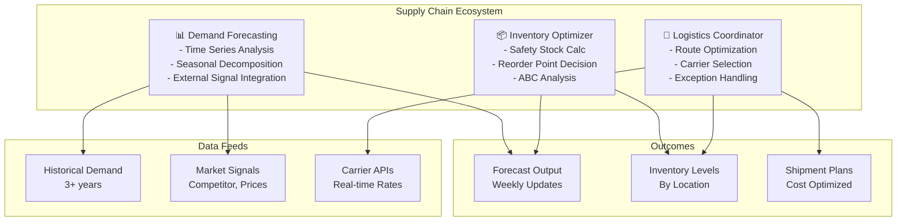

# Supply Chain Domain Adaptation

## Overview

Supply chain management requires agents optimized for demand forecasting, inventory optimization, logistics coordination, and supplier relationship management. Supply chain agents operate in highly uncertain environments with multiple interconnected nodes, complex regulatory requirements, and significant financial impact. This guide covers configuring agents for end-to-end supply chain visibility and optimization.

## Core Supply Chain Agent Architecture

**Demand Forecasting Agent**: Predicts product demand using time series analysis, seasonal patterns, promotional effects, and macroeconomic indicators. Incorporates historical demand, competitor pricing, and external events (weather, pandemics, geopolitical factors). Updates forecasts weekly with rolling 52-week horizons.

**Inventory Optimizer Agent**: Balances carrying costs against stockout risk, determines optimal safety stock levels by SKU and location, and manages seasonal stockpiling. Models the classic inventory trade-off: holding costs vs. shortage costs.

**Logistics Coordinator Agent**: Optimizes shipping routes, consolidates shipments across orders, tracks in-transit inventory, and manages last-mile delivery. Integrates with carrier APIs for real-time tracking and rate shopping.



## Implementation Details

### Configuration for Supply Chain Agents

```yaml
supply_chain_domain:
  agents:
    demand_forecasting:
      model: "gpt-4"
      temperature: 0.2      # Conservative predictions
      tools:
        - time_series_decomposer
        - arima_forecaster
        - xgboost_ensemble
        - external_signal_analyzer
        - anomaly_detector

      forecast_config:
        horizon_days: 365       # 52-week forecasts
        update_frequency: "weekly"
        lookback_period_years: 3
        confidence_interval: 0.95
        models:
          - exponential_smoothing
          - arima
          - prophet
          - ml_ensemble
        external_signals:
          - seasonal_calendar
          - promotional_calendar
          - weather_data
          - competitor_prices
          - macroeconomic_indicators

      seasonality_config:
        detection_method: "seasonal_decompose"
        components: ["trend", "seasonal", "residual"]
        seasonal_periods: [7, 365]  # Weekly and yearly

    inventory_optimizer:
      model: "gpt-4"
      tools:
        - abc_classifier
        - eoq_calculator
        - safety_stock_modeler
        - reorder_point_calculator
        - stockout_simulator

      optimization_parameters:
        holding_cost_rate: 0.25  # 25% of unit cost annually
        shortage_cost_multiplier: 3.0  # Cost of stockout
        lead_time_variability_factor: 1.65  # Z-score for 95%
        service_level_targets:
          A_items: 0.98         # Most critical
          B_items: 0.95
          C_items: 0.90         # Least critical

      abc_thresholds:
        a_items_by_value: 0.20  # 20% of SKUs, 80% of value
        b_items_by_value: 0.30
        c_items_by_value: 0.50

    logistics_coordinator:
      model: "gpt-4"
      temperature: 0.15    # Precision in optimization
      tools:
        - route_optimizer
        - carrier_rater
        - consolidation_engine
        - exception_handler
        - real_time_tracker

      shipping_config:
        carriers:
          - name: "FedEx"
            api_endpoint: "https://apis.fedex.com"
            rate_polling_interval: 3600
          - name: "UPS"
            api_endpoint: "https://onlinetools.ups.com"
          - name: "LTL_Carrier"
            api_endpoint: "internal_ltl_api"
        consolidation_rules:
          min_weight_threshold_kg: 50
          max_days_until_consolidation: 3
          min_savings_percent: 15
        route_optimization:
          algorithm: "genetic_algorithm"
          population_size: 100
          generations: 50
          time_window_strictness: "hard"  # Time windows must be met

  forecast_accuracy_targets:
    mape_target: 0.15        # Mean Absolute Percentage Error < 15%
    rmse_acceptance: 100     # Units
    cold_start_items: 0.25   # Higher variance acceptable

  inventory_kpis:
    inventory_turnover_target: 8.0  # Per year
    stockout_rate_target: 0.02      # < 2% of orders
    carrying_cost_percent_sales: 0.05  # < 5%

  logistics_kpis:
    on_time_delivery_percent: 0.98
    cost_per_shipment: 0.08  # As % of order value
    carrier_transit_time_hours: 72  # Average
```

### Demand Forecasting with External Signals

```python
def forecast_demand_with_signals(sku_id, forecast_horizon_days):
    # Historical demand patterns
    historical_demand = get_historical_data(sku_id, years=3)

    # Decompose into components
    trend, seasonal, residual = seasonal_decompose(
        historical_demand,
        period=365
    )

    # Capture external signals
    promotions_upcoming = get_upcoming_promotions(sku_id)
    weather_forecast = get_weather_forecast(location=sku_id.location)
    competitor_prices = get_competitor_pricing(sku_id)

    # Ensemble model approach
    models = {
        'arima': arima_forecast(historical_demand, periods=forecast_horizon_days),
        'prophet': prophet_forecast(historical_demand, periods=forecast_horizon_days),
        'xgboost': xgboost_forecast(
            historical_demand,
            external_features=[promotions_upcoming, weather_forecast, competitor_prices],
            periods=forecast_horizon_days
        )
    }

    # Weight models by recent accuracy
    weights = calculate_model_weights(models, historical_mape)

    ensemble_forecast = (
        weights['arima'] * models['arima'] +
        weights['prophet'] * models['prophet'] +
        weights['xgboost'] * models['xgboost']
    )

    # Adjust for known future events
    if promotions_upcoming:
        ensemble_forecast = apply_promotional_uplift(
            ensemble_forecast,
            promotions_upcoming,
            historical_multiplier=3.0
        )

    return ensemble_forecast
```

## Practical Example: Semiconductor Shortage Response

During supply disruptions, agents dynamically rebalance inventory:

1. **Detection**: Supplier lead times increase from 8 to 16 weeks, safety stock targets automatically increase
2. **Reallocation**: Inventory Optimizer shifts stock from low-demand to high-demand locations
3. **Substitution**: Recommend compatible SKUs with available inventory
4. **Expedited Sourcing**: Logistics agent identifies alternative suppliers with premium freight
5. **Communication**: Proactive alerts to customers about expected delays

## ABC Inventory Classification

Classify SKUs by value and implement corresponding control strategies:

```json
{
  "sku": "SEMI_CHIP_XYZ",
  "classification": "A",
  "annual_demand_units": 50000,
  "unit_cost": 250,
  "annual_value": 12500000,
  "cumulative_percent": 22.5,
  "control_strategy": {
    "review_frequency": "daily",
    "forecast_method": "ensemble_ml",
    "reorder_point": "calculated_rop",
    "safety_stock_service_level": 0.98,
    "supplier_oversight": "quarterly_business_reviews"
  }
}
```

| Classification | % of SKUs | % of Annual Value | Review Frequency | Control Method |
|---|---|---|---|---|
| **A Items** | 15-20% | 70-80% | Daily | Continuous review, advanced forecasting |
| **B Items** | 30-40% | 15-25% | Weekly | Periodic review, standard forecasting |
| **C Items** | 40-55% | 5-10% | Monthly | Simple EOQ, historical averages |

## Exception Management

Configure agents to handle supply chain disruptions:

```python
def handle_supply_chain_exception(exception_type, severity):
    if exception_type == "supplier_lead_time_increase":
        if severity > 30:  # > 30% increase
            # Escalate
            safety_stock_multiplier = 1.5
            alert_stakeholders("CRITICAL", "Supplier lead time increased")
            search_alternative_suppliers()

    elif exception_type == "demand_spike":
        if severity > 2.0:  # > 200% vs forecast
            consolidate_shipments_across_orders()
            reduce_minimum_order_quantities()
            activate_emergency_inventory_at_distribution_centers()

    elif exception_type == "transportation_cost_surge":
        if severity > 0.25:  # > 25% cost increase
            optimize_consolidation_windows()
            extend_lead_times_for_non_critical_items()
            renegotiate_carrier_contracts()

    elif exception_type == "quality_issue":
        if severity > 0.05:  # > 5% defect rate
            increase_incoming_inspection_sampling()
            trigger_supplier_audit()
            build_safety_stock_from_backup_supplier()
```

## Real-Time Tracking Integration

Agents maintain visibility across supply chain nodes:

```json
{
  "shipment_id": "SHIP_2026_3_15_001",
  "origin_warehouse": "US_MIDWEST_DC",
  "destination_store": "RETAIL_NYC_FLAGSHIP",
  "status": "in_transit",
  "carrier": "FedEx",
  "tracking_number": "794629071234",
  "estimated_delivery": "2026-03-22T18:00:00Z",
  "items": [
    {
      "sku": "APPAREL_SHIRT_BLUE_L",
      "units": 500,
      "forecast_inventory_at_destination": 120
    }
  ],
  "exceptions": [],
  "cost_per_unit": 0.15,
  "environmental_impact_kg_co2": 12.5
}
```

## Integration with Supply Chain Systems

- **ERP platforms**: SAP, Oracle, NetSuite for order and inventory data
- **Procurement systems**: Ariba, Coupa for supplier management
- **Warehouse management**: Manhattan Associates for inventory positioning
- **Transportation**: Descartes, JDA for logistics coordination
- **Supplier portals**: EDI, API for real-time communication

## Performance Metrics for Supply Chain Agents

| Metric | Target | Impact |
|--------|--------|--------|
| **Forecast Accuracy (MAPE)** | <15% | Reduces inventory and stockouts |
| **Inventory Turnover** | 8.0x/year | Reduces carrying costs 30% |
| **On-Time Delivery Rate** | >98% | Improves customer satisfaction |
| **Stockout Rate** | <2% | Protects revenue |
| **Logistics Cost/Order** | <8% of value | Improves margin |
| **Supplier On-Time Performance** | >98% | Reduces supply risk |

🔗 **Related Topics**: [Cohort Analysis](ANALYTICS_COHORT_ANALYSIS.md) | [Performance Profiling](TESTING_PERFORMANCE_PROFILING.md) | [Message Queues](INTEGRATION_MESSAGE_QUEUES.md) | [Database Sync](INTEGRATION_DATABASE_SYNC.md) | [Continuous Learning](AGENT_CONTINUOUS_LEARNING.md)
