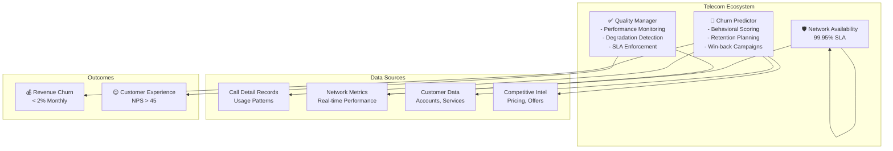

# Telecommunications Domain Adaptation

## Overview

Telecommunications systems require agents optimized for network traffic optimization, customer churn prediction, service quality management, and infrastructure capacity planning. Telecom agents operate in high-volume environments with millions of subscribers, complex billing systems, and stringent service level agreements (SLAs). This guide covers configuring agents for mobile networks, broadband, and enterprise services.

## Core Telecom Agent Architecture

**Network Optimizer Agent**: Monitors cell tower traffic, balances load across network segments, predicts congestion, and optimizes radio parameters. Handles millions of real-time connections while maintaining quality of service targets.

**Churn Prediction Agent**: Identifies customers at risk of switching to competitors using behavioral signals (declining usage, customer service calls, competitor activity). Triggers retention campaigns 30-60 days before likely churn.

**Service Quality Agent**: Monitors network performance metrics (latency, packet loss, availability), identifies degradation patterns, and orchestrates corrective actions. Ensures SLA compliance across customer segments.



## Implementation Details

### Configuration for Telecom Agents

```yaml
telecom_domain:
  agents:
    network_optimizer:
      model: "gpt-4-turbo"
      temperature: 0.10     # Precision required
      tools:
        - traffic_analyzer
        - load_balancer
        - congestion_predictor
        - radio_parameter_optimizer
        - spectrum_allocator

      network_config:
        monitoring_granularity: "per_sector"  # Individual cell towers
        update_frequency: "every_5_minutes"
        network_types:
          - 5g:
              coverage_percent: 0.45
              target_latency_ms: 10
              capacity_per_sector_gbps: 10
          - 4g_lte:
              coverage_percent: 0.95
              target_latency_ms: 50
              capacity_per_sector_gbps: 1
          - broadband:
              coverage_percent: 0.85
              target_latency_ms: 30

        traffic_prediction:
          method: "time_series_ensemble"
          look_ahead_minutes: [15, 60, 1440]
          external_signals:
            - time_of_day     # Peak hours
            - day_of_week     # Weekday vs weekend
            - weather         # Outdoor activity correlation
            - events          # Sports, concerts, holidays
            - network_events  # Outages, maintenance

        congestion_thresholds:
          cell_sector:
            warning_utilization: 0.70  # 70% capacity
            critical_utilization: 0.85  # 85% capacity
            emergency_utilization: 0.95  # 95% capacity
          action_triggers:
            warning: "prepare_load_balancing"
            critical: "execute_load_balancing"
            emergency: "activate_offload_network"

        load_balancing_actions:
          - priority: 1
            action: "steer_new_calls_to_neighbor_cells"
            impact: "5-15% reduction"
          - priority: 2
            action: "downgrade_non_priority_traffic_quality"
            impact: "10-30% reduction"
          - priority: 3
            action: "activate_femtocell_network"
            impact: "20-40% reduction"
          - priority: 4
            action: "request_spectrum_sharing"
            impact: "varies"

        radio_optimization:
          parameters:
            - tx_power_adjustment
            - antenna_tilt_angle
            - neighbor_list_optimization
            - inter_frequency_reselection
          optimization_frequency: "daily"
          a_b_test: true
          control_percent: 0.10  # 10% cells maintain baseline

    churn_predictor:
      model: "gpt-4"
      temperature: 0.15     # Some uncertainty acceptable
      tools:
        - behavior_analyzer
        - churn_scorer
        - retention_planner
        - campaign_executor
        - win_back_coordinator

      churn_config:
        prediction_horizon_days: [30, 60, 90]
        churn_segments:
          - residential:
              monthly_base_churn_rate: 0.015  # 1.5% monthly
              prediction_accuracy_target: 0.85
          - enterprise:
              monthly_base_churn_rate: 0.003  # 0.3% monthly
              prediction_accuracy_target: 0.92

        behavioral_signals:
          usage_decline:
            feature: "monthly_minutes_trend"
            decay_days: 30
            weight: 0.25
          service_complaints:
            feature: "customer_service_calls_rolling_30d"
            threshold: 3
            weight: 0.20
          competitor_activity:
            feature: "wifi_scan_data_competitor_networks"
            weight: 0.15
          payment_behavior:
            feature: "late_payment_rate"
            weight: 0.10
          contract_status:
            feature: "months_since_contract_renewal"
            weight: 0.10
          data_usage_decline:
            feature: "monthly_gb_trend"
            weight: 0.20

        churn_risk_scoring:
          score_range: [0.0, 1.0]
          segments:
            low_risk: [0.0, 0.30]
            medium_risk: [0.30, 0.60]
            high_risk: [0.60, 0.80]
            critical_risk: [0.80, 1.0]

        retention_campaigns:
          - risk_level: "medium_risk"
            trigger_score: 0.40
            channel: "email"
            offer_type: "data_upgrade"
            incentive_value_percent: 0.10
          - risk_level: "high_risk"
            trigger_score: 0.65
            channel: "sms"
            offer_type: "loyalty_discount"
            incentive_value_percent: 0.15
          - risk_level: "critical_risk"
            trigger_score: 0.85
            channel: "phone_call"
            offer_type: "executive_retention"
            incentive_value_percent: 0.25
            escalation: "account_manager"

        win_back_campaigns:
          inactive_threshold_days: 30
          reactive_window_days: 90
          incentive_strategy: "tiered_by_tenure"

    service_quality_manager:
      model: "gpt-4"
      temperature: 0.05     # Critical - must be precise
      tools:
        - performance_monitor
        - degradation_detector
        - sla_tracker
        - incident_responder
        - optimization_planner

      quality_config:
        kpi_targets:
          - metric: "network_availability"
            target_percent: 99.95
            grace_period_minutes: 5
          - metric: "call_drop_rate"
            target_percent: 0.1  # 0.1% or 1 per 1000 calls
          - metric: "voice_latency_milliseconds"
            target: 150
          - metric: "packet_loss_percent"
            target: 0.01
          - metric: "data_throughput_regression"
            target: 0.95  # No more than 5% below promise

        sla_measurement:
          granularity: "per_segment"  # VIP gets stricter SLA
          reporting_frequency: "daily"
          customer_segments:
            - enterprise:
                availability_sla_percent: 99.99
                response_time_hours: 1
            - premium:
                availability_sla_percent: 99.95
                response_time_hours: 4
            - standard:
                availability_sla_percent: 99.5
                response_time_hours: 24

        degradation_detection:
          methods:
            - threshold_crossing  # Real-time
            - trend_analysis      # Emerging issues
            - anomaly_detection   # Unusual patterns
          alert_escalation:
            warning: "notify_noc"  # Network Operations Center
            critical: "page_oncall"
            sev1: "executive_notification"

        incident_response_sla:
          detection_seconds: 60
          acknowledgment_minutes: 5
          mitigation_start_minutes: 15
          resolution_target_minutes: 120

  customer_lifetime_value:
    monthly_arpu_avg: 65  # Average Revenue Per User
    customer_acquisition_cost: 200
    churn_cost_multiplier: 3.0  # 3x ARPU to retain vs 1x to acquire

  network_investment:
    capex_percent_revenue: 0.20  # 20% to infrastructure
    optimization_priority: "balance_capex_and_churn_reduction"
```

### Churn Prediction Scoring Model

```python
def calculate_churn_risk_score(customer_id, lookback_days=90):
    customer = get_customer_profile(customer_id)

    # Component 1: Usage decline (25% weight)
    usage_30d = get_usage_metric(customer_id, days=30)
    usage_60d = get_usage_metric(customer_id, days=60)
    usage_decline = (usage_60d - usage_30d) / usage_60d if usage_60d > 0 else 0
    usage_score = min(max(usage_decline, 0), 1.0)

    # Component 2: Customer service interactions (20% weight)
    service_calls_90d = count_customer_service_calls(customer_id, days=90)
    service_score = min(service_calls_90d / 5, 1.0)  # Normalize on 5 calls

    # Component 3: Competitor activity (15% weight)
    competitor_networks = scan_wifi_networks(customer.location)
    competitor_score = len(competitor_networks) / 10 if competitor_networks else 0

    # Component 4: Payment reliability (10% weight)
    late_payments_12mo = count_late_payments(customer_id, months=12)
    payment_score = min(late_payments_12mo / 3, 1.0)

    # Component 5: Contract tenure (10% weight)
    months_since_renewal = calculate_months_since_contract_renewal(customer_id)
    tenure_score = 1.0 if months_since_renewal > 24 else months_since_renewal / 24

    # Component 6: Data usage trend (20% weight)
    data_30d = get_data_usage(customer_id, days=30)
    data_60d = get_data_usage(customer_id, days=60)
    data_decline = (data_60d - data_30d) / data_60d if data_60d > 0 else 0
    data_score = min(max(data_decline, 0), 1.0)

    # Composite score
    composite_score = (
        usage_score * 0.25 +
        service_score * 0.20 +
        competitor_score * 0.15 +
        payment_score * 0.10 +
        tenure_score * 0.10 +
        data_score * 0.20
    )

    # Apply segment multiplier (enterprise customers harder to predict)
    if customer.segment == 'enterprise':
        composite_score = composite_score * 0.7

    return min(composite_score, 1.0)
```

## Practical Example: Holiday Season Network Planning

During peak seasons (Christmas, New Year), coordinate agents across all three domains:

1. **Network Optimizer**: Predict 40% usage increase during Dec 24-25, pre-stage capacity
2. **Churn Predictor**: High churn risk during holidays; execute retention campaigns
3. **Service Quality**: Tighten SLA monitoring; pre-position incident response teams

```python
def execute_holiday_season_protocol():
    # Forecast network traffic
    traffic_forecast = network_optimizer.forecast_traffic(
        external_events=['christmas_holiday', 'new_years_eve'],
        expected_usage_increase_percent=40
    )

    # Pre-stage network capacity
    network_optimizer.stage_emergency_capacity(
        target_sectors=high_traffic_forecast_areas,
        additional_capacity_percent=50
    )

    # Launch retention campaigns
    at_risk_customers = churn_predictor.identify_high_risk(
        risk_threshold=0.70,
        focus_segment='enterprise'
    )
    churn_predictor.launch_retention_campaign(
        customers=at_risk_customers,
        offer_type='holiday_loyalty_bonus',
        incentive_value=customer_arpu * 0.20  # 20% of monthly bill
    )

    # Enhanced SLA monitoring
    service_quality_manager.enable_enhanced_monitoring(
        sla_strictness=1.2  # 20% tighter than standard
    )
    service_quality_manager.stage_incident_response_teams(
        locations=high_traffic_forecast_areas,
        teams_per_location=2
    )

    # Communication to customers
    send_notification_campaign(
        all_customers,
        message='Holiday congestion expected; thank you for choosing us'
    )
```

## Network Quality Metrics and Monitoring

```json
{
  "network_performance_dashboard": {
    "timestamp": "2026-03-19T14:30:00Z",
    "region": "northeast_region",
    "kpi_summary": {
      "network_availability_percent": 99.97,
      "sla_compliance_percent": 99.95,
      "call_drop_rate_percent": 0.08,
      "average_data_throughput_mbps": 45.2
    },
    "cell_sector_details": [
      {
        "cell_id": "TOWER_NYC_001_SECTOR_A",
        "utilization_percent": 72,
        "traffic_mbps": 850,
        "capacity_mbps": 1200,
        "congestion_risk": "medium",
        "action_taken": "neighbor_cell_steering_active"
      },
      {
        "cell_id": "TOWER_NYC_001_SECTOR_B",
        "utilization_percent": 89,
        "traffic_mbps": 1200,
        "capacity_mbps": 1350,
        "congestion_risk": "high",
        "action_taken": "load_balancing_in_effect"
      }
    ],
    "incidents_24h": 2,
    "mtbf_hours": 8760,
    "sla_violations": 0
  }
}
```

## Integration with Telecom Systems

- **Network Management**: Nokia NSP, Cisco Crosswork for infrastructure
- **Customer Data Platform**: Salesforce, Adobe Real-time CDP
- **Billing Systems**: Amdocs, Openet for revenue management
- **Network Monitoring**: Splunk, DataDog for real-time analytics
- **Customer Analytics**: Teradata, Cloudera for big data
- **Spectrum Management**: Qualcomm, Radio Frequency allocation

## Performance Metrics for Telecom Agents

| Metric | Target | Impact |
|--------|--------|--------|
| **Network Availability** | 99.95% (21.9 min downtime/month) | SLA compliance |
| **Churn Prediction Accuracy** | >85% | Enables proactive retention |
| **Call Drop Rate** | <0.1% | Quality perceived by customers |
| **Customer Satisfaction (CSAT)** | >80% | Brand loyalty |
| **Revenue Churn Rate** | <2% monthly | Business sustainability |
| **Response Time to Incidents** | <5 minutes | SLA compliance |

🔗 **Related Topics**: [Churn Prediction](ANALYTICS_CHURN_PREDICTION.md) | [Load Testing](TESTING_LOAD_TESTING.md) | [Real-time Monitoring](AGENT_PERFORMANCE_METRICS.md) | [Webhook Handling](INTEGRATION_WEBHOOK_HANDLING.md) | [Message Queues](INTEGRATION_MESSAGE_QUEUES.md)
