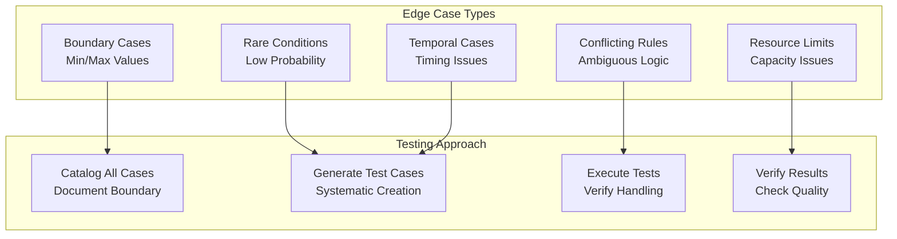

# Systematic Edge Case Testing

## Overview

Edge cases represent inputs or conditions at system boundaries where normal assumptions break down. Systematic edge case testing prevents failures in production by identifying these boundary conditions before deployment. This guide covers discovering, documenting, and testing edge cases comprehensively.

## Edge Case Categories



## Edge Case Discovery Framework

```yaml
edge_case_discovery:
  input_boundary_cases:
    numeric_inputs:
      - minimum_value: "test_at_lower_bound"
      - maximum_value: "test_at_upper_bound"
      - zero: "test_zero_if_in_range"
      - negative: "test_negative_if_applicable"
      - fractional: "test_decimal_places"
      - scientific_notation: "test_very_large_numbers"

    string_inputs:
      - empty_string: true
      - very_long_string: "max_length_exceeded"
      - special_characters: ["spaces", "unicode", "control_chars"]
      - sql_injection_patterns: true
      - xss_patterns: true

    list_inputs:
      - empty_list: true
      - single_element: true
      - very_large_list: "memory_limits"
      - duplicate_elements: true
      - null_elements: true

  state_boundary_cases:
    - initialization_states: ["uninitialized", "partial", "corrupted"]
    - transition_states: ["between_states", "invalid_transitions"]
    - terminal_states: ["already_ended", "can_restart"]

  concurrent_access_cases:
    - simultaneous_updates: "race_conditions"
    - deadlocks: "circular_dependencies"
    - missing_locks: "data_corruption"

  resource_limit_cases:
    - memory_exhaustion: "test_oom_handling"
    - disk_full: "test_io_error_handling"
    - timeout_exceeded: "test_slow_operations"
    - connection_limits: "test_max_connections"

  temporal_cases:
    - clock_skew: "system_clock_backwards"
    - timezone_edge_cases: "dst_transitions"
    - leap_year: "feb_29_handling"
    - year_2038_problem: "32bit_overflow"
```

## Systematic Edge Case Generation

```python
def generate_edge_case_tests(system_interface):
    """
    Systematically generate edge case tests
    """

    edge_cases = []

    # 1. Input boundary testing
    for parameter in system_interface.parameters:
        if parameter.type == 'numeric':
            edge_cases.extend([
                TestCase(value=parameter.min_value, name=f'{parameter.name}_at_minimum'),
                TestCase(value=parameter.max_value, name=f'{parameter.name}_at_maximum'),
                TestCase(value=0, name=f'{parameter.name}_zero'),
                TestCase(value=-1, name=f'{parameter.name}_negative_one'),
            ])

        elif parameter.type == 'string':
            edge_cases.extend([
                TestCase(value='', name=f'{parameter.name}_empty'),
                TestCase(value='a' * 10000, name=f'{parameter.name}_very_long'),
                TestCase(value='<script>alert("xss")</script>', name=f'{parameter.name}_xss_attempt'),
                TestCase(value="' OR '1'='1", name=f'{parameter.name}_sql_injection'),
            ])

        elif parameter.type == 'list':
            edge_cases.extend([
                TestCase(value=[], name=f'{parameter.name}_empty_list'),
                TestCase(value=[None], name=f'{parameter.name}_null_element'),
                TestCase(value=[1, 1, 1], name=f'{parameter.name}_duplicates'),
            ])

    # 2. State transition testing
    for state in system_interface.states:
        for transition in state.valid_transitions:
            # Test invalid transitions from each state
            invalid_targets = set(system_interface.all_states) - set(state.valid_transitions)
            for invalid_target in invalid_targets:
                edge_cases.append(
                    TestCase(
                        initial_state=state,
                        target_state=invalid_target,
                        name=f'invalid_transition_{state}_{invalid_target}'
                    )
                )

    # 3. Resource limit testing
    for resource in system_interface.resources:
        edge_cases.append(
            TestCase(
                resource=resource,
                allocation=resource.max_allocation,
                name=f'{resource.name}_at_maximum'
            )
        )
        edge_cases.append(
            TestCase(
                resource=resource,
                allocation=resource.max_allocation + 1,
                name=f'{resource.name}_exceeds_limit'
            )
        )

    return edge_cases
```

## Edge Case Documentation

```yaml
edge_case_test_specification:
  test_case_id: "EC_INPUT_001"
  test_name: "Numeric Input at Minimum Boundary"
  domain: "financial_calculation"

  test_scenario:
    input: "transaction_amount = 0.01"
    expected_behavior: "Process minimum valid transaction"
    expected_output: "Transaction accepted, amount = $0.01"
    failure_condition: "Rejects valid minimum transaction"

  edge_case_characteristics:
    - type: "boundary_case"
    - severity: "medium"
    - likelihood: "high"
    - impact: "affects_legitimate_users"

  variations:
    - variation_1:
        input: "transaction_amount = 0.001"
        expected: "Rounds to minimum or rejected as below_minimum"
    - variation_2:
        input: "transaction_amount = -0.01"
        expected: "Rejected as negative_amount"

  acceptance_criteria:
    - criterion_1: "Minimum transaction processed without error"
    - criterion_2: "No arithmetic overflow"
    - criterion_3: "Consistent rounding applied"

  automation_status: "automated_in_test_suite"
  last_executed: "2026-03-19"
  result: "passed"
```

## Edge Case Catalog

```python
def maintain_edge_case_catalog(project_id):
    """
    Maintain and update edge case catalog
    """

    catalog = get_edge_case_catalog(project_id)

    # Organize by category
    catalog_by_type = {
        'boundary_cases': [],
        'state_transition_cases': [],
        'resource_limit_cases': [],
        'concurrent_access_cases': [],
        'temporal_cases': [],
        'error_condition_cases': []
    }

    # Track coverage
    coverage_metrics = {
        'total_discovered': len(catalog),
        'tested': len([c for c in catalog if c.tested]),
        'automated': len([c for c in catalog if c.automated]),
        'passed': len([c for c in catalog if c.result == 'passed']),
        'failed': len([c for c in catalog if c.result == 'failed']),
        'coverage_percent': calculate_coverage_percent(catalog)
    }

    # Identify gaps
    untested_cases = [c for c in catalog if not c.tested]
    unauto mated_cases = [c for c in catalog if not c.automated]

    return {
        'catalog': catalog_by_type,
        'coverage': coverage_metrics,
        'gaps': {
            'untested': untested_cases,
            'unautomated': unauto mated_cases
        }
    }
```

## Testing Results and Remediation

```json
{
  "edge_case_test_results": {
    "test_suite": "Financial Calculation System",
    "execution_date": "2026-03-19",
    "summary": {
      "total_edge_cases": 450,
      "executed": 445,
      "passed": 439,
      "failed": 6,
      "skipped": 5,
      "pass_rate_percent": 98.6
    },
    "failures": [
      {
        "test_id": "EC_BOUNDARY_047",
        "test_name": "Negative Transaction Amount",
        "expected": "Reject with error message",
        "actual": "Accepts negative amount, creates credit",
        "severity": "critical",
        "root_cause": "Missing input validation",
        "remediation": "Add negative amount check",
        "status": "fixed"
      },
      {
        "test_id": "EC_RESOURCE_089",
        "test_name": "Memory Limit Exceeded",
        "expected": "Graceful degradation",
        "actual": "Out of memory crash",
        "severity": "critical",
        "remediation": "Implement memory monitoring",
        "status": "in_progress"
      }
    ]
  }
}
```

## Performance Metrics for Edge Case Testing

| Metric | Target | Measurement |
|--------|--------|---|
| **Edge Case Coverage** | >90% of boundaries | Catalog completeness |
| **Test Pass Rate** | >98% | Reliability indicator |
| **Automated Coverage** | >85% of cases | Automation extent |
| **Defect Detection Rate** | Catch >95% of bugs | Testing effectiveness |
| **Time to Fix** | <7 days | Responsiveness |

🔗 **Related Topics**: [Regression Detection](TESTING_REGRESSION_DETECTION.md) | [Chaos Engineering](TESTING_CHAOS_ENGINEERING.md) | [Security Validation](TESTING_SECURITY_VALIDATION.md) | [Integration Testing](TESTING_INTEGRATION_TESTING.md) | [Continuous Integration](TESTING_CONTINUOUS_INTEGRATION.md)
