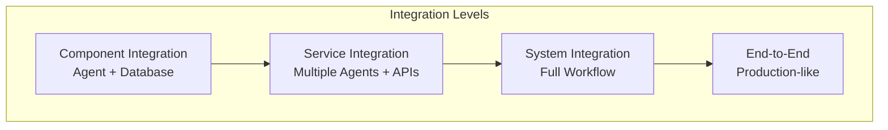

# Integration Testing

## Overview

Integration testing validates that multiple components work together correctly. Agent systems require testing across agent-to-agent communication, database interactions, API integrations, and message passing. This guide covers designing integration test suites.

## Integration Test Levels



## Integration Test Design

```yaml
integration_test_scenarios:
  agent_database_integration:
    test_case: "Agent queries database and updates results"
    setup:
      - initialize_test_database
      - seed_test_data: 1000
    execution:
      - agent_queries_data
      - verify_query_results_accuracy: 0.99
      - update_database
      - verify_persistence
    teardown:
      - rollback_database

  multi_agent_communication:
    test_case: "Agent A requests info from Agent B"
    setup:
      - start_agent_a
      - start_agent_b
    execution:
      - agent_a_sends_request
      - verify_message_delivery
      - agent_b_processes_and_responds
      - verify_response_accuracy
    assertions:
      - response_time: < 1000ms
      - message_loss: 0
      - consistency: 100%

  api_integration:
    test_case: "Agent integrates with external REST API"
    setup:
      - mock_external_api
      - define_api_responses
    execution:
      - agent_calls_api_endpoint
      - verify_request_format
      - verify_response_parsing
      - verify_error_handling
    assertions:
      - request_sent_correctly: true
      - response_parsed: true
      - error_handling_works: true
```

## Integration Test Framework

```python
def run_integration_test_suite(test_suite_id):
    """
    Execute full integration test suite
    """

    results = {
        'test_suite_id': test_suite_id,
        'start_time': now(),
        'test_results': [],
        'failures': []
    }

    # Setup test environment
    test_env = setup_test_environment()
    test_env.start_services()
    test_env.seed_databases()

    # Run each integration test
    for test_case in test_suite.test_cases:
        try:
            # Execute test
            result = execute_test_case(test_case, test_env)

            results['test_results'].append({
                'test_id': test_case.id,
                'status': 'passed' if result.success else 'failed',
                'duration_ms': result.duration_ms
            })

            if not result.success:
                results['failures'].append({
                    'test_id': test_case.id,
                    'error': result.error,
                    'assertion_failed': result.assertion
                })

        except Exception as e:
            results['failures'].append({
                'test_id': test_case.id,
                'error': str(e),
                'type': 'execution_error'
            })

    # Cleanup
    test_env.stop_services()
    test_env.cleanup_databases()

    results['end_time'] = now()
    results['pass_rate'] = calculate_pass_rate(results)

    return results
```

## Integration Test Metrics

| Metric | Target | Status |
|--------|--------|--------|
| **Pass Rate** | 100% | All integration tests pass |
| **Coverage** | >95% | Major integration paths tested |
| **Execution Time** | <30 min | Full suite completes quickly |
| **Flakiness** | <1% | Tests are deterministic |

🔗 **Related Topics**: [Edge Cases](TESTING_EDGE_CASES_SYSTEMATIC.md) | [Security Validation](TESTING_SECURITY_VALIDATION.md) | [Load Testing](TESTING_LOAD_TESTING.md) | [Continuous Integration](TESTING_CONTINUOUS_INTEGRATION.md) | [Acceptance Criteria](TESTING_ACCEPTANCE_CRITERIA.md)
