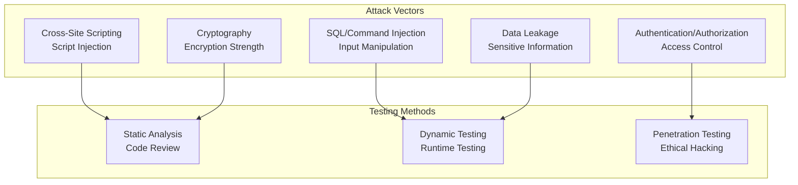

# Security Validation Testing

## Overview

Security validation ensures agents handle sensitive data safely, prevent unauthorized access, and resist common attack vectors. This includes testing authentication, encryption, injection attacks, and data privacy. Security testing is non-negotiable in production systems.

## Security Testing Categories



## Security Test Cases

```yaml
security_test_catalog:
  sql_injection_tests:
    - test: "Basic SQL injection"
      payload: "' OR '1'='1"
      expected: "Rejected or parameterized"
    - test: "Union-based injection"
      payload: "' UNION SELECT * FROM users--"
      expected: "Blocked"
    - test: "Blind SQL injection"
      payload: "' AND SLEEP(5)--"
      expected: "No information leakage"

  xss_tests:
    - test: "Script tag injection"
      payload: "<script>alert('xss')</script>"
      expected: "HTML escaped"
    - test: "Event handler injection"
      payload: ""
      expected: "Event handler removed"

  authentication_tests:
    - test: "Weak password acceptance"
      password: "123456"
      expected: "Rejected as weak"
    - test: "Session hijacking"
      attack: "Reuse known session ID"
      expected: "Session validation enforced"
    - test: "Brute force protection"
      attack: "Multiple failed attempts"
      expected: "Account locked or rate limited"

  data_privacy_tests:
    - test: "Sensitive data in logs"
      data: "credit_card_number"
      expected: "Not logged or masked"
    - test: "Unencrypted transmission"
      check: "Data in transit encryption"
      expected: "HTTPS/TLS enforced"
```

## Injection Prevention Testing

```python
def test_injection_prevention(agent_id, injection_payloads):
    """
    Test resistance to injection attacks
    """

    vulnerabilities = []

    for payload in injection_payloads:
        try:
            # Attempt injection
            result = agent.process_input(payload)

            # Check if injection was successful
            if injection_detected_in_output(result, payload):
                vulnerabilities.append({
                    'type': 'injection_vulnerability',
                    'payload': payload,
                    'severity': 'critical',
                    'remediation': 'Use parameterized queries'
                })

            # Check for information leakage
            if sensitive_info_leaked(result):
                vulnerabilities.append({
                    'type': 'information_leakage',
                    'payload': payload,
                    'severity': 'high'
                })

        except Exception as e:
            # Expected - injection blocked
            pass

    return vulnerabilities
```

## Encryption and Cryptography Testing

```yaml
cryptography_validation:
  encryption_strength:
    - algorithm: "AES"
      minimum_key_size: 256  # bits
      acceptable_modes: ["GCM", "CBC"]
      unacceptable_modes: ["ECB"]

    - algorithm: "TLS"
      minimum_version: "1.2"
      unacceptable_versions: ["SSL 3.0", "TLS 1.0"]

  hashing:
    - algorithm: "PBKDF2"
      minimum_iterations: 100000
    - algorithm: "bcrypt"
      minimum_cost: 12
    - algorithm: "Argon2"
      minimum_iterations: 2

  key_management:
    - storage: "Never hardcoded"
    - rotation_frequency: "quarterly"
    - access_control: "least_privilege"
```

## Security Audit Logging

```json
{
  "security_test_report": {
    "date": "2026-03-19",
    "agent_id": "analyzer_001",
    "vulnerabilities_found": 3,
    "vulnerabilities_fixed": 3,
    "critical": 0,
    "high": 1,
    "medium": 2,
    "findings": [
      {
        "id": "SEC-089",
        "type": "SQL injection vulnerability",
        "severity": "high",
        "description": "User input not parameterized in database query",
        "remediation": "Use prepared statements",
        "status": "fixed"
      }
    ]
  }
}
```

## Performance Metrics

| Metric | Target | Status |
|--------|--------|--------|
| **OWASP Top 10 Coverage** | 100% | Tests for all categories |
| **Vulnerability Scan Pass Rate** | 100% | No critical vulnerabilities |
| **Encryption Compliance** | 100% | All data encrypted in transit/at rest |
| **Security Test Automation** | >85% | Automated testing |

🔗 **Related Topics**: [Edge Cases](TESTING_EDGE_CASES_SYSTEMATIC.md) | [Integration Testing](TESTING_INTEGRATION_TESTING.md) | [Continuous Integration](TESTING_CONTINUOUS_INTEGRATION.md) | [Performance Profiling](TESTING_PERFORMANCE_PROFILING.md) | [Chaos Engineering](TESTING_CHAOS_ENGINEERING.md)
