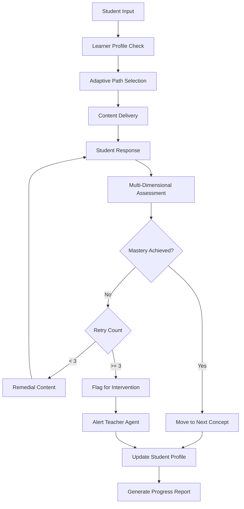

# Domain Adaptation for Education

Educational institutions deploy AutoClaw agents to deliver personalized learning, assess student progress, grade assignments, and manage curricula. Education domain adaptation requires understanding learning science, pedagogical approaches, student assessment frameworks, and institutional compliance.

## Core Educational Functions

**Adaptive Learning Pathways**: Education agents personalize learning based on student mastery, learning style, and pacing. Implement agents that assess prerequisite knowledge, recommend content sequences, and adjust difficulty dynamically. Use learning analytics to identify struggling students early and route to intervention agents.

**Assessment & Grading**: Agents designed for assessment analyze student work across multiple dimensions: conceptual understanding, procedural fluency, problem-solving ability, and communication clarity. Multi-dimensional grading (rather than single scores) provides students with actionable feedback on specific areas for improvement.

**Learner Profiling**: Build comprehensive student profiles tracking: knowledge mastery by topic (0-100% for each concept), learning preferences (visual/auditory/kinesthetic), engagement patterns, and struggle areas. Update profiles dynamically as students complete work, enabling continuous personalization.

**Curriculum Intelligence**: Agents map curriculum structure, identifying prerequisite dependencies between concepts. When a student struggles with topic X, agents trace prerequisites to locate the actual gap (often earlier content). Use curriculum graphs to prevent false negatives in assessment.

**Parent/Guardian Communication**: Education agents generate student progress reports in clear language for non-technical audiences. Include specific strengths, growth areas, and concrete next steps. Schedule automated check-ins when performance drops below thresholds.



## Implementation Example

```python
class EducationAgent(BaseAgent):
    def __init__(self, institution_id: str, grade_level: int):
        super().__init__()
        self.institution_id = institution_id
        self.grade_level = grade_level
        self.curriculum = CurriculumGraph(grade_level)
        self.learner_profiles = {}

    def assess_assignment(self, student_id: str, submission: str) -> dict:
        profile = self.get_or_create_profile(student_id)
        rubric = self.get_rubric()

        assessment = {
            "conceptual_understanding": self.assess_concept(submission),
            "procedural_fluency": self.assess_procedure(submission),
            "problem_solving": self.assess_reasoning(submission),
            "communication": self.assess_clarity(submission),
            "overall_score": 0
        }

        # Calculate weighted score
        weights = {"conceptual": 0.3, "procedural": 0.25, "reasoning": 0.25, "communication": 0.2}
        assessment["overall_score"] = (
            assessment["conceptual_understanding"] * weights["conceptual"] +
            assessment["procedural_fluency"] * weights["procedural"] +
            assessment["problem_solving"] * weights["reasoning"] +
            assessment["communication"] * weights["communication"]
        )

        # Determine next steps
        if assessment["overall_score"] >= 0.8:
            assessment["recommendation"] = self.advance_to_next_topic(student_id)
        elif assessment["overall_score"] < 0.6:
            assessment["recommendation"] = self.create_remediation_plan(student_id, submission)
        else:
            assessment["recommendation"] = self.recommend_practice_problems(student_id)

        return assessment

    def get_learner_profile(self, student_id: str) -> dict:
        profile = self.learner_profiles.get(student_id, {})
        return {
            "mastery_by_topic": profile.get("mastery", {}),
            "learning_style": profile.get("style", "mixed"),
            "engagement_score": profile.get("engagement", 0),
            "struggle_areas": self.identify_gaps(student_id),
            "recommended_pace": self.calculate_pace(student_id)
        }

    def identify_gaps(self, student_id: str) -> list:
        profile = self.learner_profiles[student_id]
        gaps = []
        for topic, mastery in profile["mastery"].items():
            if mastery < 0.7:
                prereqs = self.curriculum.get_prerequisites(topic)
                for prereq in prereqs:
                    if profile["mastery"].get(prereq, 0) < 0.8:
                        gaps.append({"missing_concept": prereq, "affects_topic": topic})
        return gaps
```

## Domain-Specific Patterns

**Standards Alignment**: Educational content must align with standards (Common Core, state standards, international baccalaureate). Agents validate curriculum against standards, ensuring coverage and appropriate rigor. Map each learning objective to standards using standard codes.

**Differentiation Strategies**: Students need different approaches. Education agents apply differentiation by content (varying materials), process (varying activities), or product (varying output formats). Route students with similar learning profiles to matched intervention types.

**Progress Monitoring**: Track student progress through multi-week intervals. Conduct progress monitoring probes every 2 weeks, graphing scores to show trends. When trend line shows insufficient progress, trigger intervention protocol automatically.

**Universal Design for Learning (UDL)**: Implement UDL principles by providing multiple means of representation (text, audio, video), action/expression (written, spoken, kinesthetic), and engagement (choice, relevance, challenge). Education agents should identify which modalities work best for each student.

**Family Engagement Data**: Track when families access progress information and respond to communications. Students with more family engagement show better outcomes. Use this data to encourage family participation.

## Configuration Example

```yaml
education_agent:
  institution_id: "SCHOOL_DIST_001"
  grade_level: 6
  subject: "mathematics"

  assessment_rubric:
    dimensions:
      - conceptual_understanding: 30%
      - procedural_fluency: 25%
      - problem_solving: 25%
      - communication: 20%
    mastery_threshold: 0.8
    intervention_threshold: 0.6

  adaptive_learning:
    enabled: true
    update_frequency: "per_assignment"
    difficulty_adjustment: true

  standards:
    framework: "CCSS"
    grade_level_standards: ["6.RP.1", "6.RP.2", "6.RP.3"]

  family_communication:
    progress_reports: "bi-weekly"
    alert_threshold: 0.65
    languages: ["en", "es", "zh"]
```

## Metrics & Monitoring

Monitor education agent effectiveness through: student mastery growth rate (target: 20% quarterly improvement), time to mastery by topic, intervention success rate (students moving from below-proficient to proficient), family engagement rate, and equity gaps (achievement differences by demographic group). Conduct monthly equity audits to ensure all students benefit equally from adaptations.

🔗 Related Topics
- DOMAIN_ADAPTATION_GOVERNMENT.md - Policy compliance patterns
- AGENT_SPECIALIZATION_PATTERNS.md - Specialized teaching agents
- ANALYTICS_COHORT_ANALYSIS.md - Comparing student cohorts
- TESTING_A_B_TESTING.md - Testing instructional approaches
- AGENT_CONTINUOUS_LEARNING.md - Agent improvement mechanisms
