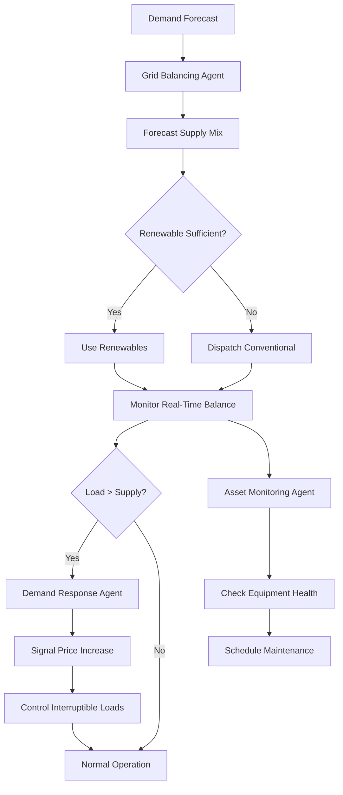

# Domain Adaptation for Energy Sector

Energy agents manage generation, distribution, demand balancing, pricing, and sustainability. Domain adaptation requires understanding grid operations, renewable intermittency, regulatory compliance, and customer behavior.

## Core Energy Functions

**Grid Balancing**: Maintain real-time balance between generation and consumption preventing blackouts and damage to equipment. Agents predict demand by hour and season, dispatch generation accordingly, and manage ancillary services (voltage regulation, frequency control). Use rolling 24-hour demand forecasts updated every 15 minutes.

**Renewable Integration**: Solar and wind generation vary with weather. Agents forecast renewable output based on weather data, manage battery storage to smooth output, and coordinate with dispatchable generators. Implement curtailment protocols for oversupply situations.

**Demand Response**: During peak demand periods, agents incentivize customers to reduce consumption through price signals or direct control. Implement tiered pricing: peak (high price), shoulder (medium), and off-peak (low). Deploy interruptible loads (EV charging, water heating) that reduce automatically at peaks.

**Asset Management**: Monitor and maintain generation, transmission, and distribution assets. Agents predict equipment aging, schedule preventive maintenance, and manage outage impacts. Coordinate field crews for repairs minimizing outage duration.

**Customer Engagement & Usage Analytics**: Provide customers visibility into consumption patterns and bills. Agents recommend efficiency improvements, manage time-of-use programs, and alert customers to unusual usage suggesting equipment failure or behavioral change.



## Implementation Example

```python
class EnergyAgent(BaseAgent):
    def __init__(self, grid_region: str, operator_role: str):
        super().__init__()
        self.grid_region = grid_region
        self.operator_role = operator_role  # generation|transmission|distribution
        self.demand_forecaster = DemandForecaster()
        self.renewable_predictor = RenewablePredictor()
        self.grid_monitor = GridMonitor()

    def manage_grid_balance(self) -> dict:
        # Get current state
        current_demand = self.grid_monitor.get_current_demand()
        current_frequency = self.grid_monitor.get_frequency()
        current_voltage = self.grid_monitor.get_voltage()

        # Forecast demand next 4 hours
        demand_forecast = self.demand_forecaster.forecast(hours_ahead=4)

        # Forecast renewable generation
        renewable_forecast = self.renewable_predictor.forecast(
            solar_forecast=self.get_weather_forecast("solar"),
            wind_forecast=self.get_weather_forecast("wind"),
            hours_ahead=4
        )

        # Calculate generation requirement
        gen_requirement = demand_forecast["next_hour"] - renewable_forecast["available"]
        current_generation = self.grid_monitor.get_current_generation()

        dispatch = {
            "timestamp": self.get_timestamp(),
            "demand_forecast": demand_forecast,
            "renewable_forecast": renewable_forecast,
            "generation_requirement": gen_requirement,
            "dispatch_actions": [],
            "balancing_status": "balanced"
        }

        # Dispatch generation
        if gen_requirement > current_generation:
            # Need more generation
            deficit = gen_requirement - current_generation
            dispatch["dispatch_actions"].append({
                "action": "increase_generation",
                "amount_mw": deficit,
                "duration_minutes": 60,
                "generator_type": self.select_generator_for_ramp(deficit)
            })
            dispatch["balancing_status"] = "ramping_up"

        elif current_generation > gen_requirement:
            # Have excess generation
            excess = current_generation - gen_requirement
            if excess > 100:  # Threshold for action
                dispatch["dispatch_actions"].append({
                    "action": "decrease_generation",
                    "amount_mw": excess,
                    "generator_type": self.select_generator_for_reduction(excess)
                })
                dispatch["balancing_status"] = "ramping_down"

        # Check frequency
        if current_frequency < 59.9:  # Below nominal 60 Hz
            dispatch["dispatch_actions"].append({
                "action": "activate_frequency_response",
                "priority": "immediate"
            })
            dispatch["balancing_status"] = "frequency_support"

        return dispatch

    def manage_demand_response(self, reserve_margin: float) -> dict:
        """Reserve margin: % of supply above current demand"""
        current_demand = self.grid_monitor.get_current_demand()
        available_supply = self.grid_monitor.get_available_supply()

        margin = (available_supply - current_demand) / available_supply

        response = {
            "reserve_margin": margin,
            "current_demand_mw": current_demand,
            "available_supply_mw": available_supply,
            "price_signal": 50,  # Base price $/MWh
            "dr_actions": []
        }

        # Implement tiered pricing
        if margin < 0.1:  # Less than 10% margin
            response["price_signal"] = 500  # Peak pricing
            response["dr_actions"].append({
                "action": "activate_all_dr_resources",
                "target_reduction_mw": available_supply * 0.05,
                "compensation_premium": 1.5  # 1.5x price
            })
            response["alert_level"] = "critical"

        elif margin < 0.15:  # Less than 15% margin
            response["price_signal"] = 200
            response["dr_actions"].append({
                "action": "activate_voluntary_dr",
                "target_reduction_mw": available_supply * 0.03,
                "compensation_premium": 1.2
            })
            response["alert_level"] = "warning"

        else:
            response["price_signal"] = 50
            response["alert_level"] = "normal"

        return response

    def manage_customer_efficiency(self, customer_id: str, meter_data: dict) -> dict:
        historical_usage = self.get_historical_usage(customer_id)
        current_usage = meter_data["current_kwh_per_day"]

        usage_change = (current_usage - historical_usage) / historical_usage

        analysis = {
            "customer_id": customer_id,
            "historical_daily_kwh": historical_usage,
            "current_daily_kwh": current_usage,
            "change_percent": usage_change * 100,
            "recommendations": []
        }

        # Detect anomalies
        if usage_change > 0.2:  # 20% increase
            analysis["alert"] = "UNUSUAL_HIGH_USAGE"
            analysis["recommendations"].append({
                "type": "equipment_check",
                "message": "Usage is 20% higher than typical. Check for equipment failures."
            })

        # Provide efficiency recommendations
        time_of_use = self.analyze_usage_by_hour(meter_data)
        peak_usage_hours = sorted(time_of_use.items(), key=lambda x: x[1], reverse=True)[:3]

        analysis["recommendations"].append({
            "type": "time_of_use_shift",
            "message": f"Shift load from {peak_usage_hours} to off-peak hours (9pm-6am)",
            "estimated_savings_percent": 15
        })

        analysis["recommendations"].append({
            "type": "equipment_upgrade",
            "message": "Consider ENERGY STAR certified equipment",
            "estimated_savings_percent": 20
        })

        return analysis
```

## Domain-Specific Patterns

**Microgrids**: Smaller grids can operate independently during main grid outages. Agents manage microgrids with local generation (solar, wind), storage (batteries), and loads. Implement seamless transition between grid-connected and islanded modes.

**Electric Vehicle Charging Coordination**: EV charging is a flexible load agents can control. Coordinate charging timing with renewable generation peaks and low-price periods. Implement smart charging protocols that optimize grid impact.

**Battery Storage Management**: Battery systems provide flexibility for renewables. Agents schedule charging (buy low energy prices) and discharging (sell high prices, provide grid support) to maximize economics and grid benefit.

**Carbon Accounting**: Track and report carbon emissions. Calculate emissions intensity (grams CO2 per kWh) by hour and customer. Use carbon data to prioritize renewable deployment and customer engagement.

**Regulatory Compliance**: Energy is heavily regulated with capacity requirements, renewable portfolio standards, and reliability standards. Agents must track compliance metrics and alert when approaching violations.

## Configuration Example

```yaml
energy_agent:
  grid_region: "REGION_01"
  operator_role: "grid_operator"

  demand_forecasting:
    method: "machine_learning"
    historical_data_years: 5
    update_frequency_minutes: 15
    forecast_horizon_hours: 24

  renewable_integration:
    solar_tracking: true
    wind_tracking: true
    curtailment_enabled: true
    battery_dispatch: true

  demand_response:
    pricing_model: "tiered"
    reserve_margin_threshold: 0.15
    interruptible_load_control: true

  grid_monitoring:
    frequency_target_hz: 60.0
    frequency_tolerance: 0.2
    voltage_monitoring: true
    outage_detection: true

  customer_programs:
    time_of_use_pricing: true
    peak_demand_charges: true
    efficiency_recommendations: true
    ev_charging_coordination: true
```

## Metrics & Monitoring

Monitor energy system health through: system reliability (outage frequency and duration), reserve margin (% of supply above demand), renewable penetration (% of generation from renewables), grid frequency stability (Hz variance), customer engagement in DR programs (% participation), and carbon intensity (grams CO2/kWh). Track operational efficiency: generator heat rates, transmission losses, and distribution losses.

🔗 Related Topics
- DOMAIN_ADAPTATION_SUPPLY_CHAIN.md - Fuel supply coordination
- ANALYTICS_FUNNEL_ANALYSIS.md - Customer adoption of programs
- AGENT_DELEGATION_HIERARCHY.md - Multi-level grid operators
- TESTING_CHAOS_ENGINEERING.md - Testing grid resilience
- INTEGRATION_MESSAGE_QUEUES.md - Real-time grid communications
