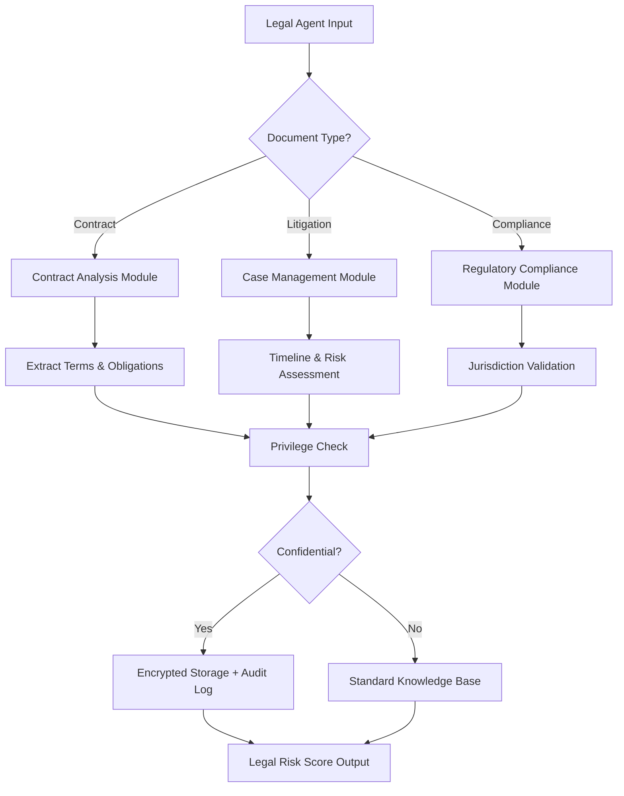

# Domain Adaptation for Legal Services

AutoClaw agents operate effectively in legal services by adapting core behaviors to compliance-intensive workflows, document analysis, and case management. Legal domain adaptation requires understanding regulatory frameworks, evidence handling, client confidentiality, and risk assessment patterns.

## Key Adaptations

**Compliance Integration**: Legal agents must embed regulatory knowledge into every decision path. The compliance layer validates actions against jurisdiction-specific rules, case law precedents, and ethical guidelines. Implement a compliance validator component that intercepts agent decisions before execution, checking against a ruleset database of statutes, regulations, and ethics opinions.

**Document Analysis Specialization**: Legal work centers on document examination. Agents specialized in legal analysis perform three-phase document processing: metadata extraction (dates, parties, document type), content analysis (clauses, obligations, risks), and relationship mapping (document dependencies and contradictions). Use OCR with legal terminology dictionaries for scanned documents.

**Confidentiality & Privilege**: Legal agents handle privileged communication. Implement role-based access control with attorney-client privilege flagging. All knowledge storage must separate privileged materials from general case information. Use encryption at rest for sensitive data, and audit trail logging for all access to privileged materials.

**Risk Scoring**: Develop agents that assess legal risk quantitatively. Risk scores incorporate statute-of-limitations timelines, precedent strength ratings, opposing party capabilities, and evidence quality. A legal risk agent produces structured risk assessments: probability (40-80%), impact (low/medium/high), and mitigation strategies.

**Case Timeline Management**: Legal work depends on deadline management. Agents maintain detailed timeline maps showing discovery deadlines, motion filing dates, trial dates, and statute-of-limitations expirations. Integrate with calendar systems and implement alert escalation for approaching deadlines.



## Implementation Example

```python
class LegalAgent(BaseAgent):
    def __init__(self, jurisdiction: str, specialization: str):
        super().__init__()
        self.jurisdiction = jurisdiction
        self.specialization = specialization  # contracts|litigation|compliance
        self.compliance_db = ComplianceDatabase(jurisdiction)

    def analyze_document(self, doc_path: str) -> dict:
        doc = self.extract_text(doc_path)
        metadata = self.extract_metadata(doc)

        analysis = {
            "document_type": self.classify_type(doc),
            "parties": self.extract_parties(doc),
            "obligations": self.extract_obligations(doc),
            "risks": self.score_risks(doc),
            "privileges": self.flag_privileges(doc),
            "timeline_items": self.extract_deadlines(doc)
        }

        # Validate against jurisdiction
        validation = self.compliance_db.validate(analysis)
        if not validation.compliant:
            self.escalate(validation.violations)

        return analysis

    def score_risks(self, document: str) -> list:
        risks = []
        for clause in self.extract_clauses(document):
            risk = {
                "clause": clause,
                "probability": self.estimate_probability(clause),
                "impact": self.classify_impact(clause),
                "mitigation": self.suggest_mitigation(clause)
            }
            risks.append(risk)
        return sorted(risks, key=lambda r: r["probability"] * self.impact_weight(r["impact"]), reverse=True)
```

## Domain-Specific Patterns

**Multi-Jurisdiction Handling**: Legal systems vary by jurisdiction. Deploy agents with jurisdiction-specific knowledge bases and cross-reference rules. A single case may involve federal, state, and local regulations. Agents should flag when multi-jurisdiction analysis applies and route to appropriate specialists.

**Precedent Integration**: Legal precedent strongly influences outcomes. Maintain a precedent database with case citations, holding statements, and distinguishing factors. Agents should search precedent databases and flag how previous cases relate to current matters. Include West Law or LexisNexis integration for comprehensive precedent research.

**Billing & Time Tracking**: Legal firms bill by time. Agents track work by task type, complexity level, and attorney seniority. Implement automatic time categorization and billing code assignment based on task performed.

**Conflict Checking**: Before taking cases, legal firms check for conflicts of interest. Agents must query conflict databases against all parties and adverse parties. Implement automated conflict alerts across all active cases.

**Evidence Chain of Custody**: For litigation agents, maintain detailed chain-of-custody logs. Every evidence document needs creation date, collection method, handler identity, and modification history. Use blockchain-style logging for immutable evidence records.

## Configuration Example

```yaml
legal_agent:
  jurisdiction: "CA"  # California
  specialization: "litigation"
  compliance_checks:
    enabled: true
    strict_mode: true
    audit_logging: true

  document_handling:
    ocr_enabled: true
    privilege_detection: true
    confidentiality_level: "high"

  timeline_management:
    alert_days_before: [7, 14, 30]
    deadline_tracking: true

  risk_assessment:
    enable_scoring: true
    risk_thresholds:
      high: 0.7
      medium: 0.4
      low: 0
```

## Metrics & Monitoring

Track legal agent performance through domain-specific KPIs: deadline adherence rate (target: 100%), risk assessment accuracy (compared against case outcomes), document analysis speed (pages per minute), and compliance violation rate (target: 0%). Monitor attorney satisfaction through weekly feedback surveys.

🔗 Related Topics
- DOMAIN_ADAPTATION_GOVERNMENT.md - Similar regulatory compliance patterns
- AGENT_SPECIALIZATION_PATTERNS.md - Building specialized legal agents
- INTEGRATION_DOCUMENT_HANDLING.md - Document processing pipelines
- ANALYTICS_RETENTION_ANALYSIS.md - Client retention metrics for legal firms
- TESTING_SECURITY_VALIDATION.md - Protecting privileged information
