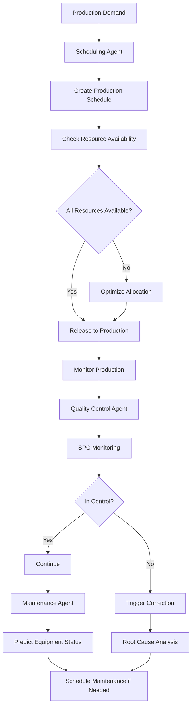

# Domain Adaptation for Manufacturing

Manufacturing agents optimize production scheduling, quality control, equipment maintenance, and resource allocation. Domain adaptation requires understanding production constraints, process variability, equipment capabilities, and lean principles.

## Core Manufacturing Functions

**Production Scheduling**: Create optimal production schedules balancing capacity, demand, and setup costs. Agents solve scheduling problems considering machine capabilities, material availability, labor constraints, and due dates. Use constraint programming or genetic algorithms for complex multi-machine scheduling.

**Quality Control & Statistical Process Control (SPC)**: Monitor process outputs using SPC charts (control charts) detecting variations. Agents sample production, measure key characteristics, plot on control charts, and trigger corrective actions when points fall outside control limits or patterns emerge.

**Predictive Maintenance**: Predict equipment failures before they occur using sensor data. Monitor vibration, temperature, pressure, and acoustic signals detecting degradation patterns. Schedule maintenance during planned downtime, avoiding costly unscheduled breakdowns.

**Resource Allocation**: Allocate limited resources (machines, labor, materials) to optimize throughput and minimize waste. Agents balance competing demands, routing jobs to available capacity with minimal setup time and maximum utilization.

**Lean Manufacturing Integration**: Implement lean principles through agents: eliminate waste (7 wastes framework), improve flow, and reduce variability. Use agents to identify bottlenecks, calculate takt time, and manage work-in-process (WIP) levels.



## Implementation Example

```python
class ManufacturingAgent(BaseAgent):
    def __init__(self, plant_id: str, production_line: str):
        super().__init__()
        self.plant_id = plant_id
        self.production_line = production_line
        self.scheduler = ProductionScheduler()
        self.quality_monitor = SPCMonitor()
        self.maintenance_predictor = MaintenancePredictor()

    def create_production_schedule(self, orders: list, planning_horizon: int = 7) -> dict:
        # Group orders by product family to minimize setups
        product_groups = self.group_by_product_family(orders)

        schedule = {
            "jobs": [],
            "resource_utilization": {},
            "total_setup_time": 0,
            "makespan": 0
        }

        for product_family, group_orders in product_groups.items():
            # Calculate economic batch quantity
            setup_time = self.get_setup_time(product_family)
            processing_time_per_unit = self.get_processing_time(product_family)
            holding_cost_per_unit = 10  # Per day
            setup_cost = 500

            ebq = self.calculate_ebq(sum(o["quantity"] for o in group_orders), setup_cost, holding_cost_per_unit)

            # Create batches
            remaining_qty = sum(o["quantity"] for o in group_orders)
            batch_num = 0
            while remaining_qty > 0:
                batch_qty = min(ebq, remaining_qty)
                job = {
                    "job_id": f"{product_family}_B{batch_num}",
                    "product_family": product_family,
                    "quantity": batch_qty,
                    "setup_time": setup_time,
                    "processing_time": batch_qty * processing_time_per_unit,
                    "due_date": max(o["due_date"] for o in group_orders)
                }
                schedule["jobs"].append(job)
                remaining_qty -= batch_qty
                batch_num += 1

        # Assign to machines and time
        schedule["jobs"] = self.scheduler.assign_to_machines(schedule["jobs"])
        schedule["makespan"] = max(j["end_time"] for j in schedule["jobs"])

        return schedule

    def monitor_quality(self, product_id: str, measurements: list) -> dict:
        # Get control limits
        ucl = self.quality_monitor.get_ucl(product_id)
        lcl = self.quality_monitor.get_lcl(product_id)
        center_line = (ucl + lcl) / 2

        # Plot measurements
        monitoring = {
            "product_id": product_id,
            "measurements": measurements,
            "control_limits": {"ucl": ucl, "lcl": lcl},
            "status": "in_control",
            "actions": []
        }

        # Western Electric rules for out of control
        mean_measurements = sum(measurements) / len(measurements)
        consecutive_above = sum(1 for m in measurements[-10:] if m > center_line)

        if any(m > ucl or m < lcl for m in measurements):
            monitoring["status"] = "out_of_control"
            monitoring["actions"].append("STOP_PRODUCTION")
            monitoring["actions"].append("INVESTIGATE_ASSIGNABLE_CAUSE")
        elif consecutive_above == 10:  # 10 consecutive above center
            monitoring["status"] = "trend_detected"
            monitoring["actions"].append("ADJUST_PROCESS")

        if monitoring["actions"]:
            self.escalate(monitoring)

        return monitoring

    def predict_maintenance_need(self, equipment_id: str, sensor_data: dict) -> dict:
        # Extract features from sensor data
        vibration_trend = self.calculate_trend(sensor_data["vibration_history"])
        temperature_trend = self.calculate_trend(sensor_data["temperature_history"])
        noise_level = sensor_data.get("acoustic_signal", 0)

        # Predict remaining useful life
        features = {
            "vibration_trend": vibration_trend,
            "temperature_level": sensor_data["temperature_history"][-1],
            "temperature_trend": temperature_trend,
            "noise_level": noise_level,
            "operating_hours": sensor_data["operating_hours"],
            "maintenance_history": len(sensor_data.get("last_maintenance", []))
        }

        rul_prediction = self.maintenance_predictor.predict_rul(equipment_id, features)

        maintenance = {
            "equipment_id": equipment_id,
            "remaining_useful_life_days": rul_prediction,
            "predicted_failure_date": self.get_date_plus_days(rul_prediction),
            "maintenance_recommendation": "schedule"
            if rul_prediction < 14 else "monitor"
        }

        if rul_prediction < 7:
            maintenance["maintenance_recommendation"] = "urgent"
            self.escalate(maintenance)

        return maintenance
```

## Domain-Specific Patterns

**Constraint Programming**: Manufacturing has many constraints: machine capabilities, material availability, labor availability, sequence-dependent setup times. Use constraint programming solvers (like Google OR-Tools) to find feasible, optimal schedules respecting all constraints.

**Bottleneck Identification**: Use Theory of Constraints (TOC) to identify bottlenecks limiting throughput. Focus improvement efforts on bottleneck machines first. Once improved, identify the new bottleneck and iterate.

**Changeover Reduction**: Setup time is pure waste. Use techniques like Single Minute Exchange of Die (SMED) to reduce changeover times. Agents should minimize changeover impact by grouping similar products.

**Six Sigma Integration**: Apply Six Sigma principles to reduce process variation and defects. Agents support DMAIC (Define, Measure, Analyze, Improve, Control) projects by providing data, identifying correlations, and monitoring control implementation.

**Labor Planning**: Manufacturing labor is complex with multiple skill levels and availability constraints. Agents schedule labor considering: cross-training needs, skill requirements per job, fatigue (avoiding long shifts), and training opportunities.

## Configuration Example

```yaml
manufacturing_agent:
  plant_id: "PLANT_001"
  production_line: "ASSEMBLY_LINE_A"

  scheduling:
    planning_horizon_days: 7
    optimization_method: "constraint_programming"
    objective: "minimize_makespan"
    sequence_dependent_setups: true

  quality_control:
    method: "spc_monitoring"
    sample_size: 5
    sampling_frequency: "every_hour"
    control_rules: "western_electric"
    ucl_sigma_multiplier: 3.0

  maintenance:
    predictive_enabled: true
    rul_prediction_model: "machine_learning"
    monitoring_interval_minutes: 30
    maintenance_planning_window_days: 14

  lean_manufacturing:
    takt_time_seconds: 60
    max_wip_units: 100
    changeover_reduction_enabled: true
    waste_elimination_focus: true
```

## Metrics & Monitoring

Track manufacturing performance through: Overall Equipment Effectiveness (OEE) = Availability × Performance × Quality (target: 85%+), on-time delivery rate (target: 98%), defect rate (parts per million), changeover time (minutes), and labor productivity (units per labor hour). Monitor inventory levels, lead times, and cost per unit.

🔗 Related Topics
- DOMAIN_ADAPTATION_SUPPLY_CHAIN.md - Supplier coordination
- ANALYTICS_RETENTION_ANALYSIS.md - Equipment reliability trends
- TESTING_LOAD_TESTING.md - Stress testing production
- AGENT_PERFORMANCE_METRICS.md - Agent efficiency tracking
- INTEGRATION_DATABASE_SYNC.md - Real-time data sync
