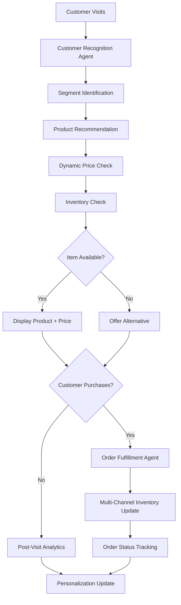

# Domain Adaptation for Retail

Retail agents manage customer experiences, optimize pricing, drive conversions, and personalize recommendations. Domain adaptation requires understanding customer behavior, product assortments, pricing science, and channel integration.

## Core Retail Functions

**Customer Segmentation & Targeting**: Segment customers by value (RFM analysis: Recency, Frequency, Monetary), behavior (browsers vs. buyers), and demographics. Create targeted campaigns for each segment: high-value loyalists (retention focus), at-risk defectors (win-back offers), and prospects (conversion focus).

**Product Recommendation Engine**: Build collaborative filtering and content-based recommendation systems. Recommend products based on: browsing history, purchase history, customer similarity, product similarity, and co-purchase patterns. Implement multi-objective optimization balancing sales, margins, and customer satisfaction.

**Dynamic Pricing**: Use demand-based pricing adjusting prices based on inventory levels, demand signals, and competitive landscape. Real-time pricing agents monitor competitor prices and market signals, adjusting dynamically. Apply price elasticity models to avoid overly aggressive cuts that destroy margin.

**Inventory-Channel Coordination**: Coordinate inventory across channels (online, brick-and-mortar, third-party marketplaces). Agents allocate inventory efficiently, preventing stockouts in high-demand channels while avoiding overstock in weak channels. Implement 72-hour inventory views across all channels.

**Customer Lifetime Value Optimization**: Every decision should optimize CLV, not short-term transactions. Route high-value customers to premium experiences; offer generous return policies to increase trust; implement loyalty programs with status tiers to drive repeat purchases.



## Implementation Example

```python
class RetailAgent(BaseAgent):
    def __init__(self, retailer_id: str, channel: str):
        super().__init__()
        self.retailer_id = retailer_id
        self.channel = channel  # online | store | marketplace
        self.customer_data = CustomerDatabase()
        self.pricing_engine = DynamicPricingEngine()
        self.recommender = RecommendationEngine()

    def process_customer_session(self, customer_id: str, browsing_history: list) -> dict:
        # Identify and segment customer
        customer = self.customer_data.get_or_create(customer_id)
        segment = self.segment_customer(customer)

        # Generate recommendations
        recommendations = self.recommender.get_recommendations(
            customer_id=customer_id,
            segment=segment,
            browsing_history=browsing_history,
            num_recommendations=5
        )

        # Apply dynamic pricing
        prices = {}
        for product in recommendations:
            base_price = self.get_base_price(product)
            inventory_level = self.check_inventory(product)
            demand_signal = self.get_demand_signal(product)

            prices[product] = self.pricing_engine.calculate_price(
                base_price=base_price,
                inventory_level=inventory_level,
                demand_signal=demand_signal,
                customer_segment=segment,
                elasticity=self.get_price_elasticity(product)
            )

        return {
            "customer_id": customer_id,
            "segment": segment,
            "recommendations": recommendations,
            "prices": prices,
            "personalized_message": self.generate_personalized_message(segment)
        }

    def segment_customer(self, customer: dict) -> str:
        # RFM Analysis
        recency_score = self.calculate_recency_score(customer)
        frequency_score = self.calculate_frequency_score(customer)
        monetary_score = self.calculate_monetary_score(customer)

        rfm_score = (recency_score * 0.4) + (frequency_score * 0.3) + (monetary_score * 0.3)

        if rfm_score >= 0.8:
            return "high_value_loyalist"
        elif rfm_score >= 0.5:
            return "active_customer"
        elif frequency_score > 0 and recency_score < 0.3:
            return "at_risk_defector"
        else:
            return "prospect"

    def calculate_order_recommendation(self, customer_id: str, items: list) -> dict:
        order = {"items": items, "subtotal": sum(item["price"] for item in items)}

        customer = self.customer_data.get(customer_id)
        segment = self.segment_customer(customer)

        # Upsell/cross-sell
        frequently_bought_together = self.find_frequently_bought_together(items)
        recommendations = [item for item in frequently_bought_together if item not in [i["sku"] for i in items]]

        # Loyalty rewards
        if segment == "high_value_loyalist":
            order["discount"] = 0.1  # 10% loyalty discount
            order["free_shipping"] = True
        elif segment == "at_risk_defector":
            order["discount"] = 0.15  # 15% win-back offer

        order["recommendations"] = recommendations
        order["final_total"] = order["subtotal"] * (1 - order.get("discount", 0))

        return order
```

## Domain-Specific Patterns

**Omnichannel Integration**: Customers expect seamless experiences across channels. Enable features like: buy-online-pickup-in-store (BOPIS), try-in-store-buy-online, and unified loyalty programs. Agents must make real-time decisions on channel allocation and inventory routing.

**Seasonal Planning**: Retail demand varies dramatically by season. Plan assortments, inventory, and pricing seasonally. Pre-season, drive awareness with content; in-season, optimize conversions; end-of-season, clear inventory aggressively while protecting brand.

**Promotional Calendar Management**: Coordinate promotions to avoid conflicts and maximize impact. Agents should optimize the promotional calendar balancing: revenue targets, margin preservation, customer expectations (not too many promotions creating price expectations), and inventory clearing goals.

**Returns & Reverse Logistics**: Minimize returns through better descriptions and fit prediction; manage returns cost efficiently. Use return data to improve product descriptions and sizing guides. For high-value items, offer easy returns to reduce purchase anxiety.

**Store Labor Optimization**: For physical stores, optimize labor schedules based on traffic forecasts and task requirements. Agents predict traffic patterns by hour, day, and season, then schedule staff accordingly to minimize labor cost while maintaining service levels.

## Configuration Example

```yaml
retail_agent:
  retailer_id: "RETAIL_CHAIN_01"
  channel: "omnichannel"

  customer_segmentation:
    method: "rfm_analysis"
    update_frequency: "daily"
    segments:
      - high_value_loyalist
      - active_customer
      - at_risk_defector
      - prospect

  pricing_strategy:
    method: "dynamic_pricing"
    update_frequency: "hourly"
    constraints:
      min_margin: 0.20
      max_discount: 0.40
      elasticity_model: "demand_based"

  recommendations:
    algorithm: "collaborative_filtering"
    content_weight: 0.4
    collaborative_weight: 0.6
    personalization_level: "high"

  inventory_coordination:
    channels: ["online", "store", "marketplace"]
    sync_frequency: "realtime"
    allocation_priority: "demand_weighted"

  omnichannel_features:
    bopis_enabled: true
    virtual_try_on: true
    unified_loyalty: true
```

## Metrics & Monitoring

Monitor retail performance through: conversion rate (target: 2-3% online, 5-8% store), average order value (track vs. baseline), customer acquisition cost, CLV, repeat purchase rate (target: 30-40%), cart abandonment rate (target: < 70%), and net promoter score. Track promotional effectiveness: incremental sales vs. promotion cost, and margin impact.

🔗 Related Topics
- ANALYTICS_CONVERSION_OPTIMIZATION.md - Improving checkout flows
- ANALYTICS_LIFETIME_VALUE.md - Maximizing customer value
- DOMAIN_ADAPTATION_SUPPLY_CHAIN.md - Inventory coordination
- AGENT_TEAM_COMPOSITION.md - Multi-agent retail systems
- TESTING_A_B_TESTING.md - Testing pricing and layouts
