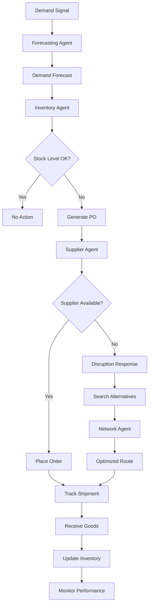

# Domain Adaptation for Supply Chain Management

Supply chain agents coordinate complex logistics networks, optimize inventory, manage supplier relationships, and respond to disruptions. Domain adaptation requires understanding procurement cycles, transportation constraints, demand forecasting, and network optimization.

## Core Supply Chain Functions

**Demand Forecasting**: Agents analyze historical sales patterns, seasonal trends, marketing calendars, and market signals to predict demand. Use exponential smoothing for stable products and machine learning for volatile SKUs. Forecast by product, location, and time horizon (weekly for 12 weeks, monthly for 12 months).

**Inventory Optimization**: Maintain optimal stock levels balancing carrying costs and stockout risks. Agents calculate economic order quantities (EOQ), reorder points, and safety stock levels. For multi-SKU environments, implement ABC classification: A items (high value, tight control), B items (medium control), C items (loose control).

**Supplier Performance Tracking**: Monitor suppliers on quality (defect rates), reliability (on-time delivery), responsiveness, and cost competitiveness. Create supplier scorecards updated weekly. Flag suppliers for review when scores drop below thresholds (e.g., < 85% on-time delivery).

**Network Optimization**: Design optimal supply networks considering facility locations, transportation lanes, and capacity constraints. Agents solve network flow problems to minimize cost while meeting service level agreements. Recalculate network configurations quarterly or when major disruptions occur.

**Disruption Response**: When disruptions occur (supplier outages, transportation delays, demand shocks), agents rapidly evaluate alternatives and trigger contingency plans. Implement decision trees for common disruption types with pre-authorized workarounds.



## Implementation Example

```python
class SupplyChainAgent(BaseAgent):
    def __init__(self, network_id: str, region: str):
        super().__init__()
        self.network_id = network_id
        self.region = region
        self.inventory = InventorySystem()
        self.supplier_network = SupplierNetwork()
        self.forecasting_engine = DemandForecaster()

    def process_inventory_decision(self, sku: str, current_stock: int) -> dict:
        # Get forecast
        forecast = self.forecasting_engine.forecast(sku, weeks=12)

        # Calculate metrics
        avg_demand = forecast["weekly_average"]
        std_demand = forecast["std_deviation"]
        lead_time = self.supplier_network.get_lead_time(sku)
        holding_cost = self.inventory.get_holding_cost(sku)
        ordering_cost = self.supplier_network.get_ordering_cost(sku)

        # Calculate EOQ and safety stock
        eoq = self.calculate_eoq(avg_demand, ordering_cost, holding_cost)
        reorder_point = avg_demand * lead_time + (2 * std_demand * lead_time ** 0.5)
        safety_stock = reorder_point - (avg_demand * lead_time)

        decision = {
            "sku": sku,
            "current_stock": current_stock,
            "reorder_point": reorder_point,
            "economic_order_quantity": eoq,
            "safety_stock": safety_stock,
            "action": "no_action"
        }

        if current_stock <= reorder_point:
            decision["action"] = "place_order"
            decision["order_quantity"] = eoq

        return decision

    def evaluate_disruption(self, sku: str, issue: str) -> dict:
        primary_supplier = self.supplier_network.get_primary_supplier(sku)
        alternatives = self.supplier_network.get_alternative_suppliers(sku)

        response = {
            "sku": sku,
            "disruption_type": issue,
            "primary_supplier_status": self.check_supplier_availability(primary_supplier),
            "alternatives": []
        }

        for alt_supplier in alternatives:
            alt_info = {
                "supplier": alt_supplier,
                "availability": self.check_supplier_availability(alt_supplier),
                "lead_time": self.supplier_network.get_lead_time(sku, alt_supplier),
                "cost_impact": self.calculate_cost_premium(sku, alt_supplier),
                "quality_score": self.supplier_network.get_quality_score(alt_supplier)
            }
            response["alternatives"].append(alt_info)

        # Rank alternatives by cost and quality
        response["recommended_alternative"] = max(
            response["alternatives"],
            key=lambda x: (x["availability"] * 100) - (x["cost_impact"] * 0.3) - (100 - x["quality_score"])
        )

        return response

    def calculate_eoq(self, demand: float, ordering_cost: float, holding_cost: float) -> int:
        import math
        eoq = math.sqrt((2 * demand * ordering_cost) / holding_cost)
        return int(eoq)
```

## Domain-Specific Patterns

**ABC Inventory Classification**: Classify SKUs as A (high-value, 80% of revenue), B (medium-value, 15% of revenue), C (low-value, 5% of revenue). Apply different control policies: A items use continuous monitoring and tight safety stocks; C items use periodic review with higher safety stocks.

**Vendor-Managed Inventory (VMI)**: For key suppliers, implement VMI where supplier owns inventory until consumption. This shifts responsibility and improves responsiveness. Agents must ensure accurate consumption reporting to suppliers.

**Just-In-Time (JIT) Principles**: For mature supply chains, reduce inventory through JIT by coordinating tightly with suppliers. Requires high supply reliability (98%+ on-time delivery). Implement frequent, small shipments coordinated with production schedules.

**Multi-Echelon Optimization**: In complex networks (warehouses -> distribution centers -> stores), optimize across echelons jointly, not independently. Agents route inventory through the network considering total cost, not just local decisions.

**Sustainability Metrics**: Track carbon footprint, recycled content, and ethical sourcing. Modern supply chains must balance cost with environmental and social responsibility. Add sustainability dimensions to supplier scorecards.

## Configuration Example

```yaml
supply_chain_agent:
  network_id: "GLOBAL_NETWORK_01"
  region: "NORTH_AMERICA"

  forecasting:
    method: "exponential_smoothing"
    seasonal_adjustment: true
    forecast_horizon_weeks: 12

  inventory_policy:
    classification_method: "abc_analysis"
    reorder_policy: "min_max"
    safety_stock_multiplier: 2.0

  supplier_management:
    performance_update_frequency: "weekly"
    quality_threshold: 0.95
    on_time_delivery_target: 0.98

  disruption_response:
    enabled: true
    response_time_minutes: 30
    alternative_supplier_minimum: 2

  sustainability:
    track_carbon: true
    track_ethical_sourcing: true
    track_recycled_content: true
```

## Metrics & Monitoring

Track supply chain health through: forecast accuracy (MAPE target: < 15%), inventory turnover ratio (target: industry baseline), supplier on-time delivery (target: 98%), fill rate (target: 99%), and total supply chain cost. Monitor cash-to-cash cycle (how quickly money returns after purchase) and network resilience score (ability to handle disruptions).

🔗 Related Topics
- DOMAIN_ADAPTATION_MANUFACTURING.md - Production planning integration
- ANALYTICS_FUNNEL_ANALYSIS.md - Tracking materials through network
- AGENT_DELEGATION_HIERARCHY.md - Multi-level agent coordination
- TESTING_LOAD_TESTING.md - Stress testing supply networks
- INTEGRATION_MESSAGE_QUEUES.md - Coordinating distributed agents
