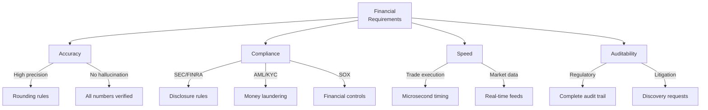

# Finance Domain Adaptation

Specializing AutoClaw for financial applications and regulations.

---

## Financial Domain Constraints

Finance has strict requirements:



---

## Financial Agent Roles

Specialized agents for finance:

### Research Agent (Market)
- Focus: Market data, economic indicators, company financials
- Sources: Bloomberg, Reuters, SEC filings
- Risk: Market manipulation (must avoid)
- Speed: Real-time for trading systems

### Analyst Agent (Critical)
- Focus: Evaluate investment theses
- Validate: Against financial analysis standards
- Risk: False recommendations cause losses
- Independence: Must resist bias

### Trader Agent (Execution)
- Focus: Execute trades with precision
- Risk: Slippage, execution errors
- Speed: Milliseconds matter
- Compliance: Pre-trade checks required

---

## Regulatory Framework

Key regulations shaping design:

```
SEC (Securities Exchange Commission):
  ├─ Market Abuse Regulation (MAR)
  ├─ Algorithmic trading rules
  └─ Disclosure requirements

FINRA (Financial Industry Regulatory Authority):
  ├─ Suitability rules
  ├─ Best execution requirements
  └─ Record-keeping

OCC (Office of Comptroller):
  ├─ Risk management
  └─ Stress testing

Implementation:
  1. Build compliance checks into every agent
  2. Log all decisions for audit
  3. Test against known violations
  4. Regular compliance reviews
```

---

## High-Frequency Trading Specialization

For ultra-low-latency systems:

```
Typical trading pipeline:
  Market data arrives (1 microsecond)
    ↓ (send over network: 100 microseconds)
  Agent receives
    ↓ (analyze: 10 milliseconds) ← TOO SLOW
  Make decision
    ↓ (send trade: 100 microseconds)
  Total: 10+ milliseconds
  → Competitors already traded at 1 millisecond

Solution: Pre-computation
  1. Build decision trees offline
  2. Load into high-speed memory
  3. Agent queries pre-computed decisions
  4. Total latency: <100 microseconds
```

---

## Portfolio Analysis

Multi-asset complexity:

```
Portfolio:
  ├─ Equities (50%): 50 individual stocks
  ├─ Bonds (30%): Government, corporate, emerging
  ├─ Alternatives (15%): Private equity, real estate
  └─ Cash (5%): Money market

Analysis questions:
  1. "What's my correlation exposure?" (systemic risk)
  2. "What's my concentration risk?" (too much in one asset)
  3. "Am I meeting my asset allocation targets?"
  4. "What's my expected return vs. risk profile?"

Agent task:
  1. Aggregate across all positions
  2. Calculate risk metrics
  3. Identify concerns
  4. Recommend rebalancing
```

---

## Risk Management Integration

Prevent dangerous positions:

```
Before agent makes decision:
  1. Pre-trade compliance check
     - Concentration limits OK?
     - Position size limits OK?
     - Leverage limits OK?
     - Counterparty risk OK?

  2. Financial risk check
     - Sector exposure within limits?
     - Asset correlation reasonable?
     - Volatility impact acceptable?

  3. Regulatory check
     - Meets SEC/FINRA rules?
     - No market manipulation?
     - Suitable for client?

  4. Operational check
     - Settlement procedures OK?
     - Counterparty creditworthy?
     - Execution logistics feasible?

Only after ALL checks pass: Execute trade
```

---

## Market Data Integration

Real-time data feeding:

```
Data sources:
  ├─ Price feeds (real-time)
  ├─ News (real-time)
  ├─ Economic data (periodic)
  ├─ Company fundamentals (daily/quarterly)
  └─ Alternative data (various)

Agent access:
  Researcher: All sources
  Analyst: Vetted sources only
  Trader: Validated real-time prices

Data quality checks:
  ├─ Outlier detection (3 standard deviations)
  ├─ Staleness detection (no update in X minutes)
  ├─ Source validation (authorized source?)
  └─ Consistency (matches other sources?)
```

---

## Reporting & Disclosures

Required financial reporting:

```
Daily reporting:
  ├─ Mark-to-market valuations
  ├─ P&L tracking
  ├─ Risk metrics (VaR, Greeks)
  └─ Compliance monitoring

Monthly reporting:
  ├─ Regulatory reports (if applicable)
  ├─ Client statements
  ├─ Performance attribution
  └─ Risk analysis

Quarterly/Annual:
  ├─ Audited financial statements
  ├─ Tax filings
  ├─ Regulatory filings (10-K, 10-Q)
  └─ Disclosure documents

Implementation:
  Agent generates data → Compliance review →
  Regulatory submission → Archive for audit
```

---

## Testing Finance Systems

Financial systems require validation:

```
Backtesting:
  1. Use historical data (past 10 years)
  2. Simulate all decisions
  3. Compare to actual outcomes
  4. Calculate Sharpe ratio, max drawdown, etc.

Stress testing:
  1. What if 2008 crisis happens?
  2. What if major company fails?
  3. What if rates surge?
  4. What if geopolitical event occurs?

Compliance testing:
  1. Can system detect insider trading?
  2. Can system prevent market manipulation?
  3. Are all regulations followed?
  4. Are decision audit trails complete?

Monte Carlo:
  1. Run 10,000 random scenarios
  2. Calculate probability distributions
  3. Identify tail risks
```

---

## 🔗 Related Topics

- [DOMAIN_SPECIFIC_AGENTS.md](DOMAIN_SPECIFIC_AGENTS.md) - Domain adaptation
- [COMPLIANCE_AUDIT.md](COMPLIANCE_AUDIT.md) - Regulatory compliance
- [REAL_TIME_SYSTEMS.md](REAL_TIME_SYSTEMS.md) - High-performance systems
- [MONITORING_AND_ALERTS.md](MONITORING_AND_ALERTS.md) - Risk monitoring

**See also**: [HOME.md](HOME.md)
