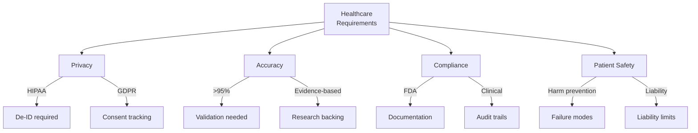

# Healthcare Domain Adaptation

Specializing AutoClaw for healthcare applications.

---

## Healthcare Unique Constraints

Clinical systems have distinct requirements:



---

## Agent Specialization for Healthcare

Adapted agent roles:

### Clinical Researcher
- Focus: Medical literature, clinical trials
- Source verification: PubMed, ClinicalTrials.gov
- Confidence: Peer-review status critical
- Risk: Outdated treatment protocols

### Medical Critic
- Focus: Clinical guideline compliance
- Validation: Against established standards (AMA, AHA)
- Risk: Identify dangerous recommendations
- Priority: Patient safety over convenience

### Knowledge Distiller (Healthcare)
- Focus: Complex medical literature → Patient education
- Requirement: Explain at multiple levels
- Risk: Oversimplification causing harm
- Goal: Evidence-based patient understanding

---

## Privacy-Preserving Analysis

Handle sensitive patient data:

```
Protected Health Information (PHI) Examples:
  ✗ Patient names
  ✗ Medical record numbers
  ✗ Dates of service
  ✗ Specific diagnoses
  ✓ Age ranges (60-70)
  ✓ Aggregated statistics
  ✓ De-identified case studies

Processing pipeline:
  Raw data
    ↓ [De-identification]
  Analyze safe data
    ↓ [Result generation]
  Share insights without revealing identity
```

---

## Evidence-Based Decision Support

All recommendations backed by research:

```
Question: "What's best treatment for condition X?"

Poor answer: "Use treatment A" (no justification)

Good answer:
  "Treatment A recommended by:
   - NICE Guidelines (2023): Level A evidence
   - American Medical Association (2024): Endorsed
   - Meta-analysis of 47 trials: 72% efficacy
   - Recent RCT (2024): Confirmed effectiveness

   Caution: Not recommended for patients >80 years
   Alternative: Treatment B for contraindicated patients"
```

---

## Clinical Guideline Compliance

Ensure recommendations follow standards:

```
Guideline checking:
  ├─ AMA guidelines
  ├─ FDA guidance
  ├─ Specialty society standards
  │  ├─ American Heart Association
  │  ├─ American Cancer Society
  │  └─ Others by specialty
  ├─ Hospital policies
  └─ State/local regulations

Recommendation validation:
  1. Check against all applicable guidelines
  2. Flag any conflicts
  3. Note if off-guideline but supported by research
  4. Require justification for non-standard approaches
```

---

## Safety-Critical Failure Modes

Healthcare allows no "minor" failures:

```
Level 1 (Catastrophic):
  - Recommend harmful treatment
  - Miss critical diagnosis
  - Contraindication not noted
  → Action: Immediate alert, halt processing

Level 2 (Serious):
  - Outdated information (treatment changed)
  - Missing recent research
  - Incomplete differential diagnosis
  → Action: Flag for review, require human confirmation

Level 3 (Minor):
  - Non-critical formatting
  - Explanation could be clearer
  → Action: Improve but don't block

Testing must verify ALL Level 1 impossible
```

---

## Audit & Accountability

Healthcare requires complete audit trails:

```json
{
  "query_id": "HQ-2024-0319-001",
  "timestamp": "2024-03-19T10:30:00Z",
  "patient_id_hash": "SHA256_HASH",
  "query": "Treatment options for condition X",
  "system_version": "v2.3.1",
  "agents_involved": ["Medical Researcher", "Medical Critic"],
  "recommendation": "Treatment A (evidence-based)",
  "confidence": 0.95,
  "evidence": [
    {
      "source": "NEJM 2024",
      "citation": "..."
    }
  ],
  "reviewed_by": "Dr. Smith",
  "approved_at": "2024-03-19T10:32:00Z"
}
```

**Requirement**: Every recommendation traceable to evidence

---

## Testing Healthcare Systems

Medical systems need special testing:

```
Standard testing inadequate:

Test 1: "System recommends treatment"
  ✓ Technically correct if recommendation made
  ✗ Doesn't verify treatment is safe/appropriate

Better tests:

Test 2: "System recommends appropriate treatment"
  - Run 100 de-identified case studies
  - Have 3 physicians validate appropriateness
  - Measure agreement rate (target: >95%)

Test 3: "System doesn't recommend harmful combinations"
  - Drug A + Drug B = contraindication
  - System must detect and alert
  - Test with 500 dangerous combinations
```

---

## Patient Education Content

Translate clinical information for patients:

```
Clinical summary: "RCT shows metformin reduces
                  HbA1c by 1.5% in T2DM"

Patient summary:
  "Research shows that a medicine called metformin
   helps people with type 2 diabetes keep their
   blood sugar more stable. In studies, it lowered
   blood sugar tests by about 1.5%.

   What that means: Better blood sugar control
   usually means:
   - Lower risk of kidney problems
   - Lower risk of eye problems
   - Better energy levels

   Ask your doctor if this might help you."

Translation keys:
  ├─ Remove jargon
  ├─ Explain why it matters
  ├─ Use analogies
  └─ Give actionable next steps
```

---

## Regulatory Compliance Tracking

Different jurisdictions, different rules:

```
FDA (US):
  - Requires validation studies
  - Pre-market approval for certain uses
  - Post-market surveillance required

CE Mark (EU):
  - Medical Device Regulation (MDR)
  - Notified body review
  - Traceability requirements

MHRA (UK):
  - Similar to CE but separate process
  - Brexit-specific requirements

PMDA (Japan):
  - Different evidence standards
  - Different cultural expectations

Implementation:
  ├─ Config per jurisdiction
  ├─ Compliance checklist
  ├─ Audit trail per requirement
  └─ Documentation per regulation
```

---

## 🔗 Related Topics

- [DOMAIN_SPECIFIC_AGENTS.md](DOMAIN_SPECIFIC_AGENTS.md) - Domain adaptation
- [COMPLIANCE_AUDIT.md](COMPLIANCE_AUDIT.md) - Regulatory compliance
- [PRIVACY_AND_SECURITY.md](PRIVACY_AND_SECURITY.md) - Data protection
- [AI_SAFETY.md](AI_SAFETY.md) - Safety in AI systems

**See also**: [HOME.md](HOME.md)
