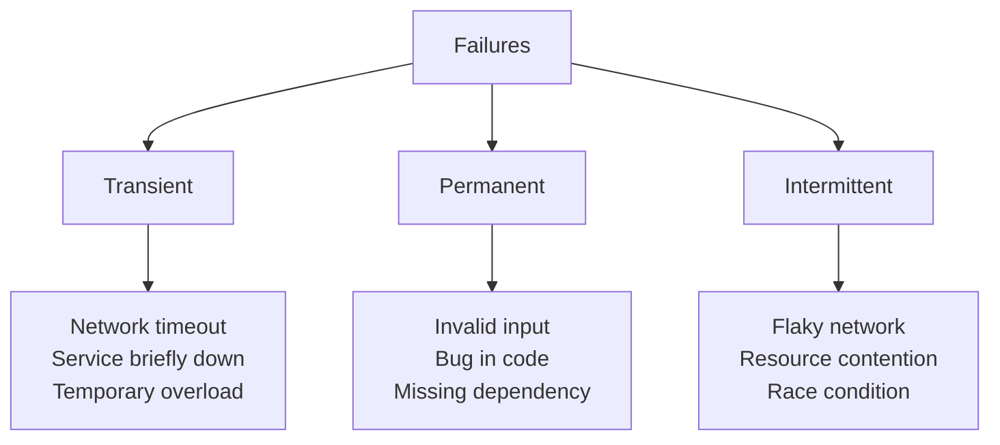
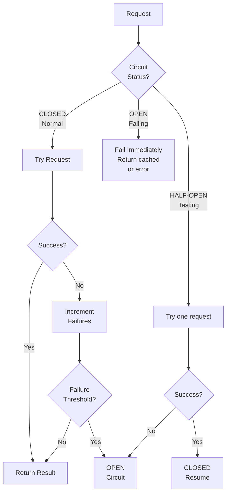
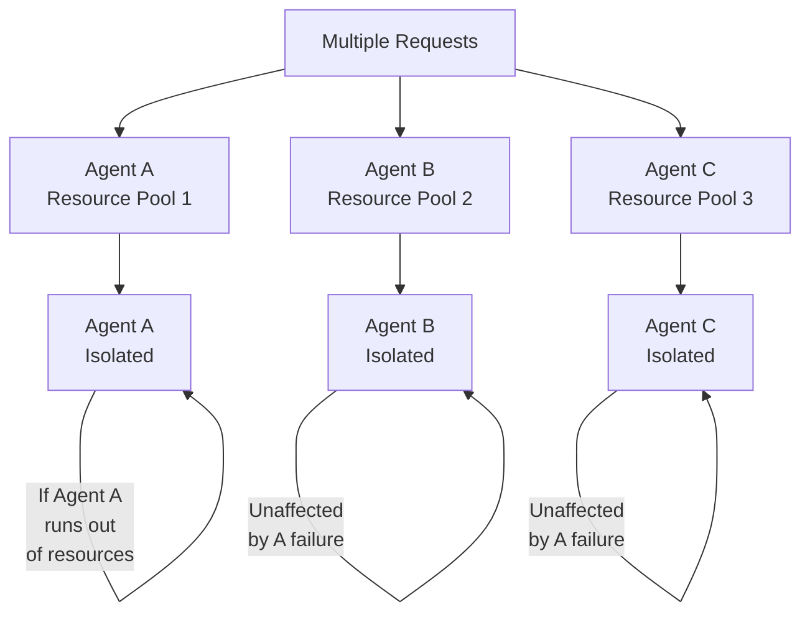
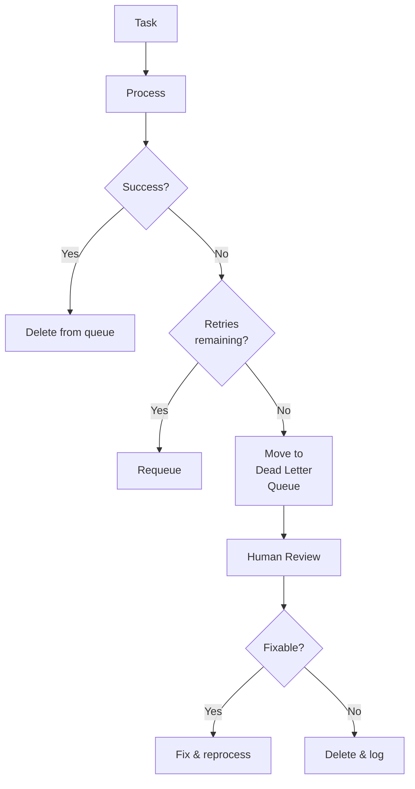
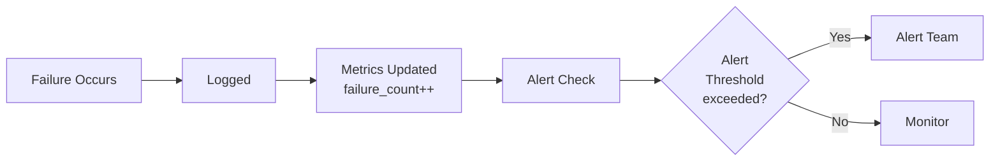

# Error Recovery & Resilience Patterns

Building systems that gracefully handle failures and recover automatically.

---

## Failure Mode Taxonomy

All failures fall into categories:



**Recovery Strategy by Type**:
- **Transient**: Retry with backoff
- **Permanent**: Fail fast, log, alert
- **Intermittent**: Circuit breaker pattern

---

## Exponential Backoff Strategy

The gold standard for transient failures:

```
Attempt 1: Retry immediately (fail)
Attempt 2: Wait 1s (fail)
Attempt 3: Wait 2s (fail)
Attempt 4: Wait 4s (fail)
Attempt 5: Wait 8s (fail)
Attempt 6: Wait 16s (fail)
After 6 attempts, total wait = 32 seconds

If any attempt succeeds → immediate success
If all fail → return error to user
```

**Implementation**:
```python
async def retry_with_backoff(func, max_attempts=5):
    for attempt in range(1, max_attempts + 1):
        try:
            return await func()
        except TransientError as e:
            if attempt == max_attempts:
                raise
            wait_time = 2 ** (attempt - 1)
            await asyncio.sleep(wait_time)
            # Add jitter to avoid thundering herd
            jitter = random.uniform(0, wait_time * 0.1)
            await asyncio.sleep(jitter)
```

**Characteristics**:
- Exponential growth prevents overwhelming service
- Jitter prevents simultaneous retries from many clients
- Maximum total wait: ~32 seconds before giving up
- Cost: Original call + 5 retries ≈ 6x cost

---

## Circuit Breaker Pattern

Prevent cascading failures:



**States**:
1. **CLOSED** (Normal): Requests pass through
2. **OPEN** (Failing): Requests rejected immediately
3. **HALF-OPEN** (Testing): Allow single request to test recovery

**Configuration**:
```
Failure Threshold: 5 consecutive failures
Open Timeout: 30 seconds before trying recovery
Success Threshold: 1 success to close circuit
```

**Benefits**:
- Prevents wasting resources on failing service
- Allows failed service time to recover
- Fails fast when dependency unavailable
- Can return cached result instead of error

---

## Bulkhead Isolation

Prevent one failure from cascading:



**Resource Isolation**:
- Memory: Each agent gets separate heap
- Connections: Each service has connection pool limit
- CPU: Thread pool limits prevent starvation
- Queue: Separate queues prevent head-of-line blocking

**Configuration**:
```yaml
bulkheads:
  researcher:
    memory: 500MB
    connections: 10
    queue_size: 100
    threads: 2

  critic:
    memory: 300MB
    connections: 5
    queue_size: 50
    threads: 1
```

---

## Graceful Degradation

Return partial results instead of failing:

```
Perfect scenario:
Research → Validate → Synthesize → Deliver
Result: Perfect answer in 10s

Degraded scenarios:

One fails:
Research → [Validate fails] → Use research only
Result: Good enough answer in 5s

Two fail:
Research → [Validate fails] → [Synthesize fails]
Result: Raw research + caveat in 2s

All available:
Result: Best quality answer
```

**Implementation Logic**:
```python
async def robust_analysis(topic):
    results = {}

    # Try to get research
    try:
        results['research'] = await researcher.analyze(topic)
    except Exception as e:
        logger.warn(f"Research failed: {e}")
        results['research'] = None

    # Try to validate
    if results['research']:
        try:
            results['validation'] = await critic.validate(
                results['research'])
        except Exception as e:
            logger.warn(f"Validation failed: {e}")

    # Return what we have
    return assemble_response(results)
```

**Quality vs. Availability Tradeoff**:
- Best quality: All steps complete (slower)
- Good quality: Core steps complete (medium speed)
- Acceptable quality: Partial results (fast)
- Fail completely: Give up (slow to return error)

---

## Dead Letter Queues

Handle persistently failing tasks:



**DLQ Purpose**:
- Prevent infinite retry loops
- Preserve data for analysis
- Allow manual intervention
- Track persistent failures

---

## Timeout Strategy

Prevent hanging requests:

```
Request A → Process
  ├─ Subtask 1: 2s (completes)
  ├─ Subtask 2: 5s timeout → Kill at 5s
  ├─ Subtask 3: 2s (after 2)
  └─ Total: 7s + 5s killed = timeout

Better:
Request B → Process
  ├─ Subtask 1: 2s timeout
  ├─ Subtask 2: 2s timeout
  ├─ Subtask 3: 2s timeout
  └─ Total: 6s max (parallelize)
```

**Timeout Hierarchy**:
```
Agent task timeout:        60s
Sub-step timeout:          15s
LLM call timeout:          30s
Database query timeout:    5s
API call timeout:          10s
```

**Timeout Recovery**:
```python
try:
    result = await asyncio.wait_for(
        process_task(),
        timeout=60
    )
except asyncio.TimeoutError:
    logger.error("Task exceeded 60s timeout")
    # Cleanup
    await cancel_subtasks()
    # Return degraded response
    return {"status": "timeout", "partial": results}
```

---

## Observability for Failures

Monitor and alert on failures:



**Failure Metrics**:
- Error rate: % of requests that fail
- Error types: Which errors most common?
- Recovery time: How long until recovery
- Impact: How many users affected?

---

## 🔗 Related Topics

- [MONITORING_AND_ALERTS.md](MONITORING_AND_ALERTS.md) - Detecting failures
- [INCIDENT_MANAGEMENT.md](INCIDENT_MANAGEMENT.md) - Responding to failures
- [PERFORMANCE_OPTIMIZATION.md](PERFORMANCE_OPTIMIZATION.md) - Preventing failures
- [DISTRIBUTED_SYSTEMS_PATTERNS.md](DISTRIBUTED_SYSTEMS_PATTERNS.md) - Distributed failure handling

**See also**: [HOME.md](HOME.md)
