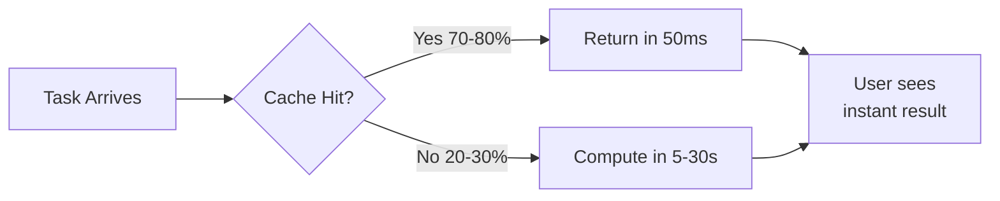
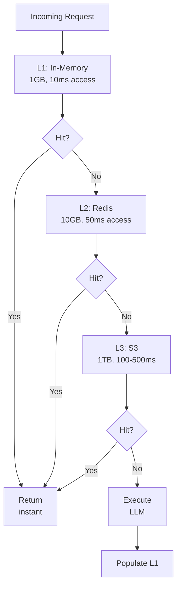
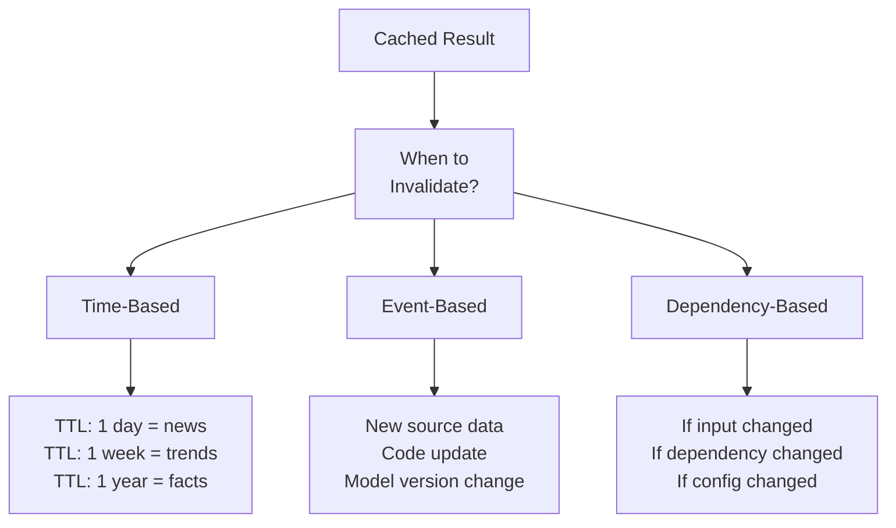
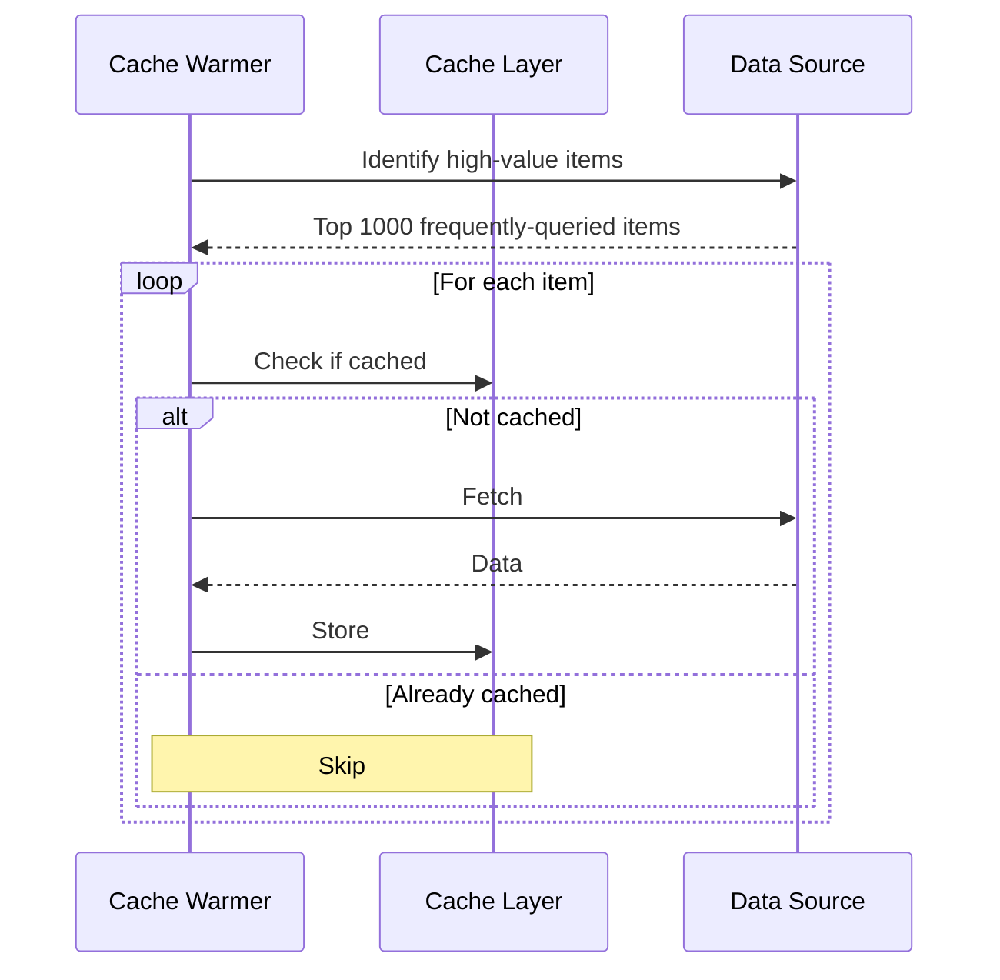
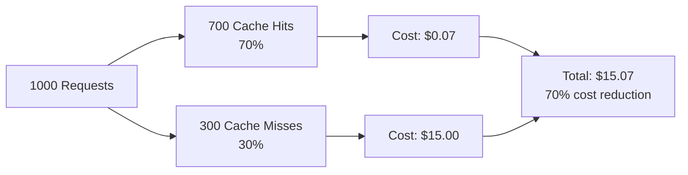
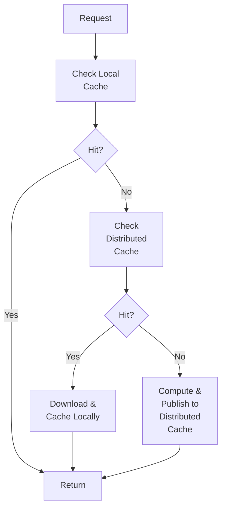

# Intelligent Caching Strategies

Maximizing cache hit rates and minimizing computational waste through strategic caching.

---

## Cache Effectiveness Overview

Cache hit rates directly impact system performance:



**Cost Impact**:
- Cache hit: $0.0001 (storage lookup)
- Cache miss: $0.05 (LLM call)
- **500x cost difference**

---

## Cache Levels

AutoClaw implements a three-level cache hierarchy:



**Cache Characteristics**:

| Level | Storage | Latency | Capacity | Eviction |
|-------|---------|---------|----------|----------|
| **L1 (Memory)** | RAM | 10ms | 1GB | LRU |
| **L2 (Redis)** | In-Memory DB | 50ms | 10GB | TTL |
| **L3 (S3)** | Object Storage | 100-500ms | 1TB | Archival |

---

## Cache Key Design

Cache effectiveness depends on key design:

**Poor Key**:
```
key = "analysis"  # Too broad
# Many different analyses use same key
# Causes collisions, low hit rate
```

**Good Key**:
```
key = "research_neural_networks_
       accuracy_focus_2024q1_v2"

Components:
- Agent type: research
- Topic: neural_networks
- Angle: accuracy_focus
- Time period: 2024q1
- Version: v2
```

**Key Components**:
```python
def build_cache_key(task):
    return f"{task.agent_type}_{task.topic}_{
            task.perspective}_{task.time_period}_{
            task.version}"
```

**Collision Reduction**:
- Too broad keys → high collisions, stale results
- Too narrow keys → low hit rates, wasted memory
- **Sweet spot**: Include semantic content, exclude noise

---

## Invalidation Strategies

When should cached data be refreshed?



**TTL Guidelines**:
```
Real-time data (prices):           TTL = 1 minute
News/current events:               TTL = 1 hour
Trending topics:                   TTL = 1 day
Industry analysis:                 TTL = 1 week
Foundational facts:                TTL = never (manual invalidate)
```

---

## Cache Warming

Pre-populate cache with high-value data:



**High-Value Items**:
- Top 100 most-researched topics
- Core domain concepts
- Frequently-used templates
- Latest research summaries

**Warm-up Timing**:
- Run during low-traffic periods (night)
- Takes ~30 minutes to warm 1000 items
- Increases cache hit rate by 20-40%

---

## Selective Caching

Not everything deserves caching:

**Cache These**:
- ✅ Expensive computations ($1+)
- ✅ Stable results (don't change often)
- ✅ Frequently accessed (high hit rate likely)
- ✅ Large results (network overhead saves)

**Don't Cache**:
- ❌ Cheap operations (<$0.001)
- ❌ Time-sensitive (always latest needed)
- ❌ Rarely accessed (low hit probability)
- ❌ Highly specific (unique inputs, low reuse)

**Decision Tree**:
```python
def should_cache(result):
    if result.cost < 0.001:
        return False  # Too cheap to matter
    if result.staleness_tolerance < 1_hour:
        return False  # Too time-sensitive
    if estimate_hit_rate(result) < 0.3:
        return False  # Unlikely to be reused
    if result.size > 100_mb:
        return False  # Storage overhead
    return True
```

---

## Cache Statistics & Monitoring

Track cache effectiveness:



**Key Metrics**:
```
Hit Rate = Hits / (Hits + Misses)
           Target: >70% for optimization to matter

Byte Hit Ratio = Cache Bytes Served / Total Bytes Served
                 Target: >80%

Eviction Rate = Items Evicted / Items Stored
                Target: <5% (indicates underprovisioned cache)

Cost Savings = (Misses × LLM_Cost) - (All × Storage_Cost)
               Typical: 50-70% reduction
```

---

## Distributed Caching

Scaling across multiple machines:



**Distributed Cache Systems**:
- **Redis Cluster**: Fast, in-memory, good for <10GB
- **Memcached**: Simpler than Redis, pure caching
- **Distributed S3**: Slower but unlimited scale

---

## Cache-Busting Patterns

What happens when cached data becomes wrong?

**Scenario 1: Code Update**
```
Before: Research agent v1 produces answer X
After: Researcher agent v2 produces answer Y

Solution: Version cache keys
Old key: "research_topic_v1"
New key: "research_topic_v2"
```

**Scenario 2: Source Data Changed**
```
Customer list was wrong for 2 hours
Now it's fixed

Solution:
- Invalidate keys matching dependency
- Rebuild from source
```

**Scenario 3: Bug Discovered in Cache**
```
Bad cache entries exist

Solution:
- Identify affected keys (pattern matching)
- Delete affected entries
- Rebuild on next access or via warming
```

---

## Performance Impact

Caching effect on end-to-end response time:

```
Scenario: Research task with 3 subtasks

Without Caching:
Research step 1:  10s (LLM)
Research step 2:   8s (LLM)
Analyze result:    5s (LLM)
Total:            23s

With 70% Cache Hit Rate:
Research step 1:  50ms (cached)
Research step 2:   8s (miss, computed)
Analyze result:   50ms (cached)
Total:           8.1s (71% faster)
```

---

## 🔗 Related Topics

- [KNOWLEDGE_SYSTEM.md](KNOWLEDGE_SYSTEM.md) - What to cache
- [PERFORMANCE_OPTIMIZATION.md](PERFORMANCE_OPTIMIZATION.md) - Overall optimization
- [DISTRIBUTED_SYSTEMS_PATTERNS.md](DISTRIBUTED_SYSTEMS_PATTERNS.md) - Multi-machine caching
- [COST_ANALYSIS.md](COST_ANALYSIS.md) - Cost savings from caching

**See also**: [HOME.md](HOME.md)
