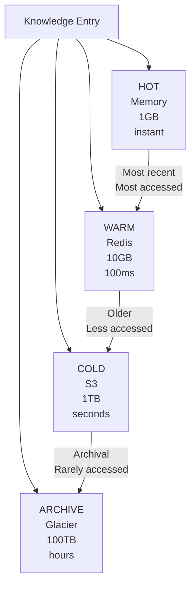
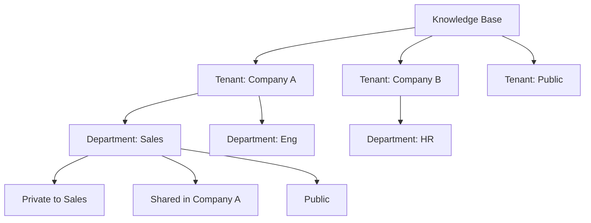
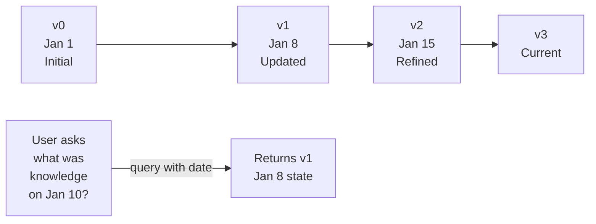

# Knowledge Base Architecture & Organization

Designing and implementing scalable knowledge storage systems.

---

## Storage Hierarchy

Knowledge exists at multiple temperature levels:



**Transition Rules**:
- HOT → WARM: After 24 hours of no access
- WARM → COLD: After 7 days of no access
- COLD → ARCHIVE: After 90 days of no access

**Access Cost**:
```
HOT:     $0.0001 (in-memory)
WARM:    $0.001  (fast lookup)
COLD:    $0.01   (disk read + network)
ARCHIVE: $0.10   (slow retrieval)
```

---

## Knowledge Base Schema

Structure determines query efficiency:

```
{
  "id": "research_neural_networks_2024",

  "metadata": {
    "created": "2024-03-19T10:30:00Z",
    "last_accessed": "2024-03-19T14:22:00Z",
    "access_count": 147,
    "confidence": 0.92,
    "source": "arxiv.org, nature.com",
    "version": "2"
  },

  "content": {
    "summary": "...",
    "details": "...",
    "key_findings": [...]
  },

  "indexing": {
    "agent_type": "researcher",
    "domain": "machine_learning",
    "topic": "neural_networks",
    "keywords": ["attention", "transformer", "scaling"],
    "time_period": "2024"
  },

  "relationships": {
    "related_topics": ["deep_learning", "computer_vision"],
    "parent_topic": "ai",
    "citations": [...]
  }
}
```

**Index Strategy**:
- Primary: (agent_type, topic, version)
- Secondary: (domain, keywords)
- Tertiary: (time_period, confidence)

**Query Examples**:
```
Find all research by researcher agent on ML:
  Primary index: ("researcher", "machine_learning", "*")

Find all high-confidence knowledge:
  Scan for confidence > 0.85

Find related items:
  Follow relationships graph
```

---

## Multi-Tenant Knowledge Base

Isolate data between users/organizations:



**Isolation Strategy**:
```
1. Tenant ID in every query
   SELECT * FROM knowledge WHERE tenant_id = 123

2. Row-level security
   Users can only access their tenant's data

3. Separate indexes per tenant
   Faster queries, no cross-contamination

4. Data encryption per tenant
   Different encryption keys per tenant
```

**Query Example**:
```python
async def get_knowledge(tenant_id, query):
    # Automatically filters to tenant
    return await kb.query(
        f"{query} AND tenant_id='{tenant_id}'"
    )
```

---

## Versioning & Time Travel

Track knowledge evolution:



**Version Storage**:
```
knowledge/neural_networks/
  ├── v0_timestamp_jansmith
  ├── v1_timestamp_janesmith
  ├── v2_timestamp_jansmith
  └── v3_current (most recent)
```

**Changelog Tracking**:
```json
{
  "id": "research_neural_networks",
  "versions": [
    {
      "version": 0,
      "created": "2024-01-01",
      "author": "jan_smith",
      "change": "Initial research"
    },
    {
      "version": 1,
      "created": "2024-01-08",
      "author": "jane_smith",
      "change": "Added latest findings from Feb 2024 papers"
    }
  ]
}
```

---

## Knowledge Relationships

Connect related items:

```
Research: "Neural Network Scaling"
  ├─ Citations: [Paper 1, Paper 2, ...]
  ├─ Related Topics: ["Transformer", "Attention"]
  ├─ Dependencies: ["Basic Deep Learning"]
  ├─ Questions: [5 Q&A pairs about this]
  └─ Broader Category: "Machine Learning"

When user queries "Attention Mechanisms":
→ Also show:
  ├─ 3 most related topics
  ├─ Dependencies user might need
  └─ Recent related research
```

**Relationship Types**:
- **Citation**: Directly references
- **Related**: Similar topic
- **Prerequisite**: Needed to understand
- **Example**: Concrete example of
- **Generalizes**: More specific version of
- **Contradicts**: Alternative view

---

## Deduplication Strategy

Avoid storing duplicate knowledge:

```
New entry comes in:
"ResNet architecture for image classification"

1. Hash content: SHA256("ResNet architecture...")
2. Check if hash exists in KB
3. If exists → Don't duplicate, increment reference
4. If new → Store and index
```

**Similarity Matching**:
```
Exact: Hash match → Definitely duplicate
Semantic: Vector similarity > 0.95 → Likely duplicate
Partial: Some overlap → May be worth storing separately
```

**Deduplication Benefits**:
- Storage: 40-60% reduction
- Query speed: Fewer results to review
- Currency: Single source of truth
- Cost: Less storage = less money

---

## Garbage Collection & Cleanup

Remove stale or low-value knowledge:

```
For each knowledge entry:
  last_accessed_time = entry.last_accessed
  today = now()
  days_since_access = today - last_accessed_time

  if days_since_access > 365:
    if access_count < 5:
      Mark for archival (move to cold storage)
    else:
      Keep (popular despite age)

  if confidence < 0.3:
    Review (may be incorrect)
```

**Cleanup Schedule**:
- **Daily**: Remove entries with very low confidence
- **Weekly**: Move unused entries to cold storage
- **Monthly**: Archive entries not accessed in 90 days
- **Quarterly**: Delete entries not accessed in 1 year

**Exceptions** (Never delete):
- User explicitly marks "keep forever"
- High confidence (>0.95) foundational knowledge
- Recently added (<7 days)
- Citations to this entry still exist

---

## Access Patterns & Optimization

Different access patterns need different indexes:

```
Pattern 1: "Give me all research on topic X"
  Index: (agent_type="researcher", topic=X)
  Retrieval: 50ms, return 100-1000 items

Pattern 2: "What's the latest research?"
  Index: (agent_type="researcher", created_date DESC)
  Retrieval: 100ms, return 10 latest items

Pattern 3: "Find something related to Y"
  Index: vector_similarity(query_embedding, knowledge_embedding)
  Retrieval: 500ms, return 5 most similar

Pattern 4: "What can I tell user about Z?"
  Index: (topic=Z, confidence DESC)
  Retrieval: 50ms, return best items
```

---

## Knowledge Quality Metrics

Track knowledge base health:

```
Coverage: % of important topics documented
  Target: >90% of common queries have cached answer

Freshness: How recent is knowledge?
  Target: Core knowledge updated monthly
  Target: News/trends updated daily

Accuracy: How many cached answers are correct?
  Target: >95% accuracy
  Measure: User feedback, sampled validation

Relevance: Do answers match what user asked?
  Target: >80% of top 3 results relevant
  Measure: User clicks, feedback
```

---

## 🔗 Related Topics

- [KNOWLEDGE_SYSTEM.md](KNOWLEDGE_SYSTEM.md) - Knowledge store basics
- [INTELLIGENT_CACHING.md](INTELLIGENT_CACHING.md) - Caching knowledge
- [SEMANTIC_SEARCH.md](SEMANTIC_SEARCH.md) - Finding knowledge
- [DATA_GOVERNANCE.md](DATA_GOVERNANCE.md) - Managing data quality

**See also**: [HOME.md](HOME.md)
