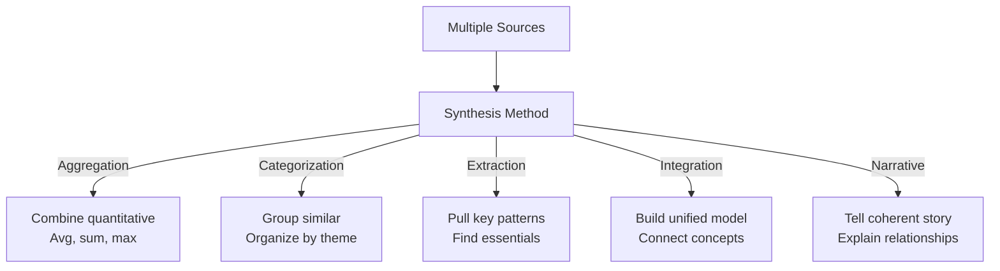

# Knowledge Synthesis Patterns

Systematically extracting insight from diverse sources.

---

## Synthesis Approaches

Different ways to combine information:



---

## Source Weighting

Not all sources equally valuable:

```
Source quality hierarchy:
  1. Peer-reviewed research (0.9 weight)
  2. Industry reports (0.7 weight)
  3. News articles (0.5 weight)
  4. Blog posts (0.3 weight)
  5. Social media (0.1 weight)

When synthesizing:
  Insight from journal: 0.9 × 1.0 = 0.9
  Same insight from blog: 0.3 × 1.0 = 0.3
  Weighted view: (0.9 + 0.3) / 2 = 0.6 (moderate confidence)

If supported by journal only:
  Confidence: 0.9 (high)

If only in social media:
  Confidence: 0.1 (low, needs verification)
```

---

## Contradiction Handling

What when sources disagree:

```
Source A: "Treatment X effective in 70% of cases"
Source B: "Treatment X effective in 45% of cases"

Analysis:
  ├─ Different populations? (A: US, B: International)
  ├─ Different metrics? (A: improvement, B: cure)
  ├─ Different time periods? (A: 2024, B: 2010)
  └─ One's wrong?

Synthesis:
  "Treatment X shows effectiveness ranging from 45-70%
   depending on population and outcome measure.
   Recent US data more positive than international average."

Record uncertainty & source of contradiction
```

---

## Pattern Identification

Find recurring themes across sources:

```
Source 1: "AI efficiency improves with scale"
Source 2: "Larger models perform better"
Source 3: "Scaling laws suggest 10x improvement"
Source 4: "Minimal gains above 100B parameters"

Pattern: Scaling helps, but has limits
Confidence: 0.85 (3/4 sources support)
Caveat: Limit point debated (100B-1T range)

Create synthesized insight:
"AI systems benefit from scaling, with strongest gains
 up to ~100B parameters, beyond which improvements
 plateau. Most recent research suggests optimal range
 rather than indefinite scaling benefits."
```

---

## Temporal Synthesis

Understanding how knowledge evolves:

```
2010: "Deep learning is experimental"
2015: "Deep learning state-of-the-art for images"
2020: "Deep learning transformers dominate NLP"
2024: "Multimodal models becoming standard"

Timeline synthesis:
  ├─ Track evolution
  ├─ Identify turning points (2012: ImageNet breakthrough)
  ├─ Note predictions vs. reality
  └─ Current cutting edge (2024 multimodal)

Use case: "What's the next frontier?"
```

---

## Hierarchical Synthesis

Build understanding from detail to big picture:

```
Level 1 (Details):
  ├─ Paper A: Method detail 1
  ├─ Paper B: Method detail 2
  └─ Paper C: Method detail 3

Level 2 (Methods):
  ├─ Method X: Details 1,2,3
  ├─ Method Y: Details 4,5
  └─ Method Z: Detail 6

Level 3 (Categories):
  ├─ Supervised Learning: Methods X,Y
  └─ Unsupervised Learning: Method Z

Level 4 (Field):
  Machine Learning encompasses...
```

---

## Causality in Synthesis

Distinguish cause from correlation:

```
Data: When X increases, Y increases
Possible interpretations:
  1. X causes Y (causal)
  2. Y causes X (reverse causality)
  3. Z causes both X and Y (confounding)
  4. Pure coincidence (correlation)

Synthesis approach:
  ├─ Check temporal order (X before Y suggests causality)
  ├─ Look for mechanism (why would X cause Y?)
  ├─ Find confounders (what else changed?)
  └─ Check other studies

Conclusion: "Association observed, causality unclear.
            Evidence suggests possible mechanism but
            requires RCT for confirmation."
```

---

## Novel Insight Generation

Create insights not explicitly in sources:

```
Source facts:
  - AI improving annually (5-10% gains)
  - Computing power doubling every 2 years
  - Energy costs rising

Synthesis (Level 1 - combination):
  "AI improvements track with computing growth"

Synthesis (Level 2 - pattern):
  "Efficiency gains not keeping pace with hardware gains"

Synthesis (Level 3 - novel insight):
  "We're hitting diminishing returns. Simply scaling
   hardware won't sustain AI progress. Algorithmic
   efficiency breakthroughs needed."
```

---

## Confidence Propagation

How confidence changes through synthesis:

```
Source A: 80% confident statement X
Source B: 70% confident statement X
Source C: 60% confident statement Y (contradicts X)

Simple average: (80 + 70 + 60) / 3 = 70%
Better: Account for agreement

Confidence for X:
  (80% + 70%) / 2 = 75% (both sources support)

Confidence for Y:
  60% (only one source, and contradicts others)

Final synthesis:
  "Evidence suggests X (75% confident)
   with Y as minority view (60% confident)"
```

---

## Synthesis Validation

Check synthesized knowledge quality:

```
Checklist:
  ✓ All major sources represented
  ✓ Contradictions documented
  ✓ Confidence scores assigned
  ✓ Temporal aspects noted
  ✓ Causality claims justified
  ✓ Extrapolations clearly marked
  ✓ Novel insights tied to sources
  ✓ Alternative interpretations considered

Quality score = % of checks passed
  <70% = Flag for review
  70-85% = Acceptable
  >85% = High quality
```

---

## 🔗 Related Topics

- [KNOWLEDGE_EXTRACTION.md](KNOWLEDGE_EXTRACTION.md) - Extracting from sources
- [RESEARCH_AUTOMATION.md](RESEARCH_AUTOMATION.md) - Conducting research
- [QUALITY_METRICS.md](QUALITY_METRICS.md) - Measuring quality
- [KNOWLEDGE_SYSTEM.md](KNOWLEDGE_SYSTEM.md) - Storing knowledge

**See also**: [HOME.md](HOME.md)
