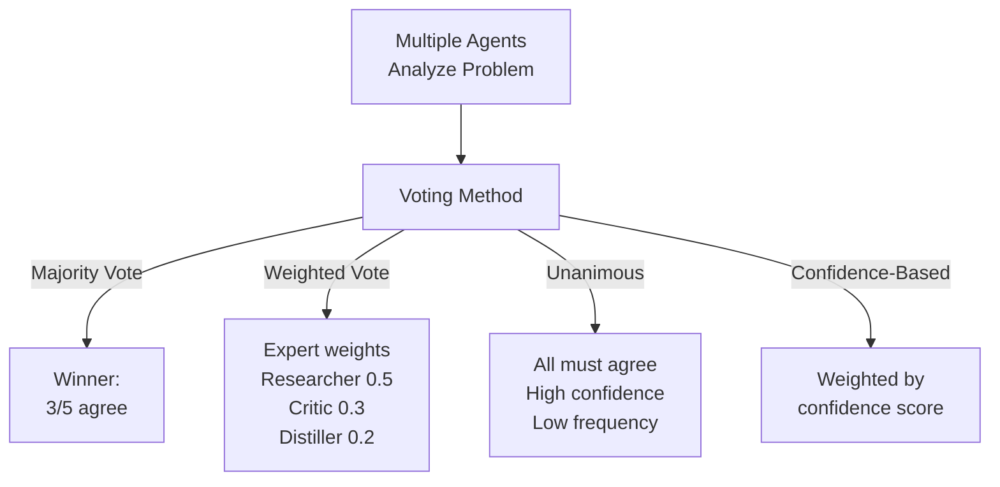
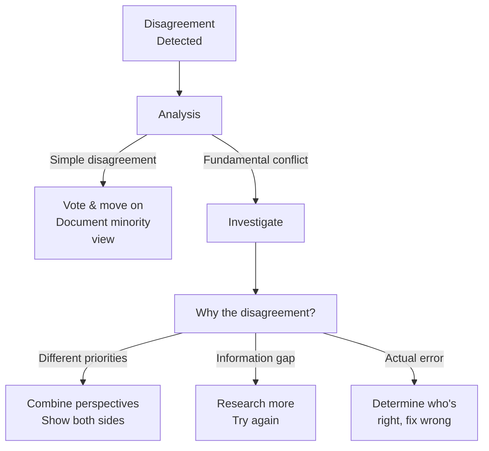

# Multi-Agent Consensus & Voting Mechanisms

Combining multiple agent opinions for better decisions.

---

## Consensus Patterns

Different ways agents can agree:



**When to Use Each**:
- **Majority**: Fast decisions, acceptable 70%+ accuracy
- **Weighted**: Expert agents matter more
- **Unanimous**: Critical decisions, delay acceptable
- **Confidence**: Most agents trust their expertise

---

## Voting Mechanisms

### Simple Majority Vote
```
Question: "Is this paper methodologically sound?"

Researcher: "Yes, uses RCT design" (Confidence: 80%)
Critic:     "No, small sample size" (Confidence: 85%)
Distiller:  "Yes, addresses key question" (Confidence: 75%)

Vote: 2/3 = Majority says YES
Final answer: YES (but with caveats)
```

### Weighted Voting
```
Same question, but weight by expertise:

Researcher: Yes × 0.4 = 0.4
Critic:     No  × 0.5 = 0.0  (critic is expert)
Distiller:  Yes × 0.1 = 0.1

Weighted total: 0.5/1.0 = 50% (borderline)
Final answer: UNCLEAR (too close to call)
Recommendation: Flag for human review
```

### Confidence-Weighted Voting
```
Weight each vote by their confidence:

Researcher: Yes, 80% confident → 0.80 × 1 = 0.80
Critic:     No,  85% confident → 0.85 × -1 = -0.85
Distiller:  Yes, 75% confident → 0.75 × 1 = 0.75

Sum: 0.80 - 0.85 + 0.75 = 0.70
Final: YES (positive score, high confidence aggregate)
```

---

## Disagreement Resolution

What when agents disagree?



**Disagreement Severity**:
```
Minor (1/5 disagree): Likely OK to proceed
Mixed (2/5-3/5 disagree): Borderline, investigate
Major (4/5 disagree): Serious issue, escalate
```

---

## Dynamic Consensus

Agents update views as new info arrives:

```
Initial Round:
  Agent A: "Good research" (60% confident)
  Agent B: "Poor methodology" (70% confident)
  Consensus: MIXED

New information: High-citation count (validated)
  Agent A updates: "Good research" (80% confident)
  Agent B reconsidering...

New information: Small sample criticized
  Agent B: "Poor methodology" (75% confident, now clearer)

Final Consensus: 60% yes, 40% no, but B more convinced

Dynamic consensus allows evolution as data arrives
```

---

## Dissent Recording

Document minority opinions:

```json
{
  "decision": "Approve research approach",
  "consensus": "4/5 agree",
  "votes": {
    "researcher": "approve (strong)",
    "critic": "approve (strong)",
    "distiller": "approve (moderate)",
    "teacher": "disapprove (moderate)"
  },
  "dissent": {
    "agent": "teacher",
    "reason": "Lacks educational scaffolding",
    "confidence": 0.65,
    "suggested_improvement": "Add learning objectives"
  },
  "decision_strength": 0.80
}
```

**Why Record Dissent**:
- Shows reasoning process
- Captures edge cases
- Enables learning from disagreement
- Provides audit trail

---

## Consensus Timing

When to stop gathering opinions:

```
Option A: Majority rules
  - Stop when >50% agree
  - Fast (often 1-2 agents enough)
  - Risk: Minority views missed

Option B: Supermajority
  - Stop when >67% agree
  - Slower (need more agents)
  - Better confidence

Option C: All respond
  - Stop when all agents voted
  - Slowest (wait for slowest)
  - Most comprehensive

Adaptive:
  - Start with majority
  - If time permits, gather more
  - If tie, escalate
```

---

## Consensus for Confidence Calibration

Build confidence score from consensus:

```
All agents agree (100%):
  → High confidence (0.90+)
  → Recommend for production use

Strong majority (80%+):
  → Good confidence (0.75-0.89)
  → Use with minor caveats

Mixed (50-80%):
  → Medium confidence (0.50-0.74)
  → Flag for additional review

Close tie (near 50%):
  → Low confidence (<0.50)
  → Recommend human review
  → Or get additional opinions
```

---

## Consensus Bottlenecks

Where consensus slows down:

```
Parallel consensus (ideal):
  Request→ Agent A [1s] ──┐
           Agent B [1s] ──┼→ Vote → Done [100ms]
           Agent C [1s] ──┘
  Total time: 1s + 100ms = 1.1s

Sequential consensus (slow):
  Request→ Agent A [1s] → Agent B [1s] → Agent C [1s] → Vote → Done
  Total time: 3s + 100ms = 3.1s

Optimization: Start voting in parallel, stop early if clear winner
```

---

## 🔗 Related Topics

- [MULTI_AGENT_COLLABORATION.md](MULTI_AGENT_COLLABORATION.md) - Agent collaboration
- [AGENTS.md](AGENTS.md) - Agent specialization
- [QUALITY_METRICS.md](QUALITY_METRICS.md) - Confidence & quality
- [ENSEMBLE_METHODS.md](ENSEMBLE_METHODS.md) - Combining models

**See also**: [HOME.md](HOME.md)
