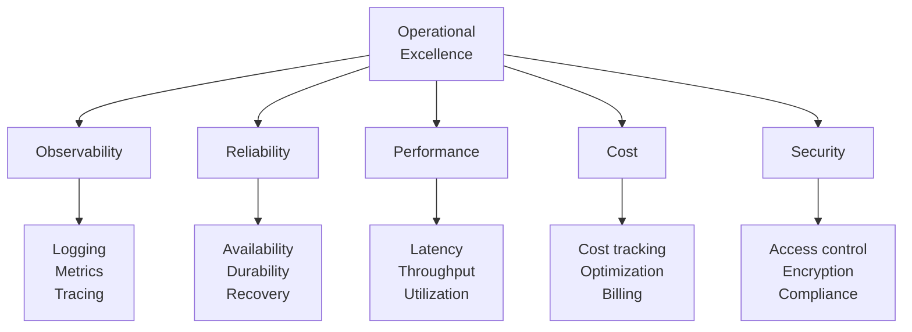

# Operational Excellence Framework

Building and maintaining production AutoClaw systems.

---

## Operational Pillars

Five pillars of operational excellence:



---

## Observability Implementation

See what's happening in production:

```
Logging (Events):
  Every important action logged:
  - Task submitted
  - Agent selected
  - Processing started
  - Result generated
  - Knowledge updated
  - Error occurred

Metrics (Trends):
  - Request latency (p50, p95, p99)
  - Request rate (requests/second)
  - Error rate (% failures)
  - Cache hit rate
  - Agent utilization

Tracing (Causality):
  - Track single request end-to-end
  - See all agents involved
  - Identify bottlenecks
  - Understand failure paths
```

**Implementation Example**:
```python
@observe
async def research_task(query):
    logger.info(f"Starting research: {query}")
    metrics.increment("research.started")

    try:
        result = await researcher.search(query)
        metrics.timing("research.duration", elapsed)
        logger.info(f"Research complete: {query}")
        return result
    except Exception as e:
        metrics.increment("research.failed")
        logger.error(f"Research failed: {query}, {e}")
        raise
```

---

## Reliability Targets

Define and measure reliability:

```
SLO (Service Level Objective):
  - 99.9% availability (8.6 hours downtime/year)
  - <1 second p99 latency
  - <0.1% error rate

SLI (Service Level Indicator):
  - Measured: actual uptime = 99.95%
  - Measured: p99 latency = 0.85s
  - Measured: error rate = 0.05%

Relationship:
  SLO = Target
  SLI = Measurement

If SLI < SLO:
  → Something's wrong
  → Investigate root cause
  → Fix before it gets worse
```

---

## Incident Response Automation

Automatically handle common issues:

```
Incident: High error rate detected
  1. Alert fires
  2. Check: Is it a known issue?
     ├─ Yes → Apply automatic fix
     │        - Scale up agents
     │        - Clear cache
     │        - Restart hung agent
     └─ No → Page on-call engineer

  3. Measure: Did fix work?
     ├─ Yes → Log incident, close
     └─ No → Escalate to senior engineer

Known issues with auto-fixes:
  - High queue depth → Scale agents
  - High error rate → Restart affected service
  - Slow queries → Clear cache
  - Resource exhaustion → Trigger garbage collection
```

---

## Change Management

Safely deploy changes:

```
Deployment pipeline:

1. Code review (2 approvals required)
2. Automated tests (must pass)
3. Integration tests (must pass)
4. Staging deployment (mirror production)
5. Smoke tests on staging
6. Canary deployment (5% of traffic)
7. Monitor for 30 minutes
8. Gradual rollout (to 100%)
9. Post-deployment validation

Rollback criteria:
  - Error rate > 1% (SLO violation)
  - Latency > 2s p99 (unacceptable)
  - Any critical security issue

Automatic rollback: Yes (if criteria met)
```

---

## Runbook Development

Procedure for common operations:

```
Runbook: Scale agent pool for high load

Symptoms:
  - Queue depth > 1000
  - Average wait time > 5 minutes
  - User complaints about slowness

Steps:
  1. Check current agent count:
     kubectl get pods -l app=agent
  2. Check resource utilization:
     kubectl top nodes
  3. If CPU < 70%:
     kubectl scale deployment agent --replicas=<N>
  4. Monitor queue depth for 5 minutes
  5. If still high, scale again
  6. Document scaling in incident report

Success criteria:
  - Queue depth < 100
  - Wait time < 1 minute
  - Error rate stable
```

---

## Capacity Planning

Predict and prepare for growth:

```
Current metrics:
  - Peak traffic: 1000 requests/sec
  - Agent pool: 50 agents
  - Utilization: 75%

Growth projection:
  - 20% growth per quarter
  - Peak in Q4 (holiday traffic)

Planning:
  Q1: Current (1000 req/sec)
  Q2: 1200 req/sec → Need 60 agents
  Q3: 1440 req/sec → Need 72 agents
  Q4: 1728 req/sec → Need 86 agents

Procurement timeline:
  - Hardware: 8-week lead time
  - Order in June for Q4 readiness
  - Test in August
  - Operate in September as backup
  - Go live in October if needed
```

---

## Cost Management

Control and optimize spending:

```
Cost breakdown:
  - LLM API calls: 50% of costs
  - Storage (S3/Redis): 25%
  - Compute (EC2/Kubernetes): 20%
  - Monitoring/Logging: 5%

Optimization opportunities:
  - Cache 70% of queries → 35% cost reduction
  - Use cheaper LLMs for simple tasks → 20% reduction
  - Compress stored data → 10% reduction
  - Right-size compute resources → 15% reduction

Target: Reduce cost 30% while maintaining quality
```

---

## 🔗 Related Topics

- [MONITORING_AND_ALERTS.md](MONITORING_AND_ALERTS.md) - Monitoring systems
- [INCIDENT_MANAGEMENT.md](INCIDENT_MANAGEMENT.md) - Handling incidents
- [DEPLOYMENT_CHECKLIST.md](DEPLOYMENT_CHECKLIST.md) - Deployment procedures
- [COST_ANALYSIS.md](COST_ANALYSIS.md) - Cost tracking

**See also**: [HOME.md](HOME.md)
