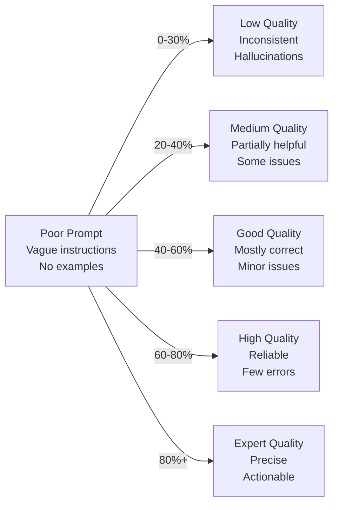
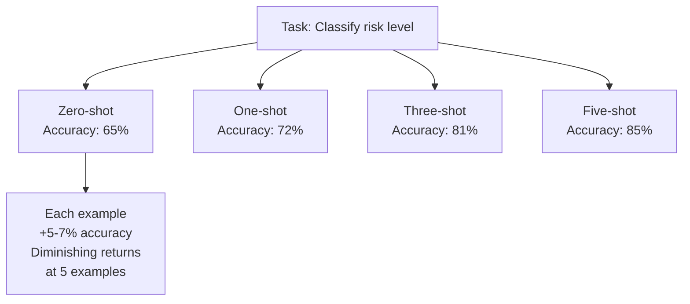
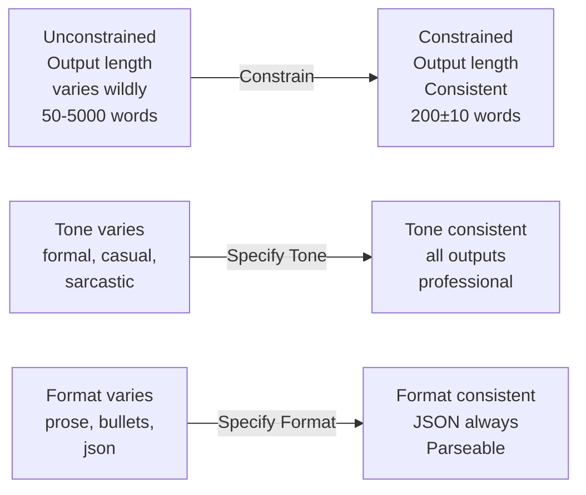
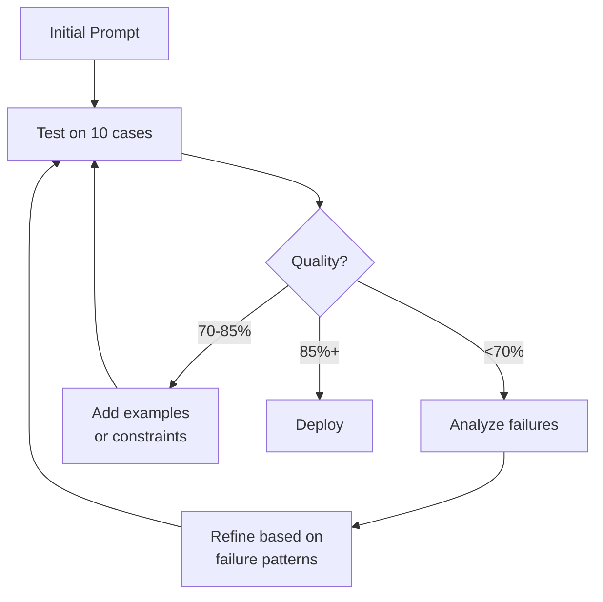

# Advanced Prompt Engineering

Systematic techniques for optimizing agent prompts and maximizing output quality.

---

## The Prompt Effectiveness Spectrum

Agent quality directly depends on prompt quality:



**Quality Cost**:
- Poor prompt: $1.00 per task, 80% failure rate
- Expert prompt: $0.90 per task, 5% failure rate
- **Net savings**: $0.70 per task after re-dos

---

## Prompt Anatomy

A complete prompt has distinct components:

```
<ROLE>
You are a specialized [domain] expert...

<CONTEXT>
Background: [situation]
Constraints: [limitations]
Resources: [available tools]

<TASK>
Primary objective: [main goal]
Specific requirements: [must-haves]

<FORMAT>
Output structure: [expected format]
Example output: [sample]

<CONSTRAINTS>
Length limits: [max tokens]
Tone: [formal/casual]
Perspective: [whose viewpoint]
```

**Effect of Each Component**:

| Component | Without | With | Improvement |
|-----------|---------|------|-------------|
| Role | 40% quality | 60% quality | +50% |
| Context | 45% | 65% | +44% |
| Task clarity | 50% | 70% | +40% |
| Output format | 55% | 75% | +36% |
| Constraints | 60% | 75% | +25% |

---

## Specialization Prompts

Tailor prompts to agent type:

### Researcher Specialization
```
You are a research agent with these specialties:
- Finding credible sources (peer-reviewed > blogs)
- Evaluating source authority
- Synthesizing disparate findings
- Identifying contradictions

When researching:
1. Prioritize academic sources
2. Check publication dates (recent = more weight)
3. Cross-reference claims across sources
4. Flag uncertainty and contradictions
5. Return with source attribution
```

### Critic Specialization
```
You are a critical evaluation expert. Your role:
- Identify unstated assumptions
- Find edge cases and exceptions
- Assess logical consistency
- Evaluate evidence strength
- Spot common fallacies

Evaluation framework:
1. What does this assume? (list assumptions)
2. Where does this break? (find edge cases)
3. Is the logic sound? (trace reasoning)
4. Is evidence sufficient? (assess support)
5. Could this be wrong? (identify failure modes)
```

### Distiller Specialization
```
You are an expert at finding signal in noise.
Your expertise:
- Identifying recurring patterns
- Distinguishing signal from noise
- Compressing without losing essence
- Extracting actionable insights
- Creating mental models

For synthesis:
1. Find patterns across sources
2. Rate pattern strength (appears in X/N sources)
3. Identify outliers
4. Extract core principles
5. Create 1-page summary of essence
```

---

## The Few-Shot Learning Technique

Examples dramatically improve output:



**Example Quality Matters**:
```
Bad example: "High risk project"
- Too vague, doesn't show reasoning

Good example:
Input: "Budget unknown, timeline fixed,
        stakeholders disagreeing"
Risk Level: HIGH
Reasoning: Timeline constraint + budget uncertainty
           creates execution risk

Better example:
Input: [structured problem description]
Analysis: [step-by-step reasoning]
Risk Level: [decision]
Confidence: [certainty]
```

**Example Selection Strategy**:
1. **Diversity**: Cover different scenarios
2. **Clarity**: Clear input → output mapping
3. **Edge cases**: Include boundary examples
4. **Complexity progression**: Easy → Hard

---

## Constraint Effectiveness

Constraints improve consistency:



**Constraint Types**:

| Constraint | Effect | Example |
|-----------|--------|---------|
| **Length** | Consistency | "Respond in 2-3 sentences" |
| **Format** | Parsability | "Return JSON only" |
| **Tone** | Style | "Remain objective and neutral" |
| **Perspective** | Voice | "Write from the user's perspective" |
| **Scope** | Boundaries | "Only discuss proven effects" |

---

## Chain-of-Thought Prompting

Explicit reasoning improves accuracy:

```
Without Chain-of-Thought:
Q: If a train travels 60mph for 2 hours, how far?
A: 120 miles ✓

Better for complex problems:
Q: A store has 15 apples. Buys 20 more. Sells 3 boxes
   of 4. How many left?
A: [Without CoT] 47 ✓
   [Complex reasoning needed, easy to get wrong]

With Chain-of-Thought:
Q: [same]
A: Let me work through this:
   1. Start: 15 apples
   2. Add: 15 + 20 = 35 apples
   3. Sold: 3 boxes × 4 = 12 apples
   4. Remaining: 35 - 12 = 23 apples
   Answer: 23 ✓
```

**Accuracy Improvement**:
```
Simple problems:    0-5% improvement from CoT
Medium problems:    10-20% improvement
Complex problems:   30-50% improvement
```

---

## Iterative Refinement

Improve prompts through experimentation:



**Refinement Workflow**:
1. Create baseline prompt
2. Test on diverse examples
3. Analyze failure patterns
4. Adjust prompt specifically
5. Repeat until 85%+ success

**Failure Analysis**:
```
If model outputs wrong format:
→ Add explicit format specification
→ Add output example

If model ignores constraints:
→ Move constraint to role description
→ Add "MUST" emphasis

If model misunderstands task:
→ Use clearer task language
→ Add worked example
→ Break into substeps
```

---

## Prompt Versioning

Track prompt evolution:

```yaml
researcher_prompt:
  v1:
    date: 2024-01-01
    quality: 65%
    changes: "Initial version"

  v2:
    date: 2024-01-15
    quality: 72%
    changes: "Added source credibility guidelines"

  v3:
    date: 2024-02-01
    quality: 81%
    changes: "Added 3 examples, improved constraint clarity"

  v4:
    date: 2024-02-15
    quality: 85%
    changes: "Reorganized role description"

  production: v4
```

---

## Performance Metrics

Measure prompt effectiveness:

**Quality Metrics**:
- Accuracy: % correct outputs
- Consistency: Variation in outputs for similar inputs
- Relevance: Directly addresses the question
- Completeness: All requested elements included
- Tone match: Matches specified constraints

**Efficiency Metrics**:
- Tokens used: Lower = cheaper
- Latency: Time to first token
- Cache hit rate: % reused results

**Cost-Quality Tradeoff**:
```
Cheap prompt:  ~500 tokens, 65% quality, $0.02
Standard:      ~1000 tokens, 80% quality, $0.04
Expert:        ~1500 tokens, 90% quality, $0.06

Cost per high-quality output:
Cheap:  $0.02 / 0.65 = $0.031 (with re-dos)
Expert: $0.06 / 0.90 = $0.067
```

---

## 🔗 Related Topics

- [ADVANCED_PROMPTING_TECHNIQUES.md](ADVANCED_PROMPTING_TECHNIQUES.md) - General techniques
- [AGENTS.md](AGENTS.md) - Agent specializations
- [KNOWLEDGE_SYSTEM.md](KNOWLEDGE_SYSTEM.md) - Providing context
- [QUALITY_METRICS.md](QUALITY_METRICS.md) - Measuring quality

**See also**: [HOME.md](HOME.md)
