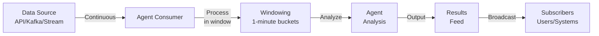
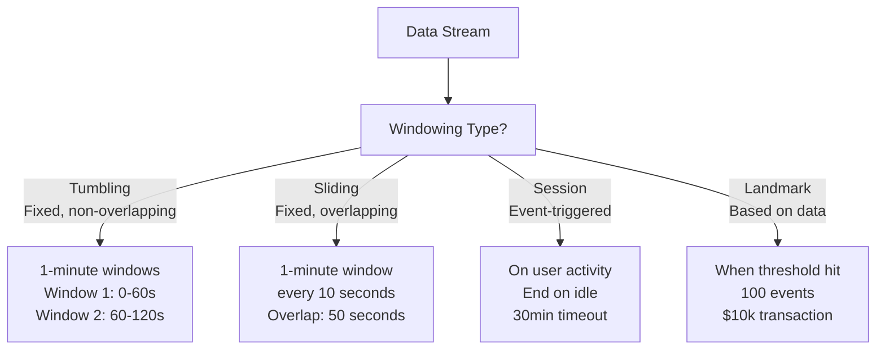
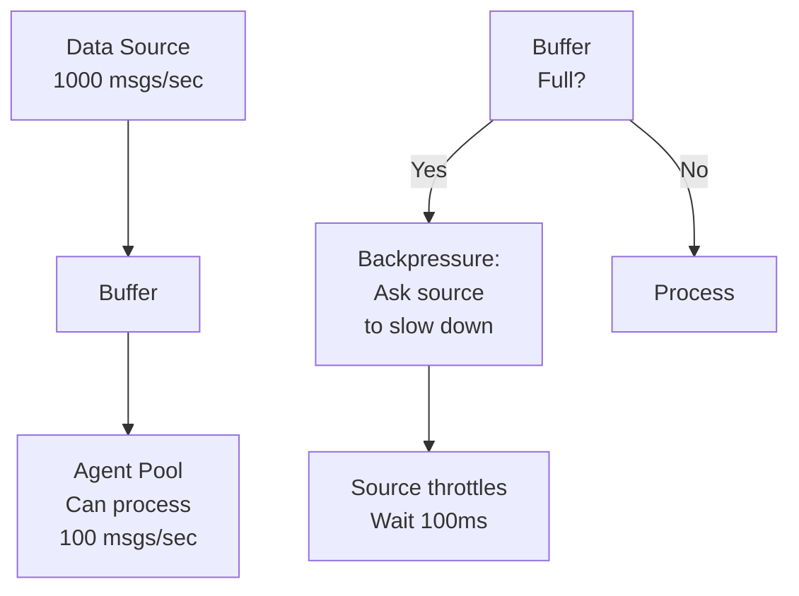
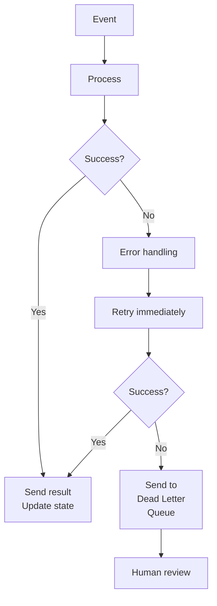

# Real-Time Streaming & Event-Driven Workflows

Processing continuous data streams with AutoClaw agents.

---

## Streaming Architecture

Handle infinite data streams:



**Key Differences from Batch**:
- Batch: Process all data at once
- Streaming: Process data as it arrives
- Batch: Minutes to hours latency
- Streaming: Sub-second latency

---

## Windowing Strategies

How to chunk infinite stream:



**Window Choice**:
- **Tumbling**: Metrics, dashboards, reports
- **Sliding**: Trending metrics, anomaly detection
- **Session**: User interactions, conversations
- **Landmark**: Alerts, critical events

---

## Streaming Agent Roles

How agents work with streams:

### Researcher (Monitor & Alert)
```
Stream of stock prices → Researcher
  1. Monitor for >5% movement
  2. Research why (news, earnings, etc.)
  3. Alert user with context
  4. Continuous process
```

### Critic (Anomaly Detection)
```
Stream of server metrics → Critic
  1. Compare to baseline (normal patterns)
  2. Identify anomalies
  3. Flag suspicious patterns
  4. Alert on high severity
```

### Distiller (Aggregation & Synthesis)
```
Stream of customer reviews → Distiller
  1. Accumulate reviews in 1-hour window
  2. Synthesize into sentiment summary
  3. Extract top issues
  4. Send to team dashboard
```

---

## Buffering & Backpressure

Handle fast data streams:



**Buffer Strategies**:
```
Small buffer (100 items):
  - Pro: Low latency, fast response
  - Con: High risk of dropping data
  - Use: Metrics, dashboards

Large buffer (10k items):
  - Pro: Handles spikes, no data loss
  - Con: Higher latency
  - Use: Critical data, compliance logs

Dynamic buffer:
  - Grows when source faster
  - Shrinks when caught up
  - Target: ~500ms latency
```

---

## Exactly-Once Processing

Guarantee each event processed exactly once:

```
Challenge: What if agent crashes during processing?

Naive:
Process → Agent crashes → Event lost ❌

Better (At-least-once):
Ack after process → Crash → Replay from before ack
Risk: Duplicate processing ❌

Best (Exactly-once):
1. Accept event (in buffer)
2. Process
3. Commit result
4. Ack source
5. If crash at step 3: Replay only step 3-4
```

**Implementation**:
```
Window: [events 100-200]
1. Researcher processes
2. Save checkpoint: "Processed through event 150"
3. Crash happens
4. Restart: Skip 100-150, resume from 151
5. Each event processed exactly once
```

---

## Stateful Processing

Maintain context across events:

```
Simple (Stateless):
Event → Process → Output
Each event independent

Complex (Stateful):
Event 1: "User logged in"
  → State: user_session_1 = active
Event 2: "User viewed product"
  → State: user_session_1.products = [product_A]
  → Analyze: What patterns for this session?
Event 3: "User purchased"
  → State: user_session_1.purchased = product_B
  → Reward recommendation system if relevant
```

**State Management**:
```yaml
stream_state:
  user_sessions: {}  # Map of session_id → state
  aggregates: {}     # Rolling metrics
  cache: {}          # Recent lookups

Per event:
  1. Load state (from Redis)
  2. Update with event
  3. Save state back
  4. Emit output if threshold reached
```

---

## Failure Handling in Streams

Recover from failures gracefully:



**Dead Letter Queue**:
```
{
  "event_id": 12345,
  "timestamp": "2024-03-19T10:30:00Z",
  "payload": {...},
  "error": "Timeout contacting API",
  "attempts": 3,
  "status": "pending_review"
}
```

---

## Latency Monitoring

Track end-to-end latency:

```
Event created: 10:30:00.000
  ↓ (10ms) Network delay
Received by system: 10:30:00.010
  ↓ (50ms) Buffer/routing
Processing starts: 10:30:00.060
  ↓ (1000ms) Agent processing
Processing ends: 10:30:01.060
  ↓ (5ms) Write to output
Output available: 10:30:01.065
  ↓ (20ms) Network to subscriber
Subscriber receives: 10:30:01.085

Total latency: 1.085s
Breakdown:
  - Network: 30ms (2.8%)
  - Buffer/routing: 50ms (4.6%)
  - Processing: 1000ms (92.2%)
  - Output: 5ms (0.5%)

Optimization target: Processing (92% of time)
```

---

## Scaling Streaming Workloads

Handling increased stream volume:

```
Initial:
1 Researcher agent
Handles: 100 msgs/sec
Latency: 500ms

As stream grows to 500 msgs/sec:
Option A: Vertical scaling (bigger agent)
  - Limited by single machine
  - Eventually hits ceiling

Option B: Horizontal scaling (more agents)
  - Partition stream: msgs 0-99 → Agent A
  - Partition stream: msgs 100-199 → Agent B
  - etc.
  - Handle 500 msgs/sec with 5 agents

Tradeoff: Coordination complexity
  - Agents on different machines
  - Need consensus for cross-stream state
```

---

## 🔗 Related Topics

- [STREAMING_DATA_PROCESSING.md](STREAMING_DATA_PROCESSING.md) - Stream processing concepts
- [REAL_TIME_SYSTEMS.md](REAL_TIME_SYSTEMS.md) - Real-time requirements
- [WORKFLOW_PATTERNS.md](WORKFLOW_PATTERNS.md) - Workflow patterns
- [MESSAGE_BUS.md](MESSAGE_BUS.md) - Message passing

**See also**: [HOME.md](HOME.md)
