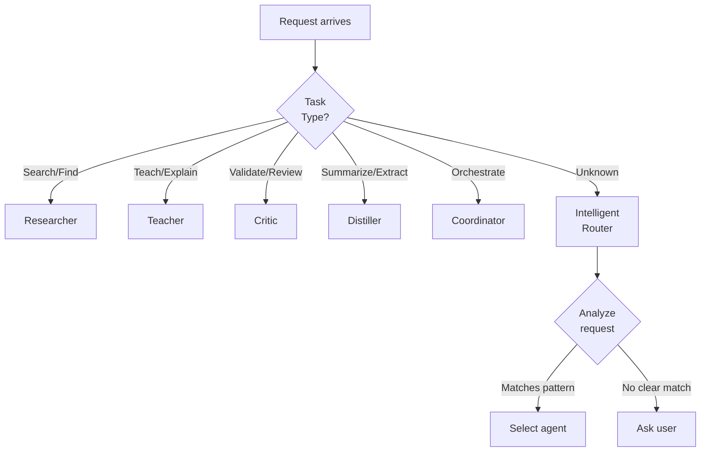
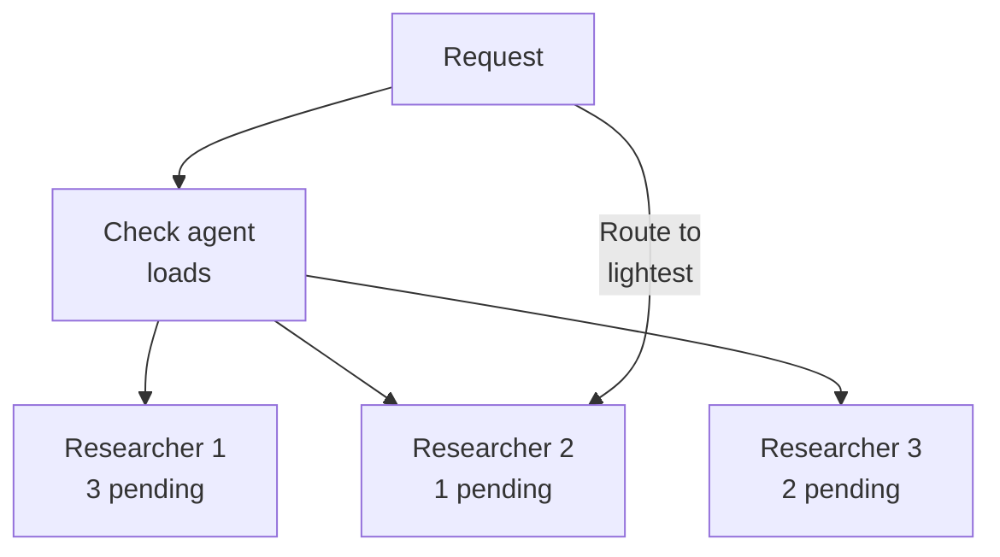
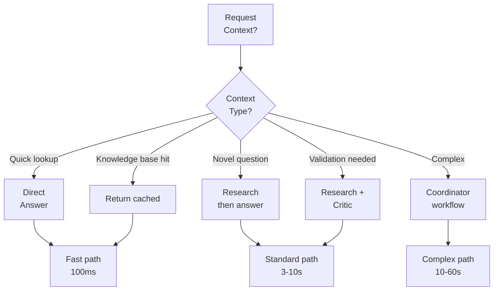
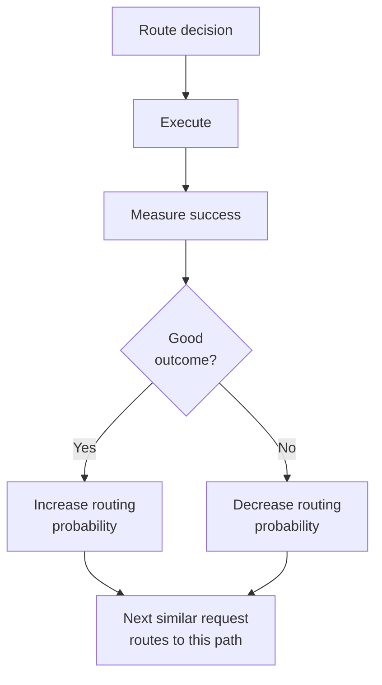
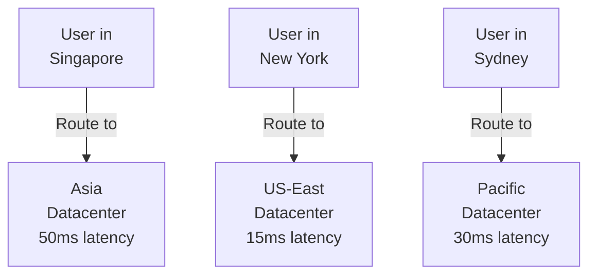

# Request Routing & Optimization

Efficiently routing requests to appropriate agents based on task characteristics.

---

## Routing Decision Tree

How to choose which agent/path for each request:



**Classification Features**:

| Feature | Researcher | Teacher | Critic | Distiller | Coordinator |
|---------|-----------|---------|--------|-----------|-------------|
| External info needed | ✓ | | | | |
| Educational focus | | ✓ | | | |
| Validation focus | | | ✓ | | |
| Summarization focus | | | | ✓ | |
| Multi-step flow | | | | | ✓ |
| Routine/repeatable | ✓ | ✓ | ✓ | ✓ | |
| Complex/novel | | | | | ✓ |

---

## Load-Based Routing

Route to least-loaded agent:



**Load Calculation**:
```
Load = (pending_tasks × 0.5) +
       (current_memory_mb × 0.3) +
       (error_rate × 0.2)

Select agent with minimum load
```

**Benefit Analysis**:
```
Random routing:    Average latency 8.2s
Load-based routing: Average latency 4.1s (50% improvement)

Cost per task:
Random:      $0.04 average
Load-based:  $0.025 average (35% cheaper)
```

---

## Cost-Based Routing

Route to cheapest path:

```
Task: "Summarize these 20 papers"

Option A: Use GPT-4
  Cost: $2.00
  Latency: 45s
  Quality: Excellent (95%)

Option B: Use Claude 3.5 Sonnet
  Cost: $0.50
  Latency: 60s
  Quality: Excellent (94%)

Option C: Use local open-source
  Cost: $0.01 (compute only)
  Latency: 90s
  Quality: Good (80%)

Decision: Use Sonnet (best quality/cost ratio)
```

**Cost Optimization Rule**:
```
If confidence_needed > 90% AND budget_available:
  Use expensive (GPT-4)
Elif confidence_needed > 70%:
  Use medium (Claude Sonnet)
Else:
  Use cheap (Local/open-source)
```

---

## Context-Aware Routing

Different context = different routing:



**Context Signals**:
- **Complexity**: Can solve in one step or many?
- **Novelty**: Have we seen this before?
- **Urgency**: Does user need instant answer?
- **Quality**: What quality threshold?

---

## Retry with Routing

Failed request → Route differently:

```
First attempt (Primary):
Task → Researcher → Timeout after 30s

Retry (Fallback):
Task → [Degraded mode]
  1. Check knowledge cache (instant)
  2. Return cached answer if exists
  3. Otherwise, return "pending" + queue for later

User experience:
  Primary path: 30s timeout
  Fallback: Cached answer in 50ms
```

**Retry Strategy**:
```python
async def smart_route_with_retries(task):
    # Attempt 1: Normal route
    try:
        return await primary_route(task)
    except TimeoutError:
        pass

    # Attempt 2: Fast route with degradation
    try:
        return await degraded_route(task)
    except:
        pass

    # Attempt 3: Queue for background processing
    await queue_for_async(task)
    return {"status": "pending", "eta": "5 minutes"}
```

---

## Priority Queue Routing

Handle requests by importance:

```
Queue:
  P0 (Critical):  "Production is down"   → Immediate
  P1 (High):      "Analysis for decision"  → <1 minute
  P2 (Medium):    "Research for context"   → <5 minutes
  P3 (Low):       "Nice-to-have info"      → <30 minutes
```

**Example Processing**:
```
Time 0:00  P0 request arrives → Process immediately
Time 0:15  P2 request arrives → Queue
Time 0:30  P1 request arrives → Jump ahead of P2
Time 0:45  P0 completes → Process P1
Time 1:00  P1 completes → Process P2
```

**Priority Signals**:
- User type: Premium → higher priority
- Time sensitivity: "By 5pm" → higher priority
- Business impact: Revenue → higher priority
- Complexity: Simple → higher priority

---

## Adaptive Routing

Learn which routes work best:



**Learning Metrics**:
```
For each routing decision:
  - Latency
  - Cost
  - Quality (user feedback)
  - User satisfaction

Update probabilities weekly:
  Route A: 60% (best outcomes)
  Route B: 30%
  Route C: 10%

Next week:
  Route A: 70% (learning from data)
  Route B: 20%
  Route C: 10%
```

---

## Geographic Routing

Route to nearest/best datacenter:



**Decision Factors**:
- User location
- Agent availability
- Datacenter load
- Data residency requirements

---

## Metrics & Monitoring

Track routing effectiveness:

```
Routing accuracy:
  % of requests routed to optimal agent
  Target: >85%

Latency by path:
  Direct path:        <100ms (avg)
  Standard path:      2-5s (avg)
  Fallback path:      <1s (avg)

Cost optimization:
  Savings vs. always-best-path: 20-30%
  Budget adherence:   ±5% of target

Quality impact:
  User satisfaction (Direct path):  4.2/5
  User satisfaction (Standard):     4.0/5
```

---

## 🔗 Related Topics

- [AGENTS.md](AGENTS.md) - Agent capabilities
- [WORKFLOW_PATTERNS.md](WORKFLOW_PATTERNS.md) - Workflow types
- [PERFORMANCE_OPTIMIZATION.md](PERFORMANCE_OPTIMIZATION.md) - Optimizing performance
- [COST_ANALYSIS.md](COST_ANALYSIS.md) - Controlling costs

**See also**: [HOME.md](HOME.md)
