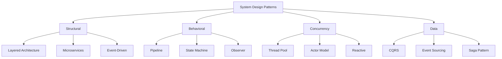
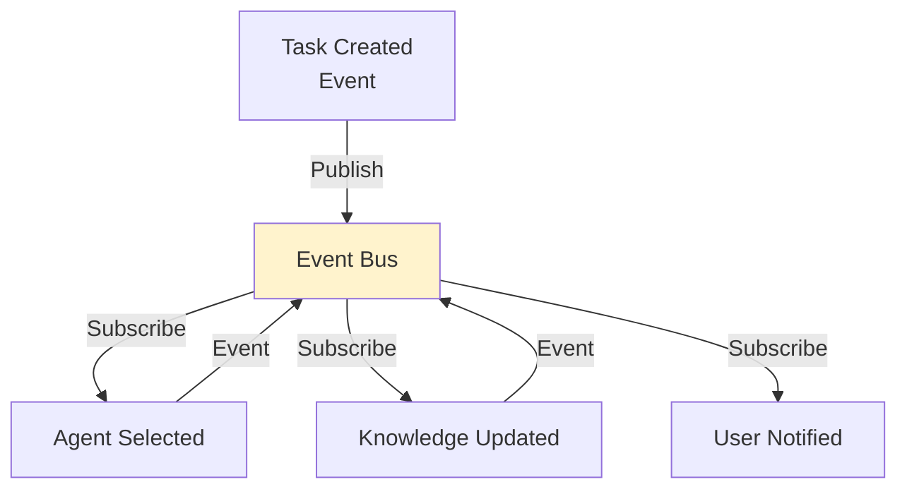

# System Design Patterns for AutoClaw

Architectural patterns for building scalable AutoClaw systems.

---

## Pattern Taxonomy

Design patterns organized by concern:



---

## Layered Architecture for AutoClaw

Clean separation of concerns:

```
Layer 4: API/CLI Layer
  ├─ REST endpoints
  ├─ Command parsing
  └─ Response formatting

Layer 3: Orchestration Layer
  ├─ Workflow coordination
  ├─ Agent selection
  └─ Task delegation

Layer 2: Agent Layer
  ├─ Researcher, Teacher, Critic, etc.
  ├─ Agent pool management
  └─ Concurrent execution

Layer 1: Foundation
  ├─ Knowledge Store
  ├─ Message Bus
  ├─ Storage Systems
  └─ External APIs

Benefits:
  - Each layer has single responsibility
  - Easy to test each layer independently
  - Swap implementations without breaking higher layers
```

---

## Event-Driven Architecture

React to events as they occur:



**Benefits**:
- Loose coupling (agents don't need to know about each other)
- High scalability (parallel event processing)
- Real-time responsiveness

**Events in AutoClaw**:
```
TaskSubmitted, TaskQueued, TaskStarted,
TaskCompleted, TaskFailed, KnowledgeUpdated,
CacheInvalidated, AlertTriggered
```

---

## Saga Pattern for Distributed Transactions

Handle multi-step processes that span systems:

```
Example: Research workflow
  1. Submit request
  2. Research completes
  3. Validate findings
  4. Update knowledge base
  5. Notify user

If step 3 fails:
  → Rollback step 2 (don't use research)
  → Notify user research needed review
  → Store partial results for manual review

Implementation:
  1. Define compensation actions
  2. Execute steps in order
  3. On failure, execute compensation
```

---

## CQRS (Command Query Responsibility Segregation)

Separate read and write paths:

```
Traditional:
  User input → Process → Update DB → Return result
              ↑__________|

CQRS:
  Write path (Commands):
    Submit task → Update main database → Publish event

  Read path (Queries):
    Get knowledge → From optimized read database
              (maintained from events)

Benefits:
  - Read database optimized for queries (indexes, caches)
  - Write database optimized for transactions (safety)
  - Scale independently (more reads than writes typically)
```

---

## Actor Model for Concurrency

Each agent as independent actor:

```
Actor = State + Behavior + Mailbox

Researcher actor:
  State: Current research tasks, knowledge cache
  Behavior: Process research request, update cache
  Mailbox: Queue of incoming research tasks

Communication:
  Actor A → Send message → Actor B mailbox
  Actor B: Process messages one at a time
  No shared state → No locks needed

Benefits:
  - Naturally concurrent
  - No race conditions
  - Location transparent (can run on different machines)
```

---

## Bulkhead Pattern Revisited

Isolation prevents cascade failures:

```
Traditional (no isolation):
  Request flow:
    App → Database (connections: 10)
    10 slow queries → All connections used
    New requests → Wait forever
    System appears down

With Bulkheads:
  Research tasks → Pool A (4 connections)
  Critic tasks → Pool B (3 connections)
  Admin tasks → Pool C (3 connections)

  Even if Pool A exhausted:
    - Pools B & C still responsive
    - System partially degraded (acceptable)
    - Not completely unavailable
```

---

## Service Locator Pattern

Discover available agents dynamically:

```python
# Traditional:
class ResearchTask:
    def __init__(self):
        self.researcher = ResearcherAgent()  # Hard-coded

# Service Locator:
class ResearchTask:
    def __init__(self, locator: ServiceLocator):
        self.researcher = locator.get_agent("researcher")
                                  # ↓ Finds available agent
                                  # even if implementation changed

Benefits:
  - Decouple task from agent implementation
  - Easy to swap agents (for testing, updates)
  - Load balancing possible
```

---

## Queue-Based Load Leveling

Handle traffic spikes:

```
Without queue:
  Spike arrives (1000 requests) → Process immediately
                               → System overloaded
                               → Request timeout
                               → Bad user experience

With queue:
  Spike arrives → Add to queue → Return "processing"
              → Process at sustainable rate
              → No timeouts
              → Queued tasks processed when capacity available

Typical queue metrics:
  Queue depth: How many pending
  Processing rate: Tasks/second
  Wait time: How long until processing starts
```

---

## 🔗 Related Topics

- [DISTRIBUTED_SYSTEMS_PATTERNS.md](DISTRIBUTED_SYSTEMS_PATTERNS.md) - Distributed design
- [MICROSERVICES_PATTERNS.md](MICROSERVICES_PATTERNS.md) - Microservices design
- [WORKFLOW_PATTERNS.md](WORKFLOW_PATTERNS.md) - Workflow design
- [PERFORMANCE_OPTIMIZATION.md](PERFORMANCE_OPTIMIZATION.md) - Performance patterns

**See also**: [HOME.md](HOME.md)
