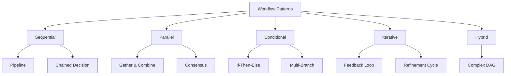
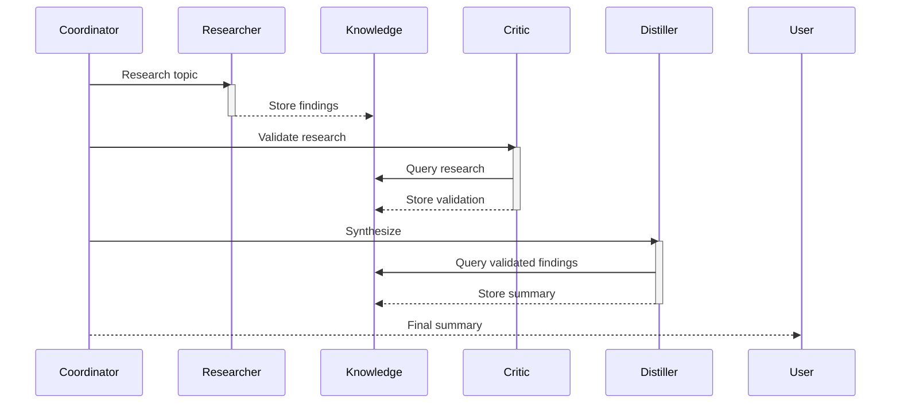
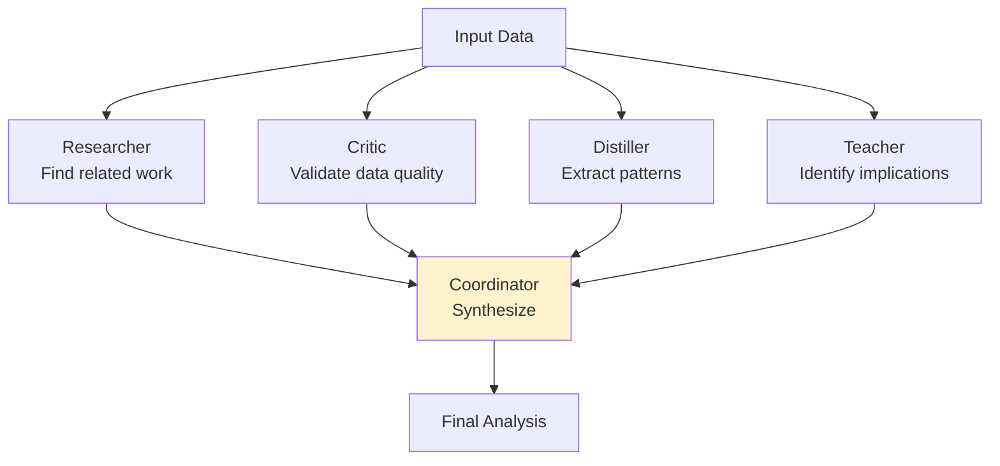
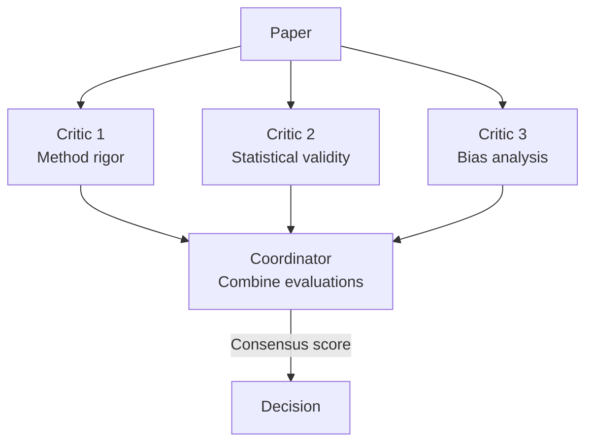
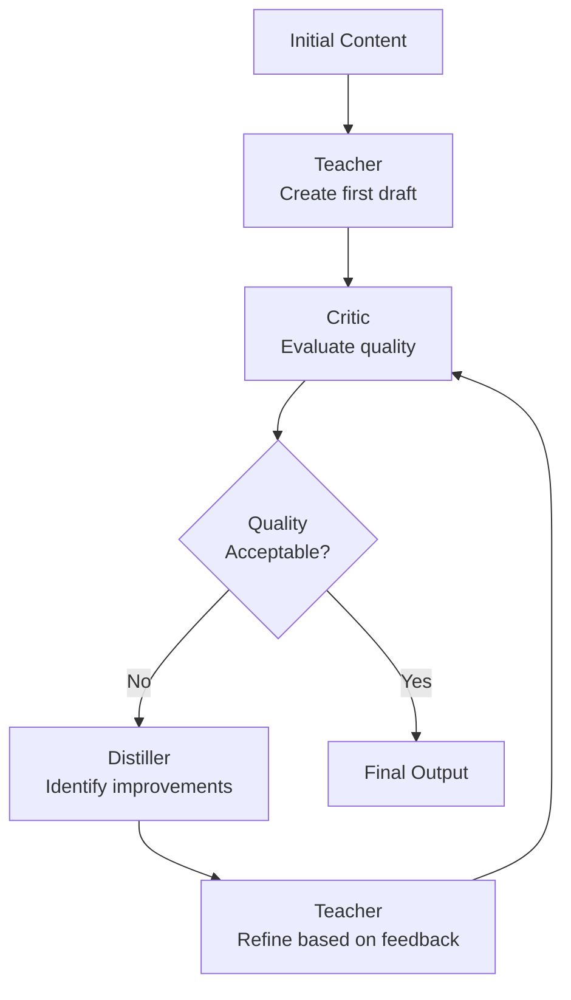
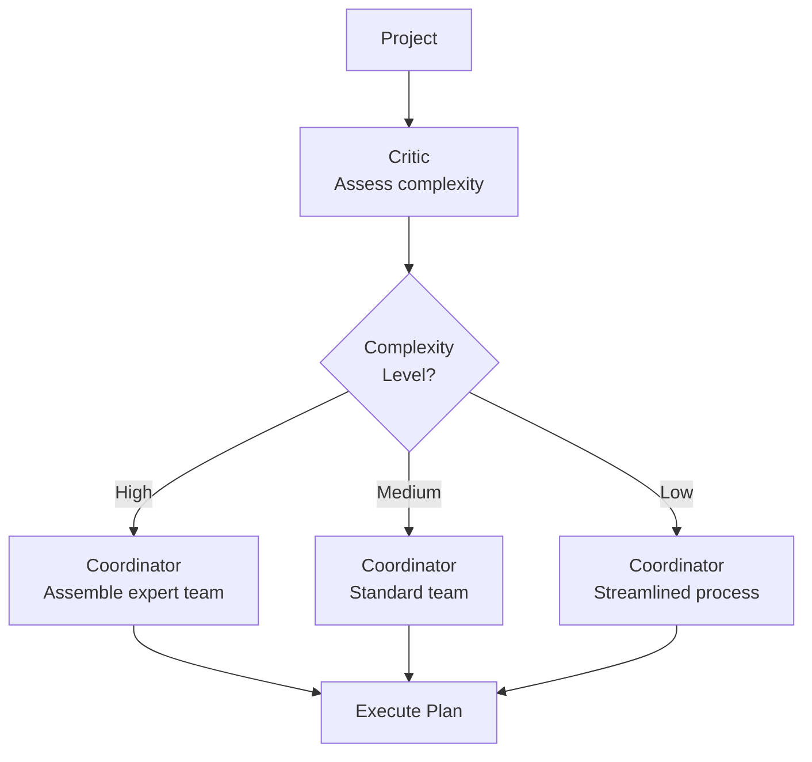
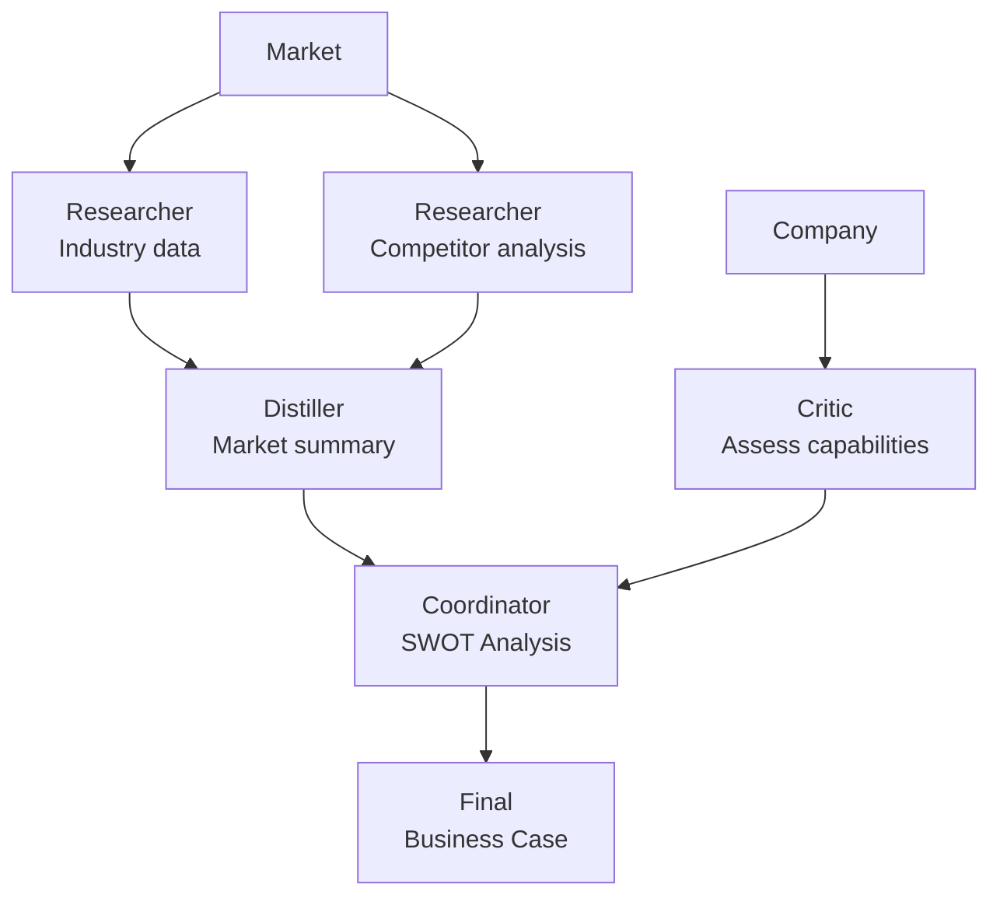
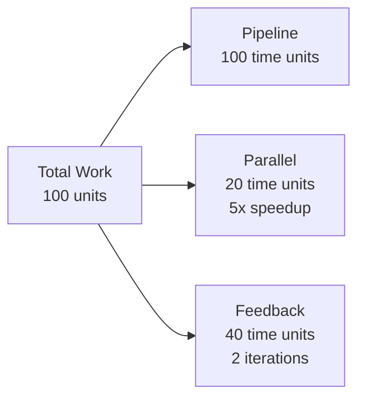

# Standard Workflow Patterns

Reusable patterns for orchestrating AutoClaw agents to solve common problem classes.

---

## 📋 Pattern Taxonomy

Workflows fall into distinct patterns based on how agents coordinate:



---

## 1. Pipeline Pattern

**Use When**: Output of one step feeds into next step; stages are ordered.

**Example**: Research → Analyze → Summarize → Publish



**Implementation**:
```python
class PipelineWorkflow:
    async def execute(self, input_data):
        result = input_data
        for stage in self.stages:
            result = await stage.execute(result)
        return result
```

**Characteristics**:
- Total time = sum of stage times (sequential)
- Error in stage N blocks rest of pipeline
- Each stage can use previous stage's output
- Memory-efficient (process once)

---

## 2. Parallel Gather Pattern

**Use When**: Multiple independent analyses needed, results combined afterward.

**Example**: Analyze same data from 5 different perspectives, then synthesize



**When Parallel is Faster**:
- 4 agents × 5s each = 5s total (vs 20s serial)
- Each agent needs <1s communication overhead
- Results need integration (not trivial)

**When Parallel Isn't Worth It**:
- Tasks take <1s (overhead dominates)
- Results have complex dependencies
- Resource constraints limited (can't spawn 4 agents)

---

## 3. Consensus Pattern

**Use When**: Critical decision requires multiple perspectives; need confidence.

**Example**: Is this research paper methodologically sound?



**Consensus Approach**:
```
If 3/3 agree: High confidence (approve)
If 2/3 agree: Medium confidence (review needed)
If 1/3 agree: Low confidence (reject)
```

**Tradeoff**:
- **Benefit**: Reduces individual agent errors
- **Cost**: 3x computational expense
- **Best for**: High-stakes decisions

---

## 4. Feedback Loop Pattern

**Use When**: Iterative refinement needed; goal is convergence.

**Example**: Write → Critique → Improve → Critique → Final



**Convergence Guarantee**:
- Set maximum iterations (e.g., 5 rounds)
- Track quality score trend
- Stop if no improvement for 2 iterations
- Typical convergence: 2-3 iterations

**Cost Consideration**:
- Each iteration adds 1 "roundtrip" time
- 3 iterations × 10s = 30s total
- Evaluate whether quality justifies time

---

## 5. Conditional Branching Pattern

**Use When**: Different paths based on analysis result.

**Example**: Analyze project risk → Route to appropriate team



**Implementation**:
```python
risk_level = await critic.assess_complexity(project)
if risk_level == "high":
    workflow = complex_workflow()
elif risk_level == "medium":
    workflow = standard_workflow()
else:
    workflow = simple_workflow()
```

---

## 6. Complex DAG (Directed Acyclic Graph)

**Use When**: Multiple dependencies, no cycles.

**Example**: Build comprehensive business analysis



**Execution Strategy**:
1. Identify all nodes with no dependencies → Execute immediately
2. On node completion, check which new nodes are ready
3. Execute all ready nodes in parallel
4. Repeat until all nodes complete

**Complexity**: Implementation requires dependency tracking

---

## Pattern Selection Guide

**Choose Based On**:

| Factor | Pattern |
|--------|---------|
| **Must combine ordered steps** | Pipeline |
| **Need multiple independent analyses** | Parallel Gather |
| **Need high confidence** | Consensus |
| **Need to improve incrementally** | Feedback Loop |
| **Different paths based on data** | Conditional |
| **Complex dependencies** | DAG |

---

## Performance Analysis



**Estimation**:
- Pipeline: O(sum of stages)
- Parallel: O(max of parallel tasks)
- Feedback: O(iterations × stage time)
- DAG: O(critical path length)

---

## 🔗 Related Topics

- [MULTI_AGENT_COLLABORATION.md](MULTI_AGENT_COLLABORATION.md) - Coordinating multiple agents
- [AGENTS.md](AGENTS.md) - Agent capabilities
- [MESSAGE_BUS.md](MESSAGE_BUS.md) - Communication between agents
- [PERFORMANCE_OPTIMIZATION.md](PERFORMANCE_OPTIMIZATION.md) - Optimizing workflow speed

**See also**: [HOME.md](HOME.md)
